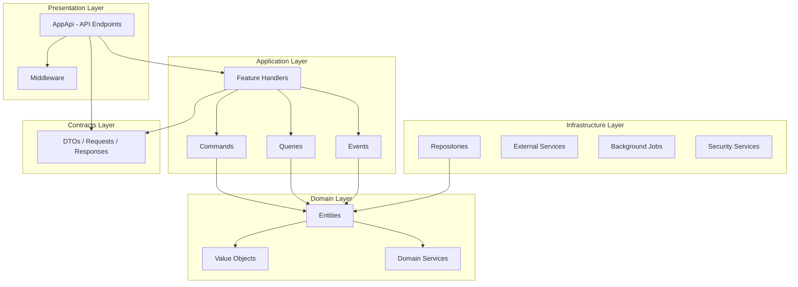
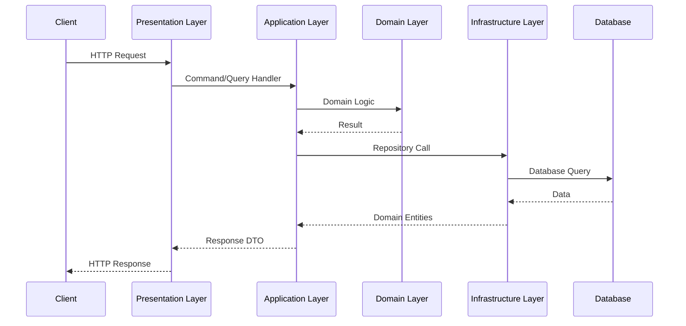

# Architecture Overview

This document describes the layered architecture of the API template, following **Clean Architecture** principles with clear separation of concerns.

## Architectural Decision Records (ADRs)
Critical architectural decisions and their rationales are documented in the [ADRs folder](architecture/adrs/).
*   **[ADR 0001: Domain Layer Persistence Awareness](architecture/adrs/0001-domain-layer-persistence-awareness.md)**
*   **[ADR 0002: Asynchronous Notification Delivery Architecture](architecture/adrs/0002-asynchronous-notification-delivery.md)**
*   **[ADR 0003: Server-Sent Events (SSE) for Real-Time Updates](architecture/adrs/0003-server-sent-events-realtime-updates.md)**

## Architecture Overview



## Layer Responsibilities

### 1. Contracts Layer `Contracts/`

**Purpose**: Data Transfer Objects (DTOs) and API contracts - the interface between layers.

**Responsibilities**:
- Define request/response objects for API endpoints
- Create data transfer structures between presentation and application layers
- Validate input/output data contracts
- Ensure type safety across layer boundaries

**Key Components** (organized per feature area):
- `Auth/` - Authentication request/response contracts
- `Users/` - User-related DTOs (UserRequest, UserResponse)
- `Orders/`, `Items/`, ... - DTOs for your domain resources
- `Common/` - Shared contracts (Pagination, ProblemDetails)

**Characteristics**:
- No business logic - pure data containers
- Independent of other layers
- Used by both Presentation and Application layers
- Defines the public API contract
- **Authenticated-Identity-Only Pattern**: Request DTOs do not contain `UserId` fields. User identity is derived exclusively from JWT claims in the Presentation layer to prevent ID spoofing.

---

### 2. Domain Layer `Domain/`

**Purpose**: Core business entities, value objects, and domain logic.

**Responsibilities**:
- Define core business entities (e.g., User, Order, Item)
- Implement domain rules and business invariants
- Create value objects for domain concepts (Email, Password, Money)
- Define aggregate boundaries and relationships
- Enforce business rules at the deepest level

**Key Components**:

#### Entities `Domain/Entities/`
- `User` - Core user entity with personal data (PII encrypted at rest, see [Envelope Encryption](security/ENVELOPE_ENCRYPTION_ARCHITECTURE.md))
- Your domain aggregates (e.g., `Order`, `Item`, `Project`)
- Identity entities (e.g., `UserGoogleIdentity`, `UserFirebaseIdentity`, `RefreshToken`)

#### Value Objects `Domain/ValueObjects/`
- `Email` - Validated email with format validation
- `Password` - Password validation rules
- `Money` - Monetary value representation

#### Domain Services
- Pure calculation/rule services that span entities (kept free of I/O)

**Characteristics**:
- No dependencies on other layers (with the explicit EF Core exception documented in [ADR 0001](architecture/adrs/0001-domain-layer-persistence-awareness.md))
- Pure business logic and rules
- Entities encapsulate their own validation
- Highly testable and domain-focused
- **Spatial Logic**: Uses `NetTopologySuite.Geometries.Point` with `geography` mapping (PostGIS) to ensure distance calculations are performed in meters rather than degrees.

---

### 3. Application Layer `Application/`

**Purpose**: Use cases, business workflow orchestration, and application services.

**Responsibilities**:
- Implement use cases (features) using CQRS pattern
- Orchestrate workflows between domain and infrastructure
- Handle commands and queries
- Publish and handle domain events
- Coordinate multiple domain operations
- Application-level validation

**Key Components**:

#### Features `Application/Features/`
One folder per aggregate, one file per use case. Example for `Users/`:
- `CreateUser` - User registration
- `AuthenticateUser` - Authentication
- `GetUser` / `UpdateUser` / `DeleteUser` - CRUD (deletion via anonymization)
- `Google/` - Google OAuth
- `Firebase/` - FCM token registration

Additional feature folders follow the same shape (e.g., `Orders/`, `Projects/`, `Payments/`).

#### Abstractions `Application/Abstractions/`
- Repository interfaces (ports for infrastructure)
- Security service interfaces
- Notification service interfaces
- Domain event interfaces

**Characteristics**:
- Depends only on Domain and Contracts layers
- Uses MediatR for CQRS implementation
- Thin orchestration layer
- Depends on abstractions (interfaces), not implementations

---

### 4. Infrastructure Layer `Infrastructure/`

**Purpose**: External concerns, data access, and infrastructure implementations.

**Responsibilities**:
- Implement repository interfaces from Application layer
- Manage database access (Entity Framework Core, **code-first** — see [Database Code-First Guide](architecture/DATABASE_CODE_FIRST.md))
- Own the EF Core migrations (the single source of truth for the database schema, including RLS policies)
- Handle background jobs and scheduled tasks
- Provide security services (JWT, encryption, hashing)
- Integrate with external services (Firebase, Stripe)
- Implement caching strategies
- Logging and observability

**Key Components**:

#### Persistence `Infrastructure/Persistence/`
- `AppDbContext` - Entity Framework DbContext
- `Migrations/` - EF Core migrations (schema + RLS policies + seed data)
- `Configurations/` - `IEntityTypeConfiguration<T>` per entity
- `Converters/` - Value converters for encryption
- `Interceptors/` - RLS and envelope-encryption interceptors

#### Repositories `Infrastructure/Repositories/`
- One folder per aggregate (e.g., `Users/UserRepository.cs`)

#### Background Jobs `Infrastructure/BackgroundJobs/`
- `NotificationWorker` - Push notifications (see [Notifications](features/NOTIFICATIONS.md))
- `UserDataDownload/` - GDPR data export

#### Security `Infrastructure/Security/`
- JWT token generation and validation
- Password hashing (BCrypt)
- Envelope encryption for sensitive data
- Row Level Security (RLS) interceptor
- **Application-Layer Encryption (ALE)**: AES-256-GCM encryption for request/response bodies.
- **Request Signing**: ECDSA P-256 signature verification.
- **Device Attestation**: Integration with Google Play Integrity and Apple App Attest.

#### Caching `Infrastructure/Caching/`
- **Output Caching**: Short-lived (30s) response caching for high-traffic read endpoints (see [Performance Overview](PERFORMANCE_OVERVIEW.md)).
- **Memory Caching**: Internal state and configuration caching.

#### Logging `Infrastructure/Logging/`
- Serilog configuration
- Sensitive data destructuring (PII masking)

**Characteristics**:
- The **outermost** technical layer: it references the inner layers (Domain, Application, Contracts) in order to implement their abstractions — never the reverse
- Contains technical concerns
- Swappable implementations
- **Spatial Performance**: Implements `GIST` indexing on `geography` columns for high-performance proximity searches (see [Spatial Queries](features/SPATIAL_QUERIES.md)).

---

### 5. Presentation Layer `AppApi/`

**Purpose**: API entry point, HTTP handling, and presentation concerns.

**Responsibilities**:
- Configure and start the ASP.NET Core application
- Define API endpoints (Minimal APIs)
- Handle HTTP requests/responses
- Authentication and authorization
- Rate limiting and CORS
- Global error handling (middleware)
- Dependency injection configuration
- Health checks and monitoring
- OpenTelemetry instrumentation

**Key Components**:

#### Endpoints `AppApi/Endpoints/v1/`
- One endpoints file per aggregate (e.g., `Users/`, `Orders/`, `Projects/`)
- **`SecurityEndpoints`**: Exposes `/v1/security/metadata` for mobile app security discovery.
- **[Filters & Middleware](architecture/FILTERS_AND_MIDDLEWARE.md)**: Details custom endpoint filters and request pipeline components.

#### Middleware `AppApi/Middleware/`
- `GlobalExceptionHandler` - Secure global error handling
- **`RequestSigningMiddleware`**: Verifies ECDSA signatures on incoming requests.
- **`AleMiddleware`**: Transparently decrypts/encrypts request and response bodies.

#### Configuration `AppApi/Extensions/`
- `ServiceCollectionExtensions` - DI setup

**Characteristics**:
- Depends on Application layer
- HTTP-specific concerns only
- Thin layer - delegates to Application
- Entry point of the application
- **Global Rate Limiting**: Implements a partitioned rate limiting strategy (Identity-based for authenticated users, IP-based for anonymous) to prevent DOS attacks.

---

## Data Flow



## Dependency Rule

```
┌─────────────────────────────────────┐
│         Contracts Layer             │  ← No dependencies
├─────────────────────────────────────┤
│           Domain Layer              │  ← No dependencies (EF Core exception: ADR 0001)
├─────────────────────────────────────┤
│         Application Layer           │  ← Depends on: Domain, Contracts
├─────────────────────────────────────┤
│         Infrastructure Layer        │  ← Depends on: Domain, Application, Contracts
├─────────────────────────────────────┤
│        Presentation Layer           │  ← Depends on: Application (+ Infrastructure for DI wiring only)
└─────────────────────────────────────┘
```

## Global Coding Standards

### 1. Time & UTC Consistency
To ensure consistency across timezones and deterministic testing:
*   **Mandate:** Use `DateTime.UtcNow` or `DateTimeOffset.UtcNow` exclusively. **Never use `DateTime.Now`.**
*   **Service:** Prefer injecting `IClock` from `SharedKernel.Clock` for application logic to allow for time-travel in unit tests.
*   **Persistence:** All `timestamp` columns in the database are stored as UTC (`timestamp with time zone`).

### 2. Database Schema Changes
*   **Mandate:** The schema is **code-first**. Every schema change goes through an EF Core migration — never hand-edit the database or maintain parallel SQL scripts. See [Database Code-First Guide](architecture/DATABASE_CODE_FIRST.md).

## Key Design Patterns

1. **CQRS** - Separation of Commands and Queries via MediatR
2. **Repository Pattern** - Abstraction over data access
3. **Dependency Injection** - Constructor injection throughout
4. **Domain Events** - Event-driven communication
5. **Value Objects** - Immutable domain concepts
6. **Mediator Pattern** - Decoupling request/handler
7. **Background Jobs** - Async task processing

## Summary

This architecture provides:
- **Testability** - Each layer can be tested in isolation
- **Maintainability** - Clear separation of concerns
- **Flexibility** - Easy to swap implementations
- **Scalability** - Background jobs for async processing
- **Security** - Permission-based RBAC, automated resource ownership verification, and decoupled RLS (see [Security Overview](SECURITY_OVERVIEW.md))
- **Observability** - OpenTelemetry, Serilog, Health checks
- **Spatial Precision** - `geography` types for accurate distance calculations (see [Spatial Queries](features/SPATIAL_QUERIES.md))
- **Business Logic** - Core workflows and features (see [Features Overview](FEATURES_OVERVIEW.md))
- **Response Efficiency** - Output caching for optimized read paths (see [Caching Strategy](performance/CACHING_STRATEGY.md))
