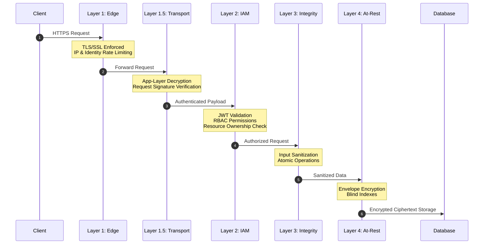

# Security Architecture Overview

This document provides a high-level overview of the security measures implemented in the API template. It serves as a central index for all security-related documentation and details our defense-in-depth strategy.

---

## 1. Security Documentation Index

*   **[Authentication Model](security/AUTHENTICATION.md)**: Details JWT access tokens, refresh token rotation, and reuse detection.
*   **[Authorization Model](security/AUTHORIZATION.md)**: Details the permission-based RBAC system and resource ownership verification.
*   **[Envelope Encryption](security/ENVELOPE_ENCRYPTION_ARCHITECTURE.md)**: Explains how PII is secured at rest using row-level encryption and blind indexes.
*   **[Row-Level Security](security/ROW_LEVEL_SECURITY.md)**: Details the PostgreSQL-level data access enforcement.
*   **[Application-Layer Security](security/APPLICATION_LAYER_SECURITY.md)**: Details ALE (encryption) and Request Signing (Asymmetric) for transport-layer defense.
*   **[Security Hardening Checklist](security/audits/SECURITY_HARDENING_CHECKLIST.md)**: The vulnerability classes this template defends against and the controls in place — never regress these.
*   **[EF Core Performance & Security](performance/EFCORE_ADVANCED_PERFORMANCE_TOPICS.md)**: Best practices for data access and query parameterization.
*   **[Stripe Payments Integration](features/PAYMENTS_STRIPE.md)**: Explains secure card processing, anti-tampering, webhook validation, and idempotency protection.

---

## 2. Defense in Depth Strategy

The API employs multiple layers of security to ensure data integrity and confidentiality.

### Layer 1: Edge Security & Network
*   **TLS/SSL**: All external traffic is enforced over HTTPS.
*   **Rate Limiting**: Partitioned rate limiting (IP-based for anonymous, Identity-based for authenticated) prevents DOS and brute-force attacks, with stricter dedicated policies on authentication and registration endpoints.

### Layer 1.5: Application-Layer Transport Security
*   **Application-Layer Encryption (ALE)**: Request and response bodies are encrypted using AES-256-GCM, protecting data even if TLS is terminated early or compromised.
*   **Request Signing (Asymmetric)**: All requests are cryptographically signed using per-device ECDSA P-256 keys. The system supports robust verification, including DER-to-P1363 signature conversion and both Raw and X.509 public key formats.
*   **Security Metadata Endpoint**: Provides dynamic SSL pinning hashes, ALE public keys, and security policies to the mobile application.

### Layer 2: Identity & Access Management (IAM)
*   **Permission-Based Authorization**: Moving beyond simple roles, the system uses granular permissions (e.g., `orders:view`, `projects:update`) bundled into grant roles by a startup-validated **Role Catalog**. Default roles (`Admin`, `ReadWrite`, `ReadSelf`, `Payments`) ship out of the box; custom roles are defined via the `Rbac` configuration section, and only catalog-defined roles are usable ([Authorization](security/AUTHORIZATION.md) §4).
*   **Automated Resource Ownership Verification**: Custom authorization handlers automatically verify that a user owns the resource they are accessing (e.g., matching a JWT claim against a route parameter) before the request reaches business logic. This provides robust protection against IDOR (Insecure Direct Object Reference) attacks.
*   **Short-lived JWTs**: Access tokens expire in 15 minutes, limiting the window for stolen tokens.
*   **Refresh Token Rotation**: Every refresh token usage generates a new one.
*   **Reuse Detection**: Presenting a previously used refresh token triggers an immediate revocation of the entire token family, neutralizing stolen token chains.
*   **Authenticated-Identity-Only Pattern**: User IDs are extracted exclusively from JWT claims in the Presentation layer. Request DTOs do not contain `UserId` fields, preventing spoofing.

### Layer 3: Data Integrity
*   **Input Sanitization**: A global `IEndpointFilter` using `HtmlSanitizer` automatically strips malicious HTML/JS from all incoming request DTOs, preventing XSS attacks at the source.
*   **Secure Exception Disclosure**: A centralized `IExceptionHandler` prevents the broadcasting of internal exception messages, stack traces, and system details. Only explicitly whitelisted `DomainException` messages are returned to clients via the standardized `ProblemDetails` format.
*   **Atomic Updates**: Critical counters and single-use artifacts (e.g., server-issued order records) use atomic database operations (`ExecuteUpdateAsync`) to prevent race conditions (Double Spending / Lost Updates).
*   **Source of Truth Validation**: Sensitive operation parameters (e.g., payment amount, target resource) are parsed from the validated server-side record, never from client-provided request bodies.
*   **Payment Verification (Stripe)**: External payment collection complies with PCI-DSS by delegating card data handling directly to Stripe. Webhook endpoints (`/v1/payments/stripe-webhook`) verify payload integrity using Stripe signatures. Server-side validation matches payment intent metadata and amounts directly against database records, while double-spending is blocked by checking for existing ledger entries and atomic invalidation of single-use order records.

### Layer 4: Data at Rest (Encryption)
*   **Envelope Encryption**: Every user record is encrypted with a unique Data Encryption Key (DEK). DEKs are encrypted with a master Key Encryption Key (KEK).
*   **Non-deterministic Encryption**: Randomized nonces ensure that identical PII results in unique ciphertexts.
*   **Blind Indexes**: Searchable PII is hashed using HMAC-SHA256 (keyed hashing) to allow secure lookups without decrypting the entire database.
*   **Row-Level Security**: PostgreSQL RLS policies restrict row visibility to the authenticated session even if application-layer checks are bypassed.

### Layer 5: Observability & Secrets
*   **Sensitive Data Masking**: A custom Serilog destructuring policy recursively masks PII (passwords, emails, names) in logs.
*   **Strict Options Validation**: All security configurations (JWT, Encryption, Hashing) use Options Validation on startup to ensure secrets meet complexity requirements (e.g., JWT signing key >= 32 characters).

---

## 3. Reporting Vulnerabilities

If you discover a security vulnerability, please report it via the project's security policy or contact the lead maintainer directly. Do not open public issues for security vulnerabilities.
