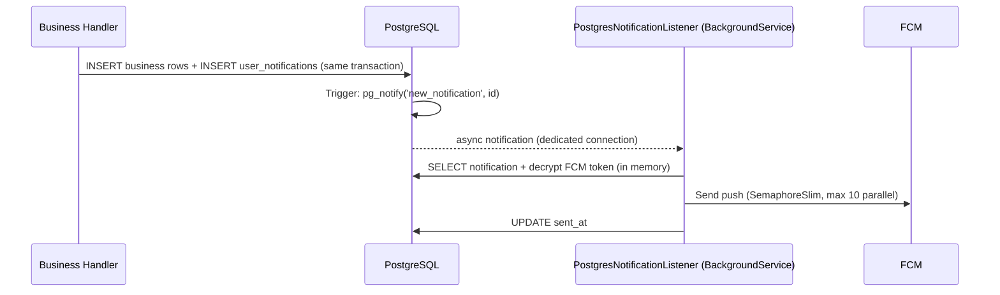

# Notifications (Push Delivery)

This document describes the asynchronous push-notification system: a transactional outbox in PostgreSQL, low-latency signaling via `LISTEN/NOTIFY`, and delivery through Firebase Cloud Messaging (FCM). The architectural rationale is recorded in [ADR 0002](../architecture/adrs/0002-asynchronous-notification-delivery.md).

## 1. Architecture

### Components
- **Outbox tables**: `user_notifications` the notification payload is written **in the same database transaction** as the business change (at-least-once guarantee; nothing is lost if the worker is down).
- **Trigger**: an `AFTER INSERT` trigger calls `pg_notify('new_notification', ...)` with the notification ID. The trigger is created in a migration (`migrationBuilder.Sql`, see [Database Code-First Guide](../architecture/DATABASE_CODE_FIRST.md) §5).
- **`PostgresNotificationListener`**: an ASP.NET Core `BackgroundService` holding a **dedicated, non-pooled** Npgsql connection executing `LISTEN new_notification`.
- **Catch-up phase**: on startup, the listener scans for unsent notifications from the last 7 days and dispatches them covering downtime windows.
- **Concurrency control**: a `SemaphoreSlim` (default 10) bounds parallel FCM calls to avoid resource exhaustion and Firebase rate limits.

## 2. FCM Token Handling

- Tokens are registered via `POST /v1/users/firebase/token` (authenticated) and stored in `user_firebase_identity`.
- **Tokens are PII**: encrypted at rest, decrypted only in worker memory during dispatch, masked in logs.
- On FCM "unregistered/invalid token" errors, the token row is deleted (self-cleaning).
- On logout, the client unregisters its token.

## 3. Delivery Semantics & Idempotency

- **At-least-once**: the outbox + catch-up design can redeliver after a crash between "FCM send" and "mark sent". Notifications must therefore be **idempotent for the user experience** (e.g., collapse keys / tags for replaceable notifications).
- `sent_at` is set with an atomic `ExecuteUpdateAsync`; a NULL `sent_at` is the only "pending" signal.

## 4. In-App Notification Feed

The same `user_notifications` rows back the in-app notifications screen:
- **Endpoint**: `GET /v1/users/notifications` (paginated, never client-cached since freshness matters here).
- RLS policy restricts rows to the owner (`user_id = get_current_user_id()`).

## 5. Rules

1. Never send a push directly from a request handler. Always write to the outbox and let the worker deliver.
2. The notification INSERT must share the business operation's transaction.
3. The listener's connection must never come from the pooled DbContext.
4. New notification types: add a `type` discriminator value + payload contract, and document the client-side handling in the mobile template.
