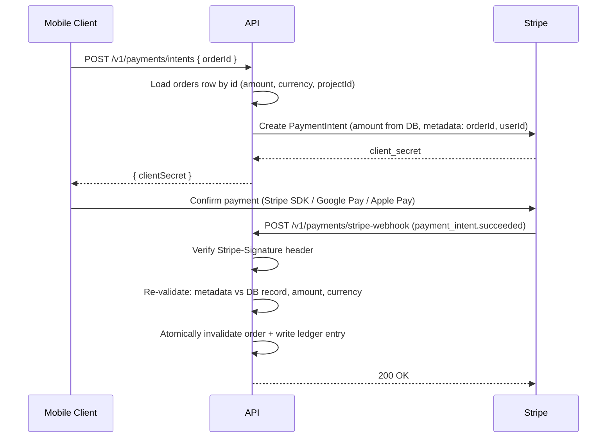

# Payments: Stripe Integration

This document describes the secure card-payment flow using Stripe **PaymentIntents**, including webhook verification, server-side source-of-truth validation, idempotency, and double-spend prevention.

## 1. Principles

1. **PCI-DSS by delegation**: card data never touches the API. The mobile client collects payment details via Stripe's SDK (or Google Pay / Apple Pay tokens routed through Stripe); the API only handles PaymentIntent IDs, amounts, and statuses.
2. **Server is the source of truth for the amount**: the amount charged comes from the server-side record — the single-use `orders` row created server-side before payment. **Never** from the client request (see [Security Hardening Checklist](../security/audits/SECURITY_HARDENING_CHECKLIST.md) §1).
3. **Nothing is fulfilled until the webhook says so.**

## 2. Payment Flow

## 3. Creating the PaymentIntent

- **Endpoint**: `POST /v1/payments/intents` (authenticated, `PaymentProcess` policy).
- The handler loads the referenced server-side order record, and creates the PaymentIntent with:
  - `amount`/`currency` **from the database record**;
  - `metadata`: `orderId`, `userId`, `projectId` are used by the webhook to correlate and re-validate;
  - an **idempotency key** derived from the order ID (`payment-intent:{orderId}`), so client retries cannot create duplicate intents.
- Expired or already-invalidated orders are rejected with `409`.

## 4. Webhook Verification (`POST /v1/payments/stripe-webhook`)

The webhook endpoint is anonymous at the HTTP layer but authenticated cryptographically:

1. **Signature verification**: the `Stripe-Signature` header is verified with `EventUtility.ConstructEvent(rawBody, signatureHeader, webhookSecret)`. The **raw** request body must be used (the endpoint is excluded from ALE/signing middleware and body-rewriting filters via `[AllowPlaintext]`/`[SkipRequestSigning]`).
2. **Re-validation against the database** (never trust the event payload alone):
   - The `orderId` in metadata must reference an existing, non-invalidated record.
   - `amount_received` and `currency` must equal the database record's values.
3. **Double-spend prevention**:
   - The order is invalidated **atomically** (`TryInvalidateAsync` via `ExecuteUpdateAsync`); if the flag was already set, the event is treated as a duplicate and acknowledged without side effects.
   - A ledger uniqueness check on the PaymentIntent ID blocks replayed or duplicated events.
4. **Fulfillment**: only after all checks pass are the ledger entry, counters (atomic increments), and outbox notification written and this must happen in one transaction.
5. **Response discipline**: return `200` for handled and safely-ignorable events; return `4xx/5xx` only when a retry from Stripe could succeed later. Unhandled event types are logged and acknowledged.

## 5. Configuration

| Setting | Source | Notes |
|---|---|---|
| `Stripe:SecretKey` | `STRIPE_SECRET_KEY` env var / secret manager | Never in `appsettings.json` |
| `Stripe:WebhookSecret` | `STRIPE_WEBHOOK_SECRET` env var / secret manager | Per-endpoint secret from the Stripe dashboard |

Use Stripe **test mode** keys in Development; the Stripe CLI (`stripe listen --forward-to localhost:PORT/v1/payments/stripe-webhook`) replays webhooks locally.

## 6. Rules

1. Never accept an amount, currency, or payee from the client request.
2. Never fulfill on the client's "payment succeeded" callback,  only on the verified webhook.
3. Webhook handlers must be idempotent; Stripe retries events.
4. All Stripe API calls that create objects must pass an idempotency key.
5. Refunds/disputes follow the same pattern: verify webhook → re-validate against ledger → atomic state change.
