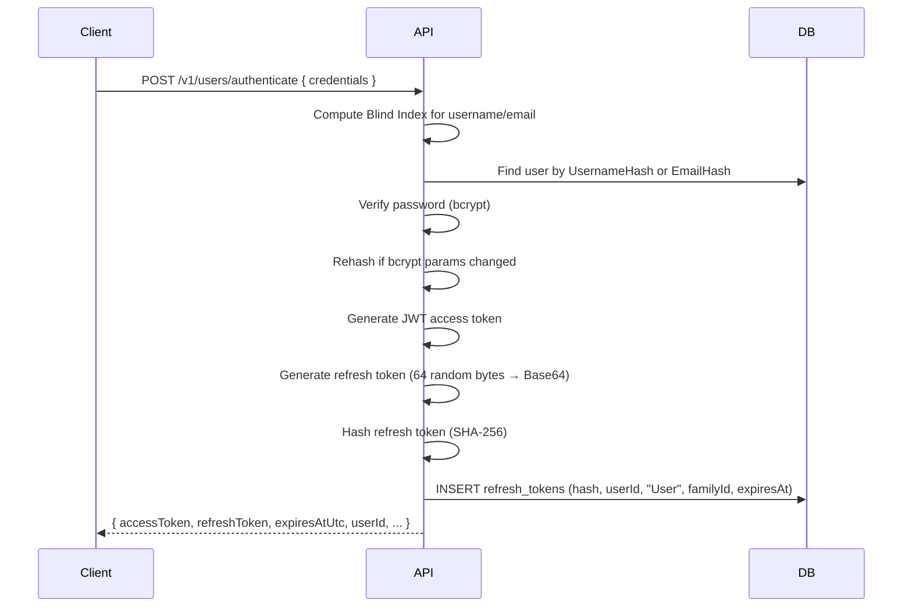
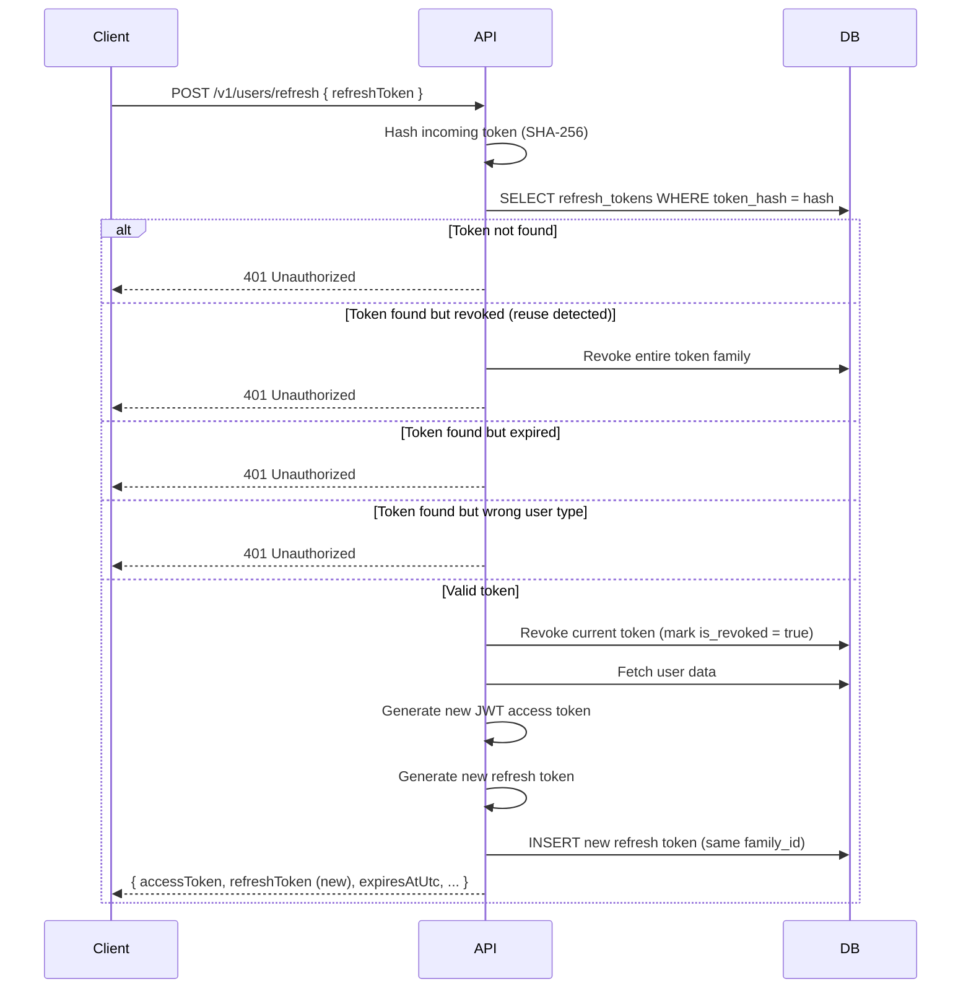

# Authentication

This document describes how authentication works in the API. The template ships with one primary principal type (**User** — the mobile app consumer) and supports additional principal types (e.g., member/admin users for a companion app) via the same security model: short-lived JWT access tokens paired with long-lived, rotatable refresh tokens discriminated by `user_type`.

---

## Table of Contents

- [Overview](#overview)
- [Token Types](#token-types)
- [Authentication Flows](#authentication-flows)
- [Token Refresh](#token-refresh)
- [Logout](#logout)
- [Refresh Token Security](#refresh-token-security)
- [Configuration](#configuration)
- [Infrastructure Security & Rate Limiting](#infrastructure-security--rate-limiting)
- [API Reference](#api-reference)
- [Architecture](#architecture)

---

## Overview

The API uses a **two-token authentication model**:

1. A **JWT access token** authorises API requests. It is short-lived (default: 15 minutes) and stateless — the server validates it using its signing key without consulting the database.
2. A **refresh token** is an opaque, cryptographically random string used solely to obtain a new access token without re-entering credentials. It is long-lived (default: 30 days) and stateful — the server tracks it in the `refresh_tokens` database table.

This separation limits the blast radius of a leaked access token (max 15-minute window) while providing a seamless user experience through silent re-authentication.

---

## Token Types

| Property | Access Token (JWT) | Refresh Token |
|---|---|---|
| **Format** | JSON Web Token (signed, not encrypted) | Opaque Base64 string (64 bytes / 512 bits) |
| **Lifetime** | 15 minutes | 30 days |
| **Storage (server)** | Not stored — validated via signature | SHA-256 hash stored in `refresh_tokens` table |
| **Storage (client)** | In-memory or secure storage | `flutter_secure_storage` (mobile) |
| **Usage** | `Authorization: Bearer <token>` header on every request | `POST /refresh` body to obtain a new token pair |
| **Revocable** | No (expires naturally) | Yes (explicit revocation via logout or reuse detection) |

### JWT Access Token Claims

| Claim | Description |
|---|---|
| `sub` | User ID (numeric string) |
| `unique_name` | Username |
| `uid` | User ID (numeric string, duplicate for convenience) |
| `role` | The principal type, e.g. `"User"` (add roles per companion app, e.g. `"AdminUser"`) |
| `type` | Optional sub-role (e.g. `"Admin"`, `"Manager"`, `"Member"`) |
| `iss` | `app-api` (configurable) |
| `aud` | `app-mobile-client` (configurable) |
| `nbf` | Not-before timestamp |
| `exp` | Expiration timestamp |

Add resource-scoping claims as needed for ownership checks (see [Authorization](AUTHORIZATION.md)) — e.g., an `orgId` claim for organization-scoped users. Keep the JWT small: only claims the authorization layer actually reads.

### Signing Algorithm

The template defaults to **HMAC-SHA256 (HS256)**, which is appropriate when a single service both issues and validates tokens. If multiple services must validate tokens, switch to an asymmetric algorithm (**RS256** or **ES256**) so validators only hold the public key and cannot mint tokens.

---

## Authentication Flows

All authentication endpoints are anonymous (`AllowAnonymous`) and return both an access token and a refresh token upon successful credential validation.

### User Authentication

**Endpoint:** `POST /v1/users/authenticate`

**Request:**
```json
{
  "usernameOrEmail": "john@example.com",
  "password": "s3cur3P@ss"
}
```

**Response (200 OK):**
```json
{
  "accessToken": "eyJhbGciOiJIUzI1NiIs...",
  "refreshToken": "a1b2c3d4e5f6...base64...",
  "expiresAtUtc": "2026-04-30T19:15:00Z",
  "userId": 123456789,
  "username": "john_doe",
  "email": "john@example.com"
}
```

**Flow:**



**Constant-time behaviour:** When the user is not found, a dummy bcrypt verification is still performed so response time does not leak account existence (see [Security Hardening Checklist](audits/SECURITY_HARDENING_CHECKLIST.md) §4).

### Additional Principal Types

Companion apps (e.g., an admin/back-office app) follow the identical flow on their own endpoints (e.g., `POST /v1/admin/users/authenticate`). The JWT carries the corresponding `role` claim, and the refresh token row is stored with the matching `user_type` discriminator. A refresh token presented to the wrong principal type's endpoint is rejected with `401`.

### Google OAuth (Users)

**Endpoint:** `POST /v1/users/google/authenticate`

Google authentication accepts a Google ID Token, validates it against Google's public keys, and either links the Google identity to an existing user (by email) or creates a new one. The `sub` claim from the ID token is stored hashed. The response shape is the same as standard User authentication, including a refresh token.

---

## Token Refresh

When the access token approaches expiry, the client exchanges the refresh token for a new token pair **without requiring credentials**.

**Endpoint:** `POST /v1/users/refresh`

The endpoint is anonymous — the refresh token itself serves as the authentication credential.

**Request:**
```json
{
  "refreshToken": "a1b2c3d4e5f6...base64..."
}
```

**Response (200 OK):**
```json
{
  "accessToken": "eyJhbGciOiJIUzI1NiIs...(new)...",
  "refreshToken": "m7n8o9p0...base64...(new)...",
  "expiresAtUtc": "2026-04-30T19:30:00Z",
  "userId": 123456789,
  "username": "john_doe",
  "email": "john@example.com"
}
```

**Flow:**



> **Important:** The old refresh token is immediately invalidated. The client must store and use the **new** refresh token from the response. Each refresh token is single-use.

---

## Logout

Logout explicitly revokes the refresh token, preventing further silent re-authentication from that session.

**Endpoint:** `POST /v1/users/logout` (requires a valid access token)

**Request:**
```json
{
  "refreshToken": "a1b2c3d4e5f6...base64..."
}
```

**Response:** `204 No Content`

The endpoint is idempotent — revoking an already-revoked or non-existent token silently succeeds. The access token remains valid until it expires naturally (max 15 minutes).

---

## Refresh Token Security

### Token Rotation

Every time a refresh token is used, it is **consumed** (revoked) and a new one is issued. This is called **token rotation**. The new token inherits the same `family_id` as the old one, linking them to the original login session.

```
Login → Token A (family: abc-123)
Refresh → Token A revoked, Token B issued (family: abc-123)
Refresh → Token B revoked, Token C issued (family: abc-123)
```

### Reuse Detection

If a refresh token that has already been revoked is presented again, the system interprets this as a **token theft scenario** — an attacker is replaying a token that the legitimate user has already rotated.

In this case, the **entire token family is revoked**, forcing all sessions derived from that login to re-authenticate:

```
Attacker replays Token A (already revoked)
→ Tokens A, B, C all revoked
→ 401 "Refresh token reuse detected. All sessions revoked."
→ Legitimate user must log in again
```

This is a deliberate security tradeoff: a small inconvenience (one re-login) to prevent an attacker from maintaining persistent access.

### Token Storage

| Layer | What is stored | How |
|---|---|---|
| **Database** | SHA-256 hash of the refresh token | `refresh_tokens.token_hash` column, unique index |
| **Client (Flutter)** | Raw refresh token | `flutter_secure_storage` (Keychain on iOS, Keystore on Android) |

The raw refresh token **never** appears in server logs, database records, or error messages. Only the hash is persisted. SHA-256 is sufficient (vs. bcrypt) because refresh tokens are high-entropy random strings (512 bits), not user-chosen passwords susceptible to dictionary attacks.

### Database Schema

```
refresh_tokens
├── id              BIGINT       (PK, time-based snowflake)
├── token_hash      VARCHAR(64)  (unique index, SHA-256 hex)
├── user_id         BIGINT       (the principal's ID)
├── user_type       VARCHAR(20)  (principal type discriminator, e.g. "User")
├── family_id       UUID         (groups rotated tokens, indexed)
├── expires_at      TIMESTAMP    (UTC)
├── is_revoked      BOOLEAN      (default false)
└── created_at      TIMESTAMP    (UTC)
```

**Indexes:**
- Unique on `token_hash` (lookup by hash)
- On `family_id` (bulk revocation)
- Composite on `(user_id, user_type)` (revoke-all-for-user)

The table is created via an EF Core migration (see [Database Code-First Guide](../architecture/DATABASE_CODE_FIRST.md)).

---

## Configuration

Settings are in `appsettings.json` under the `Jwt` section:

```json
{
  "Jwt": {
    "Issuer": "app-api",
    "Audience": "app-mobile-client",
    "SigningKey": "",
    "AccessTokenMinutes": 15,
    "RefreshTokenDays": 30
  }
}
```

| Setting | Description | Default |
|---|---|---|
| `Issuer` | JWT `iss` claim | `app-api` |
| `Audience` | JWT `aud` claim | `app-mobile-client` |
| `SigningKey` | HMAC-SHA256 key (≥ 32 chars, injected via `JWT_SIGNING_KEY` env var) | — |
| `AccessTokenMinutes` | JWT lifetime | 15 |
| `RefreshTokenDays` | Refresh token lifetime | 30 |

The signing key is never stored in `appsettings.json` in production — it is injected via the `JWT_SIGNING_KEY` environment variable (or, preferably, a secret manager). Options validation rejects startup with a key shorter than 32 characters.

---

## Infrastructure Security & Rate Limiting

The API implements a **Partitioned Rate Limiting Strategy** to protect against brute-force attacks and resource exhaustion.

### Partitioning Rules

Requests are partitioned based on the user's authentication state:

1. **Authenticated Users**: The rate limit is applied per **User Identity** (`SubjectId`). This ensures that one user cannot consume all API resources, regardless of their IP address.
2. **Anonymous Users**: The rate limit is applied per **Remote IP Address**. This prevents unauthenticated attackers from overwhelming endpoints like `/authenticate` or `/register`.

### Configuration Defaults

| Policy | Window | Permit Limit | Applied to |
|---|---|---|---|
| **Global** | 60 seconds | 100 requests | All endpoints (queue limit 0 → immediate `429`) |
| **`auth`** | 5 minutes | 200 requests per IP | `/authenticate` and `/refresh` endpoints |
| **`account_creation`** | 1 hour | 50 requests per IP | Registration endpoints |

The global limits are configurable via environment variables:
- `RATE_LIMITING_PERMIT_LIMIT`
- `RATE_LIMITING_WINDOW_SECONDS`

---

## API Reference

### Users

| Method | Path | Auth | Description |
|---|---|---|---|
| POST | `/v1/users/register/send-code` | Anonymous | Send signup verification code to email |
| POST | `/v1/users` | Anonymous | Register a new user (requires verification code) |
| POST | `/v1/users/authenticate` | Anonymous | Login with username/email + password |
| POST | `/v1/users/google/authenticate` | Anonymous | Login with Google ID Token |
| POST | `/v1/users/refresh` | Anonymous | Exchange refresh token for new token pair |
| POST | `/v1/users/logout` | Required | Revoke refresh token |
| POST | `/v1/users/change-password` | Required | Change password (verifies old password) and revoke all active sessions |

Additional principal types replicate this table under their own route prefix.

### Error Responses

All authentication failures return `401 Unauthorized` with a descriptive message:

| Scenario | Message |
|---|---|
| Invalid credentials | `Invalid credentials provided.` |
| Invalid refresh token | `Invalid refresh token.` |
| Expired refresh token | `Refresh token has expired.` |
| Reuse detected | `Refresh token reuse detected. All sessions revoked.` |
| Wrong user type | `Invalid refresh token.` |

---

## Architecture

The authentication system follows the project's clean architecture:

```
┌─────────────────────────────────────────────────────────────────┐
│  AppApi (Presentation)                                          │
│  ├── UsersEndpoints.cs         → /authenticate, /refresh, /logout│
│  └── Program.cs                → DI registration, JWT middleware │
├─────────────────────────────────────────────────────────────────┤
│  Application (Use Cases)                                        │
│  ├── AuthenticateUserHandler   → Validate creds, issue tokens   │
│  ├── AuthenticateGoogleUserHandler                              │
│  ├── RefreshUserTokenHandler   → Validate, rotate, reuse detect │
│  ├── LogoutUserHandler         → Revoke refresh token           │
│  ├── IJwtTokenService          → CreateToken, Generate, Hash    │
│  ├── IRefreshTokenRepository   → CRUD + family/user revocation  │
│  └── IRefreshTokenSettings     → RefreshTokenDays config        │
├─────────────────────────────────────────────────────────────────┤
│  Infrastructure (Implementations)                               │
│  ├── JwtTokenService           → JWT signing + SHA-256 hashing  │
│  ├── JwtOptions                → Config (implements settings)   │
│  ├── RefreshTokenRepository    → EF Core / PostgreSQL           │
│  └── BCryptPasswordHasher      → Password verification          │
├─────────────────────────────────────────────────────────────────┤
│  Domain (Entities)                                              │
│  ├── User                      → Consumer users                 │
│  └── RefreshToken              → Hashed token + family tracking │
└─────────────────────────────────────────────────────────────────┘
```

The Application layer depends only on abstractions (`IJwtTokenService`, `IRefreshTokenRepository`, `IRefreshTokenSettings`). The Infrastructure layer provides the concrete implementations, wired together in `Program.cs`. This ensures that authentication logic is testable and independent of the specific JWT library or database.
