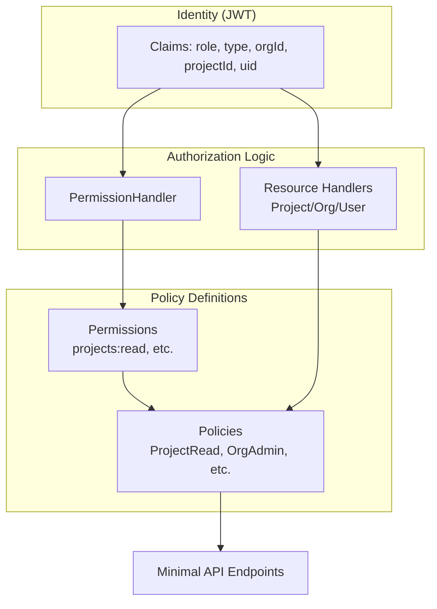
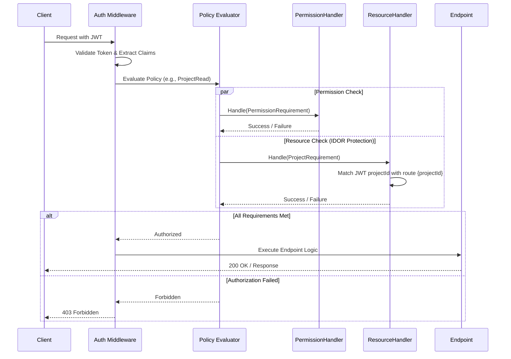

# Authorization Model

This document describes the **Permission-Based Role-Based Access Control (RBAC)** system implemented in the API. The system ensures that users can only perform actions they are permitted to do and only on resources they own.

The template ships with a two-level **example hierarchy** that fits most multi-tenant CRUD products — keep the mechanism, rename the entities to your domain:
- **Organization** (parent tenant, e.g., a company) → **Project** (child resource — rename to whatever your product's unit is: a store, a team, a workspace, a property, ...)
- Principals: `User` (consumer/end user), `MemberUser` (works within one Project), `OrgUser` (owns one or more Organizations; sub-type `Admin`).

---

## 1. Core Principles

The authorization model is built on three pillars:

1.  **Permissions over Roles**: Authorization gating is performed against granular permissions (e.g., `projects:read`, `analytics:view`) rather than broad roles. This allows for flexible mapping of permissions to roles without changing endpoint code.
2.  **Stateless Resource Ownership**: JWT claims carry enough context (`orgId`, `projectId`, `uid`) to verify resource ownership (IDOR protection) at the authorization layer without extra database lookups in most cases.
3.  **Decoupled Enforcement**: Authorization logic is separate from both business logic (Application layer) and database-level security (RLS).

---

## 2. RBAC Architectural Overview

The following diagram illustrates how JWT claims are mapped to permissions and policies through specialized handlers, eventually protecting the API endpoints.



---

## 3. Permission Structure

Permissions are defined as strongly-typed constants in `Domain.Constants.SecurityConstants`. They follow a `resource:action` naming convention:

### Project Permissions
- `projects:read`: View project details and activity history.
- `projects:write`: Create new projects (typically Org Admin).
- `projects:update`: Edit project configuration.
- `projects:delete`: Remove projects.

### Analytics Permissions
- `analytics:view`: Access aggregated performance data.

### Order & Payment Permissions
- `orders:view`: See personal (consumer) or project-scoped (member) order history.
- `orders:manage`: Create and invalidate single-use, server-side order records (member side).
- `payments:process`: Pay against a server-issued order (consumer side).

Add new `resource:action` constants per feature — see Section 8.

---

## 4. Policy-Based Gating

Endpoints are protected using standardized ASP.NET Core Authorization Policies. These policies combine **Permission Requirements** with **Resource Ownership Handlers**.

| Policy | Permission Required | Resource Verification |
|---|---|---|
| `UserSelf` | (Implicit via ID) | Verifies JWT `uid` matches route `{userId}` |
| `ProjectRead` | `projects:read` | Verifies JWT `projectId` matches route `{projectId}` |
| `ProjectWrite` | `projects:update` | Verifies JWT `projectId` matches route `{projectId}` |
| `ProjectAnalytics` | `analytics:view` | Verifies JWT `projectId` matches route `{projectId}` |
| `OrderManage` | `orders:manage` | Verifies JWT `projectId` matches route `{projectId}` (member-side creation) |
| `PaymentProcess` | `payments:process` | Explicitly requires `User` role (consumer-side payment) |
| `OrgAdmin` | `projects:write` | Verifies JWT `orgId` matches route `{orgId}` |
| `OrgUserSelf` | (Implicit via ID) | Verifies JWT `uid` matches route `{orgUserId}` |
| `MemberUserManagement`| (Implicit via Hierarchy)| Verifies JWT `uid` matches `{memberUserId}` OR requester owns the project's Organization |
| `OrgAdminOnly` | (Type: Admin) | Restricts access to Org owners with Admin status |
| `OrgProjectOwner` | (Implicit via Project) | Restricts access to Org Users who own the project (via ProjectRequirement) |

---

## 5. Authorization Handlers

The Infrastructure layer implements custom `AuthorizationHandler<TRequirement>` classes to enforce these policies.

### PermissionHandler
Maps the `role` and `type` claims in the JWT to specific permissions.
- **OrgAdmin** (OrgUser + Type: Admin): Granted all permissions.
- **MemberUser**: Granted `projects:read`, `analytics:view`, `orders:manage`, `orders:view`.
- **User**: Granted `projects:read`, `orders:view`, `payments:process`.

### Resource Handlers (IDOR Protection)
These handlers provide automated "Deep Gating" by comparing the user's secure JWT claims against the resource IDs in the URL.

#### Hierarchical Resource Verification
In many cases, verification is stateless (e.g., matching a JWT `projectId` to a route `{projectId}`). However, for **Org owners**, the system performs hierarchical verification to support multi-organization ownership:

*   **Relationship**: `OrgUser` (Owner) -> `Organization` (Tenant) -> `Project` (child resource).
*   **Verification Flow**: 
    1.  An `OrgUser` provides a `{projectId}` in the URL.
    2.  The `ProjectResourceHandler` fetches the `Project` record from the database to identify its parent `OrgId`.
    3.  The handler then checks if that `OrgId` is present in the user's JWT `orgId` claims.
*   **Rationale**: This allows a single `OrgUser` to own multiple legal entities (Organizations), each with its own set of projects, while keeping the API routes flat and easy to use (e.g., `/v1/projects/{projectId}`).

#### Route Parameter Naming Conventions
For the automated resource handlers to work, the URL templates in the Minimal API endpoint files **MUST** use the following exact parameter names:

| Parameter Name | Used By | Description |
|---|---|---|
| **`{projectId}`** | `ProjectResourceHandler` | The unique ID of the project. |
| **`{userId}`** | `UserResourceHandler` | The unique ID of the consumer user. |
| **`{orgId}`** | `OrgResourceHandler` | The unique ID of the organization. |
| **`{orgUserId}`** | `OrgUserResourceHandler` | The unique ID of the org user (for self-service). |
| **`{memberUserId}`** | `MemberUserResourceHandler` | The unique ID of the member user. |

**Example:**
```csharp
// CORRECT: Handler will pick up {projectId} and verify it against JWT
v1.MapGroup("/projects/{projectId}/analytics")

// INCORRECT: Handler will ignore {id} and no automated check will occur
v1.MapGroup("/projects/{id}/analytics")
```

---

## 6. Two-Actor Payment Authorization

Order-based payments involve two distinct actors under different policies (see [Payments](../features/PAYMENTS_STRIPE.md) for the full flow):

1.  **Order Creation (Member Actor)**:
    - **Endpoint**: `POST /v1/projects/{projectId}/orders`
    - **Policy**: `OrderManage`
    - **Gating**: Requires `orders:manage` permission AND verifies that the Member User belongs to `{projectId}`.

2.  **Payment (Consumer Actor)**:
    - **Endpoint**: `POST /v1/payments/intents`
    - **Policy**: `PaymentProcess`
    - **Gating**: Requires the user to be logged in with the `User` role. The security is enforced by the **server-issued, single-use order record**, which acts as the server-side source of truth for the Project ID and Amount.

---

## 7. Member User Management Authorization

Managing member users (such as listing or updating them) has specific authorization rules:

1.  **Listing Member Users**:
    - **Endpoint**: `GET /v1/projects/{projectId}/users`
    - **Policy**: `OrgProjectOwner`
    - **Gating**: Requires `OrgUser` role and checks that the project's parent `OrgId` is in the user's JWT `orgId` claims. Member users and consumer users are blocked.

2.  **Modifying Member Users**:
    - **Endpoints**: `PUT /v1/projects/users/{memberUserId}`, `DELETE /v1/projects/users/{memberUserId}`
    - **Policy**: `MemberUserManagement`
    - **Gating**: Verifies the JWT `uid` matches `{memberUserId}` OR the requester is an `OrgUser` whose organization owns the project.

---

## 8. Adding New Permissions or Roles (Configuration Points)

This section is the extension contract for your product's features (see also [Extending the Template](../architecture/EXTENDING_THE_TEMPLATE.md)).

### To add a new Permission:
1.  Add the `resource:action` constant to `Domain.Constants.SecurityConstants`.
2.  Update `Infrastructure.Security.Handlers.PermissionHandler` to map the new permission to existing roles.
3.  Register a new policy in `AppApi.Extensions.SecurityExtensions`.

### To add a new Role:
1.  Add the constant to `Domain.Constants.SecurityConstants`.
2.  Update the `PermissionHandler` switch expression to define the role's permission set.
3.  Update the `Authenticate` and `Refresh` handlers in the Application layer to provision the new role claim.

### To rename the example hierarchy:
Rename `Project`/`MemberUser` (entities, permissions, policies, route parameters, JWT claim, tables, RLS functions) consistently to your domain's terms in a single change; the verification mechanism itself never changes.

## 9. Request Authorization Flow

This sequence diagram illustrates the request lifecycle, specifically how the system performs parallel checks for both granular permissions and resource ownership (IDOR protection).



---

## 10. Relationship with Row-Level Security (RLS)

While RBAC is the primary gatekeeper at the API level, **Row-Level Security (RLS)** in PostgreSQL provides a final, independent layer of defense. RBAC ensures the user is *authorized* to call the endpoint; RLS ensures that even if an authorization check is bypassed, the database will only return rows belonging to the authenticated session (`app.current_user_id`).

This is enforced by the `RlsInterceptor` (an EF Core `DbCommandInterceptor`), which executes a **separate, parameterized** command on the same connection and transaction immediately before each primary command:

```sql
SELECT set_config('app.current_user_id', @userId, true);
```

The user ID is always passed as a **parameter** (never string-interpolated — that would open a SQL injection vector via the identity claim), and the third argument `true` makes the setting **transaction-local**, so the identity context is automatically discarded when the transaction ends and can never leak to another request reusing the pooled connection. See [RLS Deep Dive](RLS_DEEP_DIVE.md) for why a separate command is used instead of prepending SQL to the main query. Database-level policy checks use `STABLE` functions to ensure high performance under load.

---

## 11. Best Practices

1.  **Always use Policies**: Never check roles or IDs manually inside an endpoint lambda. Use `.RequireAuthorization(SecurityConstants.Policies.X)`.
2.  **Resource-Aware Routing**: Ensure your routes use the standard parameter names (see Section 5) so the automated resource handlers can pick them up.
3.  **Stateless First**: Design your authorization logic to rely on JWT claims whenever possible. Only use repository lookups in handlers (like `ProjectResourceHandler` for OrgUsers) when absolute verification across entities is required.
