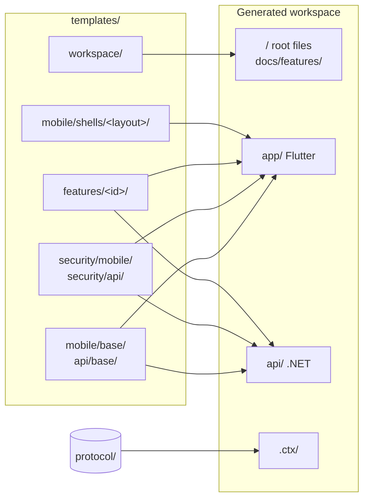
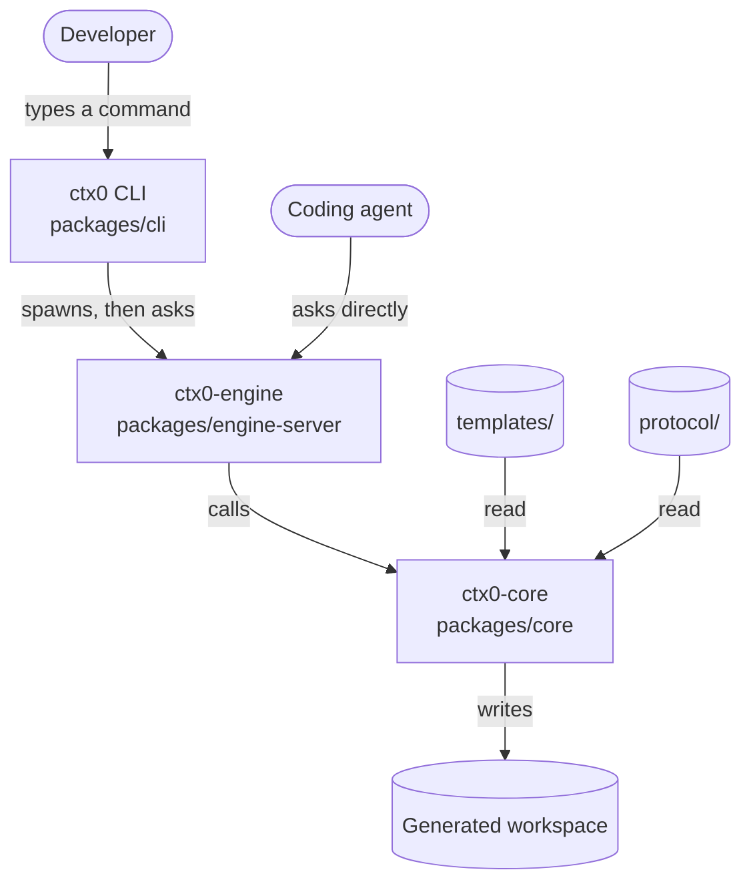

# ctx.0 system architecture

## What it does

Every project that pairs a mobile app with a backend needs the same foundation: login,
token refresh, encrypted fields, per-user data isolation, GDPR export and erasure,
translations, navigation. Building it takes weeks, and the security parts are easy to get
wrong.

ctx.0 writes that foundation. You choose features, and it generates a Flutter app and a
.NET API that already speak an encrypted, signed protocol, with tests.

```
$ ctx0 create workspace Acme --features auth profile notes
```

The result is a directory that builds and runs:

```
acme/
  app/    Flutter application
  api/    .NET API
  .ctx/   record of what was generated
```

Generated projects have no runtime dependency on ctx.0.

## Features are folders

A feature is a directory of ordinary source files. This is all of `notes`:

```
templates/api/features/notes/
  feature.json
  agents.md
  src/Domain/Notes/Note.cs
  src/Api/Endpoints/NotesEndpoints.cs
  src/Infrastructure/Gdpr/NotesPersonalData.cs
  src/Infrastructure/Persistence/Configurations/NoteConfiguration.cs
  tests/Ctx.Tests/NotesRlsEnvelopeTests.cs
```

Those C# files sit where they belong in the generated API. ctx.0 copies a base project,
then copies each selected feature folder on top of it.

The copy rewrites one thing. Templates are written against the placeholder name `CtxApp`,
which becomes your application name in file contents and in file paths, so
`CtxApp.csproj` becomes `Acme.csproj`. There is no templating language in the source
files, so they compile and can be tested as they are.

Each folder carries a `feature.json`, abridged here:

```json
{
  "id": "notes",
  "summary": "User notes with envelope-encrypted title/body, blind-index search, ...",
  "sides": ["api"],
  "requires": ["auth"]
}
```

`sides` says which projects the feature touches. `requires` lists features that must be
applied first, so `notes` names `auth` because it stores per-user data. Adding a feature
to ctx.0 means adding a directory and this file, leaving the generator unchanged.

## Shared files use anchors

Copying folders breaks down when two features need the same file. Both `notes` and
`profile` register themselves in the API's `Program.cs`. If each shipped its own copy, the
second one applied would erase the first.

Shared files therefore ship with labelled insertion points:

```csharp
// templates/api/base/src/Api/Program.cs, abridged
using CtxApp.Infrastructure.Persistence;
// ctx:anchor:usings

var builder = WebApplication.CreateBuilder(args);

builder.Services.AddCtxSecurity(builder.Configuration);

// ctx:anchor:services

var app = builder.Build();

// ctx:anchor:endpoints

app.Run();
```

A feature lists the lines it wants placed after a named anchor. Two of the four wiring
entries in `notes`:

```json
"wiring": [
  { "file": "api/src/Api/Program.cs", "anchor": "usings",
    "insert": "using CtxApp.Api.Endpoints;" },
  { "file": "api/src/Api/Program.cs", "anchor": "endpoints",
    "insert": "app.MapNotesEndpoints();" }
]
```

Many features can insert at one anchor. An insertion that is already present is skipped,
so enabling a feature, disabling it and enabling it again leaves the file as it started.

## Build order

A later layer overwrites an earlier one, so the order is fixed.



1. Workspace root: README, `docker-compose.yml`, agent context files.
2. The two base projects, a runnable but empty Flutter app and .NET API.
3. The security layer on both sides, always applied and impossible to disable. It provides
   encryption, request signing, JWTs and per-user row isolation.
4. Selected features, each after the features it requires. Asking for `notes` also applies
   `auth`.
5. Wiring, once every anchored file exists.

Two runs with the same inputs produce identical output. Every list read from the
filesystem is sorted into UTF-8 byte order (`packages/core/src/order.ts`) rather than used
in the order the operating system returned it.

## Files ctx.0 assembles

Four parts of a workspace depend on choices or on several features at once, so ctx.0
writes them instead of copying them.

**Translations.** Each feature ships its phrases per language in an `l10n/` folder. ctx.0
merges the fragments from enabled features into the files Flutter and .NET expect,
covering the languages you selected. (`packages/core/src/l10n.ts`)

**Navigation.** A feature that can appear as a screen declares a label, an icon and an
entry page. ctx.0 combines those with your chosen layout, one of a bottom bar, rail,
drawer or plain list, and writes the app's navigation. (`packages/core/src/shell.ts`)

**Theme.** The colour scheme and font chosen at create time become `AppTheme`: one seed
colour that Material 3 expands into a light and a dark scheme, and the chosen font's text
theme merged over it. Both choices are optional, and a font is the only thing that adds the
`google_fonts` package to the app. (`packages/core/src/theme.ts`)

**Documentation.** Each feature ships an `agents.md`. The workspace `AGENTS.md` and
`docs/features/` are assembled from the enabled ones. (`packages/core/src/agents.ts`)

Disabling a feature regenerates all of them.

## Packages

`@ctx0/core` (`packages/core`) holds the generating logic. It returns results and prints
nothing.

Typing `ctx0 create` is one way to reach it, and a coding agent is another. To serve both,
the engine runs as a service answering a fixed set of requests, and the CLI is one of its
callers.



The CLI runs the engine as a separate process and talks to it over stdin and stdout using
MCP, the protocol agent tools already speak.

`packages/engine-server/src/contract.ts` lists the requests:

| Request | Answer |
|---|---|
| `engine.info` | Which engine and versions are running. |
| `catalog.list` | Every available feature and what it does. |
| `catalog.resolve` | Given a selection, the full list once dependencies are added. |
| `layouts.list` / `locales.list` | The offered navigation layouts and languages. |
| `theme.list` | The offered colour schemes and fonts, with each font's language coverage. |
| `vars.resolve` | The names derived from "Acme": slug, bundle id. |
| `workspace.create` | Generate a workspace. |
| `workspace.status` | What a given directory was generated with. |
| `secrets.generate` | Server keys for the generated API. |

The file holds descriptions and no logic, so a replacement CLI, or an engine written in
another language, only has to match it. Its version number changes when a request changes
shape.

The engine checks arguments, so every caller gets the same answer to a bad request.
Failures a user can fix, such as an unknown feature name or a target directory that
already has files in it, come back as answers carrying a message, which lets the CLI print
something useful.

## The generated workspace

```
acme/
  app/              Flutter application
  api/              .NET API
  .ctx/
    manifest.json     every layer applied, the files it wrote, a hash of its source
    vectors.json      known-good encryption test values
    wire-protocol.md  the app-to-API protocol specification
  docs/features/    one page per enabled feature
  AGENTS.md
  README.md
  docker-compose.yml
```

Each side carries its own copy of the security code, and both test against the same
`vectors.json`, which keeps them agreeing on the protocol specified in
[`protocol/wire-protocol.md`](../../protocol/wire-protocol.md).

`manifest.json` records which layer wrote each file and a hash of the source it came from,
so you can tell which feature produced a file and whether it has been edited since.
