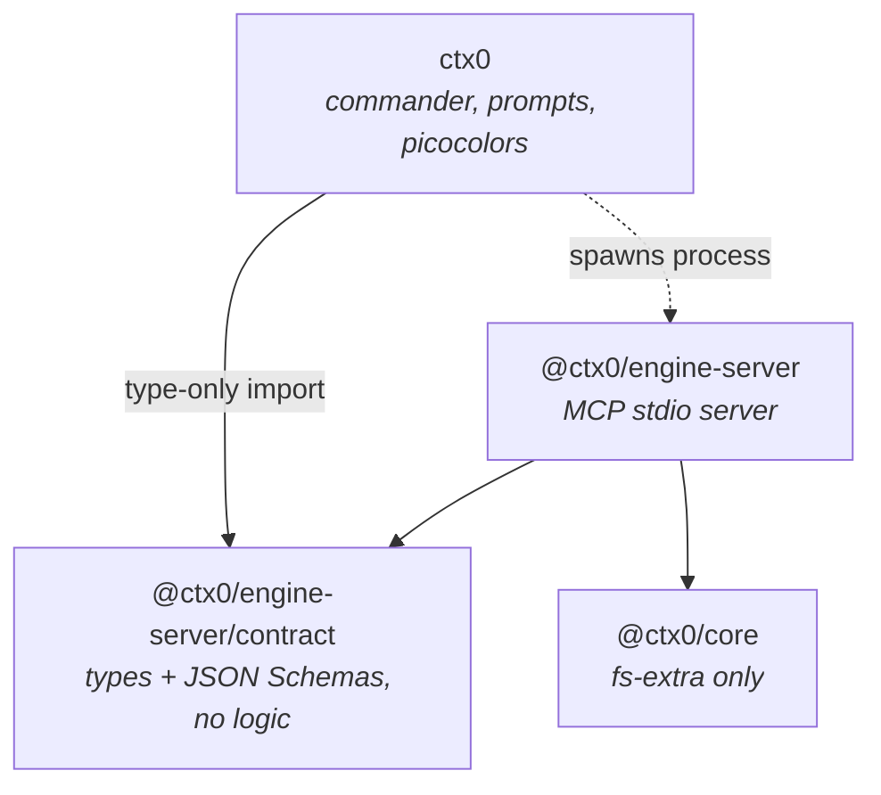
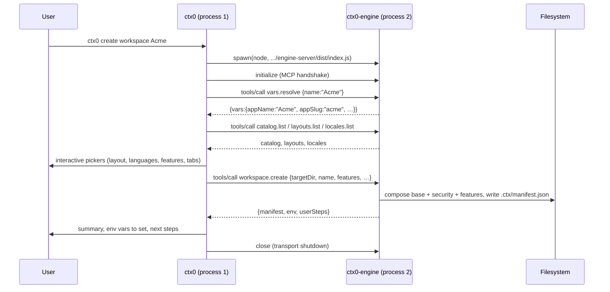
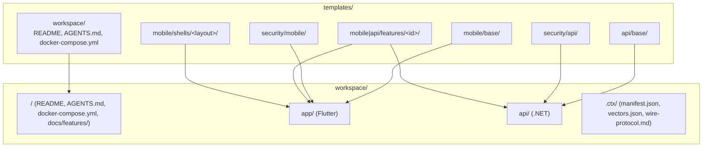

# ctx.0 system architecture

ctx.0 is a **scaffolder**: it composes a security-first workspace — a Flutter app and a
.NET API that speak an encrypted, signed wire protocol — out of template trees, and hands
the result to the user. It is not a framework the generated code depends on at runtime.
Once a workspace exists, nothing in it links back to ctx.0 except a manifest recording how
it was made.

This document is the entry point. Each subsystem has its own document:

| Subsystem | Document | What it is |
|---|---|---|
| `@ctx0/core` | [core.md](core.md) | The CLI-free composition engine. All scaffolding logic. |
| `@ctx0/engine-server` | [engine-server.md](engine-server.md) | The contract, and the engine behind JSON-RPC 2.0 / MCP on stdio. |
| `ctx0` | [cli.md](cli.md) | The command-line frontend. A client of the contract. |
| `templates/` | [templates.md](templates.md) | The composition inputs: base trees, feature overlays, shells, security. |
| `protocol/` | [protocol.md](protocol.md) | The app↔API wire protocol spec and its golden vectors. |
| generated workspace | [generated-workspace.md](generated-workspace.md) | The architecture of the thing ctx.0 emits. |
| `.github/workflows` | [ci.md](ci.md) | Repository automation. |

Decisions behind this structure are recorded in [../adr/](../adr/).

## Context

```mermaid
flowchart LR
    user([Developer])
    agent([Agent host / MCP client])
    cli["`ctx0` CLI<br/>packages/cli"]
    engine["`ctx0-engine`<br/>packages/engine-server"]
    core["@ctx0/core<br/>packages/core"]
    tpl[("templates/")]
    proto[("protocol/")]
    ws[("Generated workspace<br/>app/ + api/ + .ctx/")]

    user -->|argv, prompts| cli
    agent -->|MCP tools/call| engine
    cli -->|JSON-RPC 2.0 on stdio| engine
    engine -->|function calls| core
    core -->|reads| tpl
    core -->|reads| proto
    core -->|writes| ws
```

Two frontends reach the same engine. The CLI is not privileged: it spawns `ctx0-engine` as
a child process and speaks the same protocol an MCP-capable agent host would
([ADR-0001](../adr/0001-cli-never-imports-core.md),
[ADR-0002](../adr/0002-engine-over-jsonrpc-mcp-stdio.md)).

## Package dependency graph



The solid arrow from `cli` to `contract` is a **type-only** import: it disappears at
compile time. There is no runtime edge from the CLI to the engine other than the spawned
process. `@ctx0/core` depends on nothing but `fs-extra` and the Node standard library —
no CLI framework, no MCP SDK, no printing.

Build order follows the graph: `core` → `engine-server` → `cli`. The root `build` script
in `package.json` encodes it.

## Process and trust boundaries



- **Process boundary**: CLI and engine are separate OS processes communicating over the
  child's stdin/stdout. All argument validation happens engine-side in `dispatch`
  (`packages/engine-server/src/tools.ts`), so a malformed call from *any* client gets the
  same message.
- **Error boundary**: actionable failures (unknown feature, non-empty target directory) are
  returned as MCP tool results with `isError: true`, not as JSON-RPC transport errors, so
  the message survives intact to the CLI's top-level handler in
  `packages/cli/src/index.ts`.
- **Secret boundary**: server secrets are generated in the engine
  (`packages/core/src/secrets.ts`), returned once over the transport, and printed by
  `ctx0 keygen`. Nothing is written to disk — the encodings are part of the wire protocol,
  so no frontend is allowed to derive them itself
  ([ADR-0005](../adr/0005-vendored-security-overlay.md)).

## The composition model in one picture

A workspace is a **base tree plus a stack of overlays**. Every layer is a self-contained
directory that is copied onto the workspace in a deterministic order, with token
substitution applied to file contents *and* path segments; layers that must touch a shared
file (`Program.cs`, `di.dart`, `pubspec.yaml`) declare idempotent **wiring** edits instead
of overwriting it.



Application order is fixed and is what the manifest records:

1. `workspace` → workspace root
2. *(optional)* `flutter create` platform scaffolding into `app/`
3. `app_base` → `app/`, `api_base` → `api/`
4. `security_mobile` → `app/`, `security_api` → `api/` (always on, never toggleable)
5. each requested feature, in dependency order, per declared side
6. translation merge, wiring, navigation shell, protocol sync, generated docs
7. `.ctx/manifest.json`

The full call trace lives in [core.md](core.md#the-createworkspace-flow).

## Where do I make change X?

| I want to… | Go to | Read |
|---|---|---|
| add or change a feature (screens, endpoints, wiring) | `templates/{mobile,api}/features/<id>/` | [templates.md](templates.md) |
| change what the security plane does | `templates/security/{mobile,api}/` | [templates.md](templates.md#the-security-overlay) |
| change how layers are composed, ordered or hashed | `packages/core/src/` | [core.md](core.md) |
| add a capability a frontend can call | `packages/engine-server/src/contract.ts` then `tools.ts` | [engine-server.md](engine-server.md#adding-a-call) |
| change CLI flags, prompts or output | `packages/cli/src/` | [cli.md](cli.md) |
| add a language | `packages/core/src/l10n.ts` + a fragment per feature | [core.md](core.md#localization), [templates.md](templates.md#translation-fragments) |
| add a navigation layout | `templates/mobile/shells/<id>/` + `LAYOUTS` in `shell.ts` | [core.md](core.md#the-navigation-shell) |
| change the app↔API crypto | `protocol/` **and** both security overlays | [protocol.md](protocol.md) |
| change CI gates | `.github/workflows/` | [ci.md](ci.md) |

## Invariants of the whole system

1. **All scaffolding logic lives in `@ctx0/core`.** The CLI and the engine server are thin
   adapters. ([ADR-0001](../adr/0001-cli-never-imports-core.md))
2. **The CLI reaches the engine only through the contract.** New CLI capability means a new
   call, never an import. ([ADR-0001](../adr/0001-cli-never-imports-core.md))
3. **`CONTRACT_VERSION` is bumped whenever a call's arguments or result change shape**, and
   `engine.info` reports it. ([ADR-0003](../adr/0003-versioned-contract-in-one-file.md))
4. **Templates are data.** Adding a feature is a directory plus a `feature.json`, not engine
   code. ([ADR-0004](../adr/0004-templates-as-data-not-code.md))
5. **Composition is deterministic.** Every list derived from the filesystem is sorted with
   `sortUtf8`, never a bare `.sort()`.
   ([ADR-0006](../adr/0006-deterministic-composition-ordering.md))
6. **Every generated file is attributable.** The manifest records which layer wrote which
   files, and the hash of the source that wrote them.
   ([ADR-0008](../adr/0008-reversible-workspace-manifest.md))
