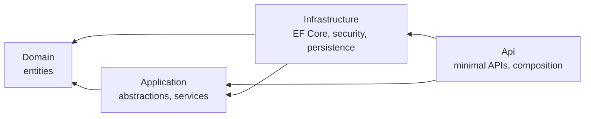
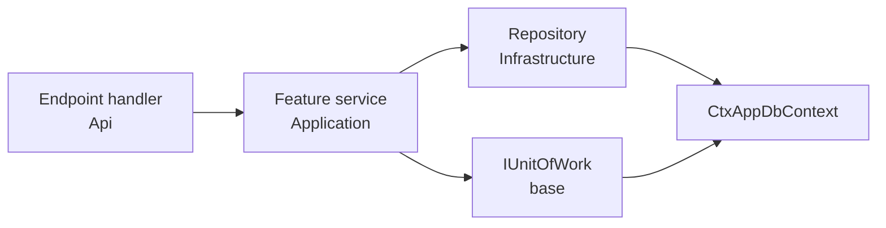
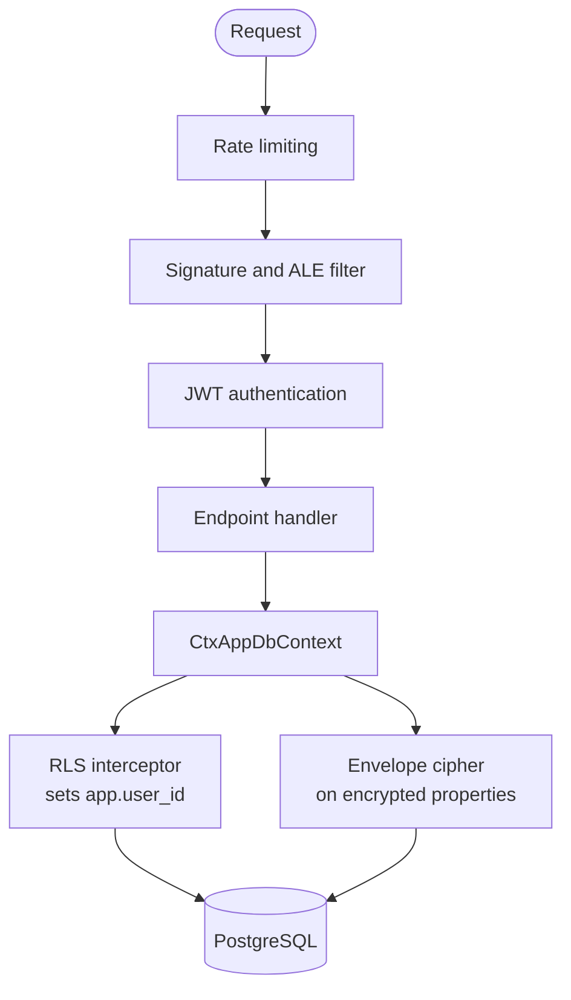
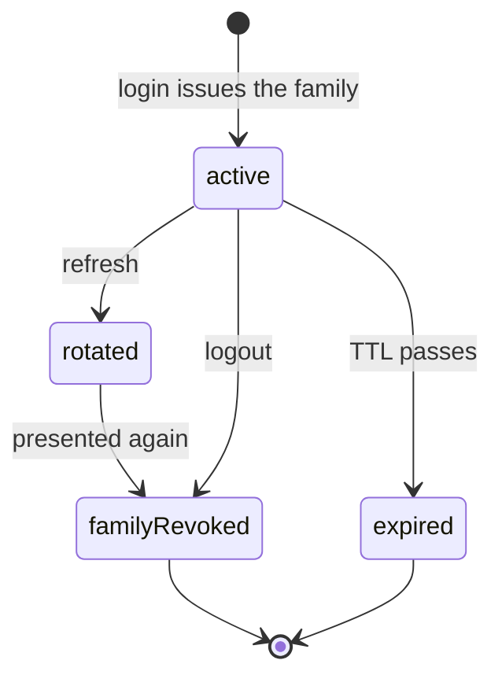

# Generated API architecture

This describes the .NET application ctx.0 writes into `api/` of a generated workspace. It
is assembled from `templates/api`: a base solution, the vendored security layer, and one
folder per enabled feature. The example throughout is a workspace generated with `auth`,
`gdpr` and `notes`.

## Projects

Four projects on .NET 9, referenced in one direction only.

`Domain` holds entities and references nothing. `Application` declares the interfaces the
outer layers implement, the cross-cutting ones such as `ICurrentUser`, `IFieldCipher`,
`IBlindIndex`, `IUnitOfWork` and `IPersonalDataContributor`, and each feature's own service
and repository interfaces, and it holds the services that carry the feature's logic.
`Infrastructure` implements those over EF Core, PostgreSQL and the crypto primitives. `Api`
hosts the endpoints and is the only project that composes the others.

A feature's files land in whichever projects it needs. `notes` writes
`Domain/Notes/Note.cs`, `Application/Notes/INotesService.cs`,
`Application/Notes/NotesService.cs`, `Application/Notes/INotesRepository.cs`,
`Api/Endpoints/NotesEndpoints.cs`, `Infrastructure/Persistence/NotesRepository.cs`,
`Infrastructure/Persistence/Configurations/NoteConfiguration.cs` and
`Infrastructure/Gdpr/NotesPersonalData.cs`, and its tests into `tests/Ctx.Tests/`.

## Composition

`Program.cs` is short, and stays short because features extend it through anchors rather
than editing it. It does six things: register the security plane, register localisation,
register the `DbContext` against PostgreSQL with the container's interceptors attached,
build the app, map the health check and the always-on security endpoints, and run. Two
anchors sit in the middle of that, one among the service registrations and one among the
endpoint mappings, with a third among the imports.

`AddCtxSecurity` registers the whole security plane: password hashing, JWT issuing and
validation, refresh tokens, device key registry, ALE key provider, envelope cipher, blind
index, the RLS interceptor and rate limiting. Registering interceptors through the
container is what lets the RLS interceptor be scoped per request while the `DbContext`
configuration stays generic.

`AddCtxLocalization` and `UseCtxLocalization` are always on, in the base rather than a
feature. They resolve the request culture from the `Accept-Language` header before any
handler renders text, so the API answers in the caller's language whether or not the `l10n`
feature is enabled. The mobile side matches this: its localisation plumbing is always on too,
in the session layer.

Each feature adds three kinds of line at the anchors: a `using`, its service registrations,
and its `Map…Endpoints()` call. `profile`, for instance, registers an `RlsPolicy` for its
table and an `IPersonalDataContributor`, then maps its endpoints.

## Endpoints

Minimal APIs grouped per feature, one static class with one `Map…Endpoints` extension
method. The method opens a route group under the feature's path prefix, requires
authorization on it where the feature needs a signed-in user, and maps its handlers.
Handlers take their dependencies as parameters and hold no state. They take the feature's
application service, `INotesService` for instance, and the request context such as
`ICurrentUser`, and leave the data work to the layer below. `auth`'s refresh and logout
handlers additionally take the security layer's `RefreshTokenService`, since rotating and
revoking refresh tokens is that layer's concern rather than feature data. The route groups
in a fully featured workspace:

| Group | Source | Authentication |
|---|---|---|
| `/health` | base | none |
| ALE key discovery, device enrollment | security layer | device signature |
| `/v1/auth/register`, `/login`, `/refresh`, `/logout`, `/v1/me` | `auth` | none except `/v1/me` |
| `/v1/notes` | `notes` | JWT |
| `/v1/profile` | `profile` | JWT |
| `/v1/privacy/consent`, `/export`, `/account/delete` | `gdpr` | JWT |

### Services and repositories

Behind most endpoints sits a small stack that keeps EF Core out of the handler and out of
the feature's logic.

An endpoint calls a service in `Application` (`INotesService`). The service holds the
feature's logic, works against a repository interface also in `Application`
(`INotesRepository`) whose implementation lives in `Infrastructure` (`NotesRepository`, over
the `DbContext`), and commits through `IUnitOfWork`. The service names no EF Core type, which
is what lets it be tested with a fake repository, and writing a row becomes one service call
rather than handler code touching the context.

`IUnitOfWork` is registered once in the base over the shared `DbContext`, and its
`SaveChangesAsync` is the single point a change is committed, so a service decides when a
unit of work closes rather than each repository saving on its own. Every feature follows
this shape, `auth` included: its endpoints call `IAuthService`, which works through
`IAuthRepository`. The refresh and logout endpoints are the one thing outside it, reaching
the security layer's `RefreshTokenService` directly, because refresh tokens are owned by
that always-on layer and not by a feature repository.

## Request path

Two independent identities travel with a request. The device identity comes from the
ECDSA signature over the request and the ALE session, established by the security layer at
enrollment. The user identity comes from the JWT and becomes `ICurrentUser`. Endpoints
that act on user-owned rows require the second.

The two are deliberately not merged. A device is enrolled before anyone has signed in, and
one device can serve several users over its life, so proving which install sent a request
tells the API nothing about whose rows it may touch. Everything downstream of the handler,
RLS included, keys off the user identity alone.

## Session and token lifecycle

Authentication issues two tokens with different jobs, and the split is what keeps a stolen
credential short-lived without making the user sign in every quarter of an hour.

| | Access token | Refresh token |
|---|---|---|
| Form | signed JWT | opaque random string |
| Carries | user id as subject, issued-at, unique id | nothing |
| Default lifetime | 15 minutes | 14 days |
| Verified by | signature check, no database read | lookup of its hash |
| Stored server-side | not at all | hash only |

The access token is a bearer credential validated on signature, issuer, audience and
expiry, which is what lets any endpoint authenticate a caller without touching the
database. The price of that is that it cannot be revoked, so its lifetime is kept short.
Revocation is the refresh token's job, and that one is stored, one row per token, holding
only a hash. A database leak therefore yields no usable session.

### Rotation and theft detection

Every login starts a token *family*. Each refresh mints a new access token and a new
refresh token in the same family, and marks the presented one revoked with a pointer to its
replacement. A refresh token is therefore usable exactly once.

The `rotated` to `familyRevoked` edge is the point of the design. A token that has already
been rotated should never be presented again, so seeing one means two parties hold the same
token and one of them stole it. The API cannot tell which, so it revokes the entire family,
signing out both. The legitimate user signs in again; the attacker's window closes at the
next rotation rather than at the end of the fortnight.

Logout revokes the family the presented token belongs to, which ends every session
descended from that login.

An expired or unknown token is rejected without revoking anything, since neither is
evidence of theft.

### Where this lives

The rules sit in `RefreshTokenService` in the `Application` project, with all persistence
behind `IRefreshTokenStore`. The service has no EF Core dependency, which is what makes the
reuse path testable without a database. `auth` supplies the store implementation and the
endpoints; the service, the JWT issuer and the token entity are part of the always-on
security layer, so a workspace without `auth` still has them and could authenticate some
other way.

The signing key, the two lifetimes, the issuer and the audience are configuration. The
lifetimes are the only knobs most workspaces touch, and shortening the access token is the
cheapest way to narrow the revocation gap.

## Data

EF Core code-first on PostgreSQL, one `CtxAppDbContext` shared by all features. The base
context maps the `User` entity, exposes a `model-config` anchor, and finishes by applying
the encryption conventions. Each feature ships an `IEntityTypeConfiguration` per entity and
inserts one line at that anchor to apply it, so features add tables without any of them
owning the context.

**Encryption at rest.** A property marked with the `Encrypted` attribute is
envelope-encrypted through a value converter installed by the encryption conventions, so
services and repositories read and write plaintext and the column holds ciphertext. In
`notes`, the title and body are marked; the user id, the created timestamp and the title's
blind index are not.

Ciphertext is not searchable, so a field that has to be looked up carries an HMAC blind
index beside it. `IBlindIndex.Compute` produces the same value for the same input, which
supports exact-match queries and nothing else.

**Row isolation.** `RlsConnectionInterceptor` sets the PostgreSQL session variable
`app.user_id` on every connection open, from the authenticated user in `ICurrentUser`. RLS
policies match on that setting, so a query that never filters by user still returns only
the caller's rows, and an unauthenticated request
returns none. `RlsInitializer` creates the policies at startup from the `RlsPolicy`
registrations features contribute. Isolation therefore sits in the database rather than in
handler code that could forget it.

## Features that serve other features

`gdpr` has to answer subject access and erasure requests over data belonging to features it
knows nothing about. It does so through `IPersonalDataContributor`, an interface with three
members: the section name the feature's data appears under in an export, an export method
returning that data for one user, and an erase method removing it.

Every feature holding user-owned rows registers an implementation. `PersonalDataExporter`
resolves all of them and assembles the export bundle; `AccountEraser` calls each
`EraseAsync` inside one transaction, with contributors staging deletes on the shared
`DbContext` and the caller committing. Exports run through a queued background job, so a
large bundle does not hold a request open.

The same shape reappears wherever features must cooperate: an interface in `Application`,
implementations shipped by each feature, and one consumer resolving the set.

## Configuration

Settings come from configuration sections bound at startup, including the JWT signing key,
envelope keys and rate limits. `AddCtxSecurity` refuses to start when the signing key is
shorter than 32 characters, and points at `ctx0 keygen`. Failing at boot rather than at the
first signed token means a misconfigured workspace cannot serve traffic.

In Development the schema and RLS policies are created at startup. In production they are
applied with `dotnet ef database update`.

## Tests

One `tests/Ctx.Tests` project that every feature adds files to. Feature tests are
integration tests over the composed app, `NotesRlsEnvelopeTests` for example asserting
that a note's stored columns are ciphertext and that a second user's request sees no rows.
The security layer contributes tests that run `vectors.json` through the API's crypto,
which are the same vectors the Flutter app tests against.
