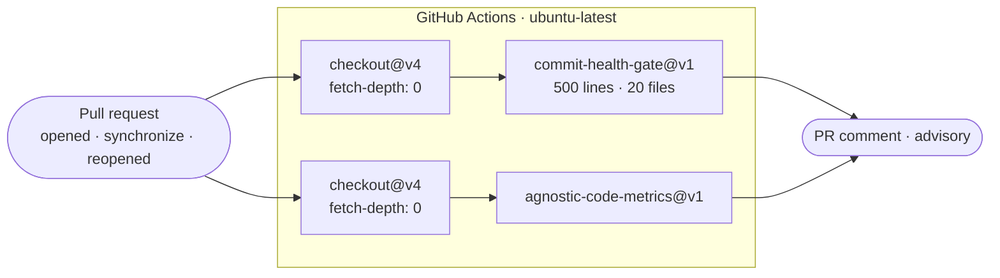

# CI and repository automation

**Location**: `.github/workflows/`

## Purpose

Two workflows run on pull requests. Neither builds or tests the code — they analyse the
*change itself* and comment on the pull request. Both are advisory: they report, they do
not block a merge.

```
.github/workflows/
  commit-health-gate.yaml       commit hygiene on the PR's commits
  agnostic-code-metrics.yaml    language-agnostic metrics for the diff
```



## `commit-health-gate.yaml`

| | |
|---|---|
| Trigger | `pull_request` — `opened`, `synchronize`, `reopened` |
| Runner | `ubuntu-latest` |
| Permissions | `pull-requests: write`, `contents: read` |
| Action | `rw-core/commit-health-gate@v1` |

Checks the commits on the branch for hygiene problems — most visibly "mega commits". The
thresholds are set explicitly:

| Input | Value | Meaning |
|---|---|---|
| `mega-commit-line-threshold` | `500` | A commit changing more lines is flagged. |
| `mega-commit-file-threshold` | `20` | A commit touching more files is flagged. |
| `fail-on-violation` | `false` | Violations are reported as a comment; the job still passes. |

Checkout uses `fetch-depth: 0` because the action needs the full history to see the
branch's commits rather than a single squashed tip.

Practically: keep commits scoped. A feature is a template directory, a manifest and its
tests — that is one commit, comfortably inside both thresholds. A change that trips them is
usually two changes.

## `agnostic-code-metrics.yaml`

| | |
|---|---|
| Trigger | `pull_request` (all activity types) |
| Runner | `ubuntu-latest` |
| Permissions | `contents: read`, `pull-requests: write` |
| Action | `rw-core/agnostic-code-metrics@v1` |

Computes language-agnostic metrics over the diff and posts them to the pull request. Being
language-agnostic matters here: a ctx.0 change routinely spans TypeScript (the engine),
Dart and C# (the templates), and Markdown/JSON (docs, manifests, vectors). A
TypeScript-only analyser would miss most of the repository.

Also uses `fetch-depth: 0`, for the same reason.

## What is *not* automated

There is no build/test/lint workflow in the repository today. Those are run locally:

```bash
npm run build     # core → engine-server → cli
npm test          # every workspace with a test script
npm run lint      # type-check (tsc --noEmit); builds core first so the CLI resolves types
```

See [../DEVELOPMENT.md](../DEVELOPMENT.md) for the full loop. If a CI workflow is added for
these, note the build order constraint: `@ctx0/core` must be built before
`@ctx0/engine-server` and the CLI, and `packages/engine-server`'s `test` script builds
first on its own because `stdio.test.ts` spawns `dist/`.

## Invariants

1. **Both workflows are advisory.** `fail-on-violation: false` is deliberate — commit
   hygiene is a conversation on the PR, not a gate.
2. **Both need full history** (`fetch-depth: 0`); a shallow checkout silently degrades what
   they can see.
3. **Actions are pinned to a major version** (`@v1`, `@v4`).

---

**See also**: [system architecture](README.md) · [../DEVELOPMENT.md](../DEVELOPMENT.md)
