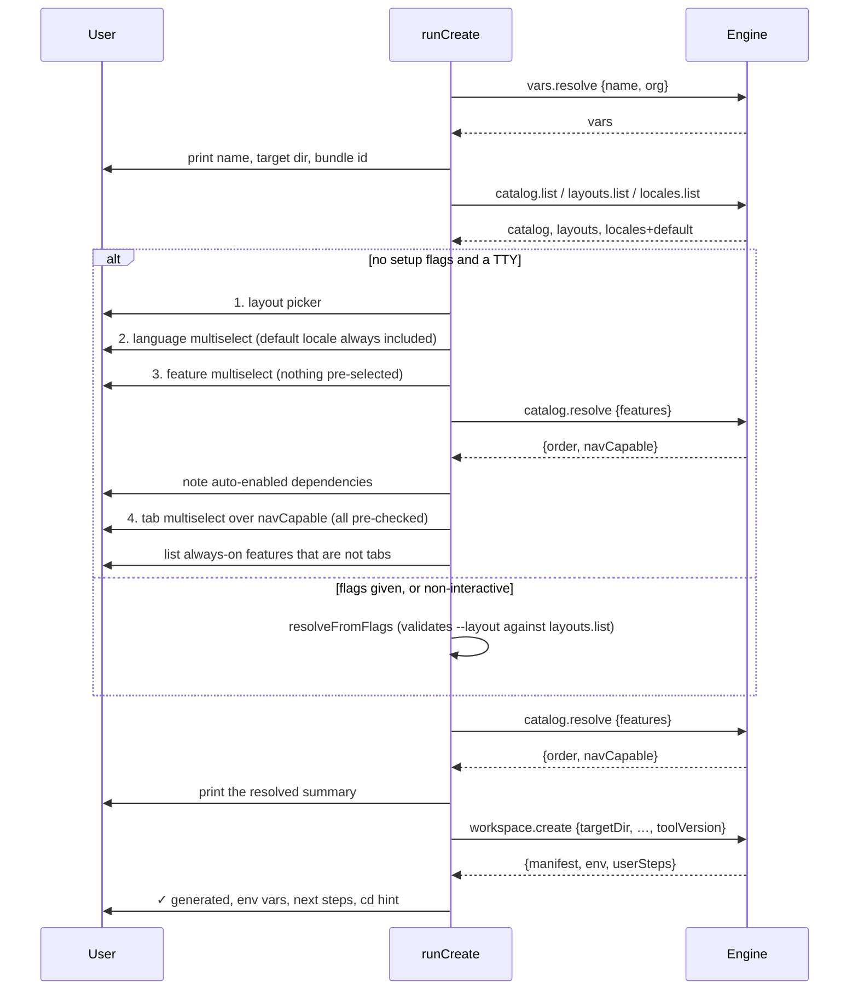

# `ctx0` — the command-line frontend

**Package**: `packages/cli` · **Binary**: `ctx0` → `dist/index.js` ·
**Runtime dependencies**: `commander`, `prompts`, `picocolors`, `fs-extra`,
`@modelcontextprotocol/sdk`, and `@ctx0/engine-server` (for the spawned binary and its
type-only contract import).

## Purpose

`ctx0` turns argv and an interactive session into engine calls, and engine results into
terminal output. That is its entire job. It holds **no scaffolding logic**: it does not
import `@ctx0/core`, does not know what a template tree looks like, and does not decide
which features can be navigation tabs — it asks
([ADR-0001](../adr/0001-cli-never-imports-core.md)).

## Boundaries

**May depend on**: the contract's *types* (`@ctx0/engine-server/contract`, erased at
compile time), the MCP client SDK, terminal libraries.

**Must never**: import `@ctx0/core`, read the template tree, or reimplement anything the
engine can answer. When you find yourself wanting to reach into the engine, add a call
([engine-server.md](engine-server.md#adding-a-call)).

**Callers**: the user, via the `ctx0` binary.

## Module map

| File | Lines | Responsibility | Key exports |
|---|--:|---|---|
| `src/index.ts` | 78 | The commander program: command/flag definitions and the top-level error handler. | — (executable) |
| `src/engine.ts` | 78 | The contract client: spawns `ctx0-engine`, makes typed calls, shuts it down. | `Engine`, `withEngine` |
| `src/commands/create.ts` | 283 | `ctx0 create workspace` — the guided flow and the flag-driven path. | `runCreate`, `CreateArgs` |
| `src/commands/status.ts` | 41 | `ctx0 status` — catalog listing or workspace summary. | `runStatus` |
| `src/commands/keygen.ts` | 19 | `ctx0 keygen` — print the server secrets. | `runKeygen` |
| `src/version.ts` | 15 | The CLI's own version, read from its `package.json`. | `cliVersion` |

## Commands

| Command | What it does |
|---|---|
| `ctx0 create workspace <name>` | Scaffold a full workspace (Flutter app + .NET API). |
| `ctx0 status` | Outside a workspace: list the feature catalog. Inside one: show enabled features, layout and languages. |
| `ctx0 keygen` | Print a fresh set of server secrets as environment variables. |
| `ctx0 --version` / `-v` | The CLI version. |

`create workspace` options:

| Flag | Meaning |
|---|---|
| `-o, --org <org>` | Reverse-DNS organization, e.g. `com.acme`. Defaults to `com.<appSlug>`. |
| `-d, --dir <dir>` | Parent directory to create the workspace in. Defaults to the cwd. |
| `-f, --features <ids...>` | Feature ids to enable. **Presence skips the interactive picker.** |
| `-l, --layout <id>` | `bottom_nav` \| `nav_rail` \| `drawer` \| `home_list`. |
| `-t, --tabs <ids...>` | Feature ids to surface as main-navigation tabs. |
| `--locales <codes...>` | Languages to ship, e.g. `en el de`. English is always included. |
| `--no-platforms` | Skip `flutter create`; generate the ctx.0 source overlay only. |

The workspace is created at `<dir or cwd>/<appSlug>` — the slug the engine derived, not the
name as typed, so the CLI asks `vars.resolve` before it can even print the target path.

## The engine client

`Engine.start()` (`src/engine.ts`) constructs an MCP `Client` identified as `ctx0-cli` at
`cliVersion()`, and connects a `StdioClientTransport` that spawns
`process.execPath` (the running Node binary) with the engine's entry point. The path is
resolved through the package rather than guessed:

```ts
require.resolve('@ctx0/engine-server/package.json')  // → .../engine-server/package.json
path.join(path.dirname(manifest), 'dist', 'index.js')
```

This works for a linked workspace, a global install, and a published tarball alike, because
Node's resolver does the work. The engine's `package.json` exports its own `package.json`
precisely so this resolution is possible.

`Engine.call(name, args)` is typed by the contract — `CallArgs<K>` in, `CallResult<K>` out
— so a wrong argument name is a compile error, not a runtime surprise. It unwraps the MCP
response:

- `isError` → throw an `Error` carrying the joined text blocks, i.e. the engine's own
  message, which the top-level handler in `index.ts` prints as `✗ <message>`.
- missing `structuredContent` → throw `Engine call "<name>" returned no result.`
- otherwise → the structured result.

`withEngine(body)` is the standard shape: start the engine, run the body, and stop it in a
`finally`, so a thrown error still shuts the child process down. Every command uses it, and
each command opens exactly one engine for its whole run.

## `ctx0 create workspace`



Details that matter:

- **`shouldPrompt`** returns true only when the user supplied *no* setup flags
  (`--features`, `--layout`, `--tabs`, `--locales`) **and** both stdin and stdout are TTYs.
  So the same command is scriptable in CI and guided at a terminal, with no extra flag.
- **The engine decides what can be a tab.** `promptSetup` calls `catalog.resolve` and
  builds the tab picker from `navCapable`, rather than inspecting the catalog itself.
- **Auto-enabled dependencies are surfaced** (`reportAutoDeps`): the ids in the resolved
  order that the user did not pick are printed before the tab step, so nothing appears in
  the workspace unannounced.
- **Always-on features are reported, not hidden** (`reportAlwaysOnFeatures`): enabled
  features that are not nav-capable get their own listing with the note that they integrate
  app-wide rather than as a tab.
- **Cancelling any prompt aborts cleanly** with `Cancelled — no workspace was created.`
- **`tabs`/`locales` stay `undefined` on the flag path** when the flags were not given,
  which is how the CLI expresses "engine default" (every nav-capable feature; every offered
  language) rather than second-guessing it.
- **`toolVersion: cliVersion()`** is passed to `workspace.create`, so the workspace manifest
  records the CLI version that generated it rather than the engine version.
- **`scaffoldPlatforms`** is `args.platforms !== false` — commander sets `platforms: false`
  for `--no-platforms`. When on, the CLI prints a line before the call, since
  `flutter create` is the slow step.
- **`MULTISELECT_INSTRUCTIONS`** replaces the `prompts` default footer, which was terse
  enough that multiselect lists read as single-select.

## `ctx0 status`

One `workspace.status` call with the cwd:

- **Inside a workspace**: prints the app name and protocol version, then every catalog
  feature with `●` (enabled) or `○` (not), the summary, and a `[tab]` marker, followed by
  the layout and the languages from the manifest.
- **Outside**: falls through to `catalog.list` and prints the catalog with each feature's
  sides, plus a hint to run it inside a workspace.

## `ctx0 keygen`

One `secrets.generate` call, printed as `NAME=value` lines with a reminder that the values
are secret and belong in the environment. The CLI does not know what the variables are or
how they are encoded — it iterates whatever map the engine returns
([core.md](core.md#server-secrets)).

## Output conventions

`picocolors` only, no spinner framework. Bold for section headers, cyan for identifiers the
user chose, dim for derived or advisory text, green `✓` for success, red `✗` for the
top-level failure. Every command ends by telling the user what to do next — `create` prints
the env vars to set, the manual steps each enabled feature declared, and the `cd` line.

`ensureReadmeHint` warns (non-fatally, in yellow) if the generated workspace has no
`README.md`, which would mean the workspace template lost one.

## Error handling

`main()` in `src/index.ts` wraps `program.parseAsync` in a single try/catch: any error —
from commander, from a prompt cancellation, or rethrown by `Engine.call` with the engine's
message intact — is printed as `✗ <message>` and sets `process.exitCode = 1`. There is no
per-command error handling, and no stack traces in normal operation.

## Invariants

1. **The CLI never imports `@ctx0/core`.**
   ([ADR-0001](../adr/0001-cli-never-imports-core.md))
2. **Everything the CLI knows about features, layouts, languages or workspaces comes from a
   call.** New capability means a new call, not a new import.
3. **The contract import is type-only**, so nothing of the engine ends up in the CLI bundle.
4. **One engine per command run**, always shut down via `withEngine`.
5. **Engine messages are printed verbatim.** The CLI does not rewrite or classify them.

## Development

```bash
cd packages/cli
npm run dev -- status                                     # tsx, no build
npm run dev -- create workspace Demo --org com.demo --no-platforms
```

Or the shipping artifact:

```bash
npm run build                      # from the repo root: core → engine-server → cli
node packages/cli/dist/index.js status
npm run ctx0 -- status             # equivalent root script
```

The CLI has no unit tests; its `test` script passes with `--passWithNoTests`. The behaviour
worth asserting lives behind the contract, and is covered by
`packages/engine-server/test/`. Full workflow instructions — linking onto `PATH`, the
`tsx` loop, working without Flutter/.NET — are in [../DEVELOPMENT.md](../DEVELOPMENT.md).

---

**See also**: [system architecture](README.md) · [engine-server.md](engine-server.md) ·
[core.md](core.md) · [ADR-0001](../adr/0001-cli-never-imports-core.md) ·
[ADR-0002](../adr/0002-engine-over-jsonrpc-mcp-stdio.md)
