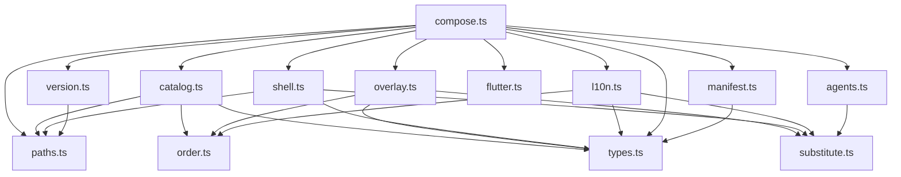
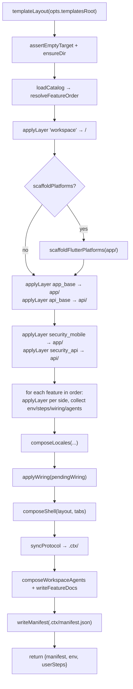

# `@ctx0/core` — the composition engine

**Package**: `packages/core` · **Entry point**: `packages/core/src/index.ts` ·
**Runtime dependencies**: `fs-extra` and the Node standard library, nothing else.

## Purpose

`@ctx0/core` is the scaffolder. It discovers the feature catalog from the template trees,
resolves a requested feature set into a dependency-complete application order, composes a
workspace by copying `base` trees and feature overlays with token substitution, merges
translation fragments, applies idempotent wiring to shared files, generates the navigation
shell and the context docs, syncs the wire protocol, and records everything in a reversible
manifest. It returns structured results and **never prints** — every frontend (the `ctx0`
CLI, the MCP engine server, a future portal) sits over it as a thin adapter.

## Boundaries

**May depend on**: `node:fs`/`node:path`/`node:crypto`/`node:child_process`/`node:url`,
`fs-extra`.

**Must never depend on**: a CLI framework, the MCP SDK, a logger, `process.stdout`. It
must not know that a CLI exists. Errors are thrown as `Error` with a message written for a
human; the frontend decides how to show it.

**Callers**: `packages/engine-server/src/tools.ts` is the only in-repo consumer. Its unit
tests (`packages/core/test/*.test.ts`) are the other.

## Module map

| File | Lines | Responsibility | Key exports |
|---|--:|---|---|
| `src/index.ts` | 95 | The public surface. Re-exports in themed groups; the only file a consumer imports from. | — |
| `src/types.ts` | 135 | The shared vocabulary: feature manifests, wiring, nav metadata, the workspace manifest, substitution vars. | `Side`, `LayoutId`, `FeatureNav`, `WiringEdit`, `FeatureDeps`, `FeatureManifest`, `AppliedFeature`, `WorkspaceNavigation`, `WorkspaceLocalization`, `WorkspaceManifest`, `TemplateVars` |
| `src/paths.ts` | 60 | Locates the template root and derives every tree path from it. Handles the monorepo and published-package layouts. | `templatesRoot`, `templateLayout`, `TemplateLayout` |
| `src/order.ts` | 26 | The single comparator every derived list is sorted with. | `compareUtf8`, `sortUtf8` |
| `src/substitute.ts` | 82 | Token vocabulary and substitution; derives vars from user input. | `TOKENS`, `resolveVars`, `substitute`, `slugify`, `pascalCase`, `isProbablyBinary` |
| `src/catalog.ts` | 102 | Discovers features from the template tree, validates their manifests, resolves dependency order. | `loadCatalog`, `resolveFeatureOrder`, `CatalogEntry` |
| `src/overlay.ts` | 134 | The layer primitives: copy a tree, hash a tree, apply wiring edits. | `copyTree`, `hashTree`, `applyWiring` |
| `src/shell.ts` | 193 | The layout catalog and the generator for `app/lib/app/shell.dart`. | `LAYOUTS`, `isLayoutId`, `navCapable`, `composeShell`, `SHELL_REL`, `LayoutDescriptor` |
| `src/l10n.ts` | 350 | The offered languages, and the merge of per-overlay translation fragments into ARB / resx / generated support code. | `LOCALES`, `DEFAULT_LOCALE`, `isLocaleCode`, `resolveLocales`, `composeLocales`, `ARB_DIR_REL`, `L10N_SUPPORT_REL`, `L10N_FRAGMENT_DIR`, `RESOURCES_DIR_REL`, `LOCALIZATION_DIR_REL`, `SUPPORTED_CULTURES_REL`, `LocaleDescriptor`, `LocaleSource` |
| `src/agents.ts` | 129 | Composes the workspace `AGENTS.md` and the per-feature docs from overlay fragments. | `composeAgentsDoc`, `readAgentsFragment`, `renderFeatureDoc`, `featureDocPath`, `AGENTS_BLOCK_START`, `AGENTS_BLOCK_END`, `AGENTS_FRAGMENT_FILE`, `FEATURE_DOCS_DIR`, `AgentsFragment` |
| `src/compose.ts` | 301 | The top-level `createWorkspace` operation that orchestrates every module above. | `createWorkspace`, `CreateOptions`, `CreateResult` |
| `src/manifest.ts` | 29 | Read/write `.ctx/manifest.json`, and the "is this a workspace" check. | `readManifest`, `writeManifest`, `isWorkspace`, `MANIFEST_REL` |
| `src/secrets.ts` | 67 | Generates the server secrets in the encodings the wire protocol mandates. | `generateServerSecrets`, `ServerSecrets` |
| `src/flutter.ts` | 62 | The one shell-out: `flutter create` for the platform directories. Opt-in. | `scaffoldFlutterPlatforms`, `ensureFlutterAvailable` |
| `src/version.ts` | 39 | The engine's own version and the wire-protocol version read from `protocol/protocol.json`. | `coreVersion`, `protocolVersion` |

## Internal dependency graph

`types.ts` and `order.ts` are leaves. `compose.ts` is the only orchestrator; nothing
imports it.

## Locating the templates

`templatesRoot(explicitRoot?)` (`src/paths.ts`) resolves the tree root, and every other
path is derived from it by `templateLayout`. A candidate is accepted when it contains a
`workspace/` directory. Two layouts are supported and both must keep working:

| Layout | Root | Detected as |
|---|---|---|
| Monorepo / development | repo-root `templates/` | `../../../templates` relative to `packages/core/{src,dist}` |
| Published package | `packages/core/templates` | `../templates` relative to `dist/` |

A frontend that bundles its own templates passes `templatesRoot` explicitly and that value
is used verbatim. `templateLayout` returns `root`, `workspace`, `mobileBase`,
`mobileShells`, `apiBase`, `securityMobile`, `securityApi`, `mobileFeatures`,
`apiFeatures`, and `protocol` (which is resolved *outside* the templates root, as
`<root>/../protocol`).

## Substitution

Three tokens are rewritten everywhere — in file contents and in path segments. They are
deliberately **valid identifiers**, so every template tree compiles and runs untouched;
that is what makes an overlay independently testable.

| Token | Becomes | Example |
|---|---|---|
| `com.ctx.app` | `vars.bundleId` | `com.acme.acme` |
| `CtxApp` | `vars.appName` (PascalCase) | `Acme` |
| `ctxapp` | `vars.appSlug` (lower/snake) | `acme` |

Replacement is ordered most-specific-first (bundle id before the bare tokens) and is
case-sensitive: `ctxapp` never matches `CtxApp`. `substitute` uses `split`/`join` rather
than a regex, so no token content is interpreted as a pattern.

`resolveVars(appNameInput, orgInput?)` derives all four vars: `slugify` lowercases and
collapses non-alphanumerics to single underscores, `pascalCase` rebuilds the display name
from the slug, the org defaults to `com.<appSlug>`, and the bundle id is `<org>.<appSlug>`
— the same scheme `flutter create` uses, so the native project ids line up.

`isProbablyBinary` scans the first 8000 bytes for a NUL and, when found, copies the file
byte-for-byte instead of substituting into it.

## The catalog

`loadCatalog(explicitRoot?)` scans `templates/mobile/features/*` then
`templates/api/features/*`, each in `sortUtf8` order of directory name, and returns a
`Map<string, CatalogEntry>` where an entry is the feature's manifest plus the source
directory per side it ships. A feature present on both sides appears once, in mobile scan
order; api-only features follow. Iteration order of that `Map` is the catalog order every
frontend lists features in.

`validateManifest` rejects, at load time:

- a `feature.json` whose `id` does not match its directory name;
- a missing `summary`;
- an empty or absent `sides` array;
- an overlay found under a side the manifest does not declare.

`resolveFeatureOrder(requested, catalog)` is a depth-first post-order walk over `requires`.
It emits dependencies before dependants, deduplicates, throws
`Unknown feature "<id>"` for anything not in the catalog, and detects cycles via a
`visiting` set, reporting the chain (`a -> b -> a`).

The always-on layers — `workspace`, `app_base`, `api_base`, `security_mobile`,
`security_api` — are deliberately **not** in the catalog. They are applied unconditionally
by `createWorkspace` and cannot be toggled.

## Layer primitives

### `copyTree(srcDir, workspaceRoot, destPrefix, vars)`

Recursively copies a layer, substituting into both content and path segments, and returns
the workspace-relative paths written in `sortUtf8` order. At the layer root it skips
`OVERLAY_META = { feature.json, agents.md, l10n }` — these are engine metadata, not
workspace content. Directory entries are read in `sortUtf8` order so the walk is
reproducible. Paths are normalised to POSIX separators before being recorded, so a manifest
generated on Windows matches one generated on Linux.

### `hashTree(srcDir)`

A SHA-256 over the **pre-substitution** source: for each file, in `sortUtf8` walk order,
the POSIX relative path, a NUL, the file bytes, a NUL. Recorded per layer in the manifest
as a drift/integrity check — the hash identifies the template that produced a layer,
independent of the app name it was rendered with.

### `applyWiring(workspaceRoot, edits, vars)`

Each `WiringEdit` names a workspace-relative `file`, an `anchor`, and the `insert` text.
The target file must contain a line carrying the marker `ctx:anchor:<anchor>` — in whatever
comment syntax the file uses (`// ctx:anchor:usings`, `# ctx:anchor:pubspec-deps`,
`<!-- -->`). The insert is placed on the line immediately below.

Three properties matter:

- **Idempotent.** If the substituted insert text (CR-stripped, trimmed) already occurs
  anywhere in the file, the edit is skipped. Enable → disable → enable is a no-op.
- **Line-ending preserving.** The file is split on LF, so a CR stays attached to its line.
  If the anchor line ends with CR, the inserted block is re-joined with CRLF and
  CR-terminated, so a CRLF checkout never gains mixed endings. Both the idempotency check
  and the anchor search ignore CR.
- **Fail-loud.** A missing target file or a missing anchor throws, naming both.

Wiring runs **after every layer has been copied**, so an anchor introduced by one layer is
available to an edit declared by another.

## The `createWorkspace` flow

`createWorkspace(opts: CreateOptions): Promise<CreateResult>` — `packages/core/src/compose.ts`.

Step by step, with what each writes:

1. **`assertEmptyTarget`** — the target must be absent, or contain nothing but `.git` and
   `.DS_Store`. Otherwise: `Target directory is not empty: <dir>`.
2. **Catalog + order** — `loadCatalog` then `resolveFeatureOrder(opts.features, catalog)`.
   Unknown ids and cycles fail here, before anything is written.
3. **`workspace` layer** → workspace root. Brings `README.md`, `AGENTS.md`,
   `docker-compose.yml`.
4. **Flutter platforms (opt-in)** — when `scaffoldPlatforms` is true,
   `scaffoldFlutterPlatforms` runs `flutter create --empty --org <org>
   --project-name <slug>` into `app/` *before* the mobile overlay, so ctx.0's `lib/`,
   `test/` and `pubspec.yaml` land on top of a runnable Flutter project. It then removes
   the sample `test/widget_test.dart`, which references the counter app and would not
   compile. `ensureFlutterAvailable` produces the actionable error when the SDK is absent.
5. **Base layers** — `mobileBase` → `app/`, `apiBase` → `api/`. Both are registered as
   locale sources.
6. **Security layers** — `securityMobile` → `app/`, `securityApi` → `api/`. Their
   `feature.json` is read via `readOptionalManifest` and contributes `env`, `userSteps` and
   `wiring` like any feature, but they are never toggleable.
7. **Features** — for each id in dependency order, each declared side is copied to its side
   prefix (`sidePrefix`: `mobile` → `app`, `api` → `api`). The manifest's `env` (a `Set`,
   deduplicated), `userSteps` and `wiring` are collected, and the feature's `agents.md`
   fragments (mobile then api, joined) become an `AgentsFragment`.
8. **`composeLocales`** — merges every registered source's `l10n/` fragments. See below.
9. **`applyWiring`** — every collected edit, in collection order.
10. **`composeShell`** — layout defaults to `bottom_nav`; tabs default to
    `navCapable(catalog, order)`. `assertTabsEnabled` rejects a tab that is not an enabled
    feature before any shell is written.
11. **`syncProtocol`** — copies `vectors.json` and `wire-protocol.md` from the protocol
    directory into `.ctx/`, when present.
12. **Docs** — `composeWorkspaceAgents` rewrites the root `AGENTS.md` as its
    (token-substituted) preamble plus the generated feature block;
    `writeFeatureDocs` writes `docs/features/<ID>.md` per enabled feature and prunes any
    `.md` in that directory that no longer corresponds to an enabled feature.
13. **`writeManifest`** — `.ctx/manifest.json`, schema 3.

`CreateResult` is `{ manifest, env, userSteps }`. `ctx0Version` is `opts.toolVersion` when
the frontend supplies one (the CLI passes its own version), otherwise `coreVersion()`.

### Layer ids in the manifest

`applyLayer(id, …)` records `{ id, files, hash }`. Ids are `workspace`, `app_base`,
`api_base`, `security_mobile`, `security_api` for the always-on layers, and
`<featureId>:<side>` for features. Consumers recover a feature id by splitting on `:` —
which is exactly what `workspace.status` does in the engine server. The reserved ids
contain no `:` and never collide with a catalog id.

## Localization

Translations are **not** ordinary overlay files. Each layer may ship a root-level `l10n/`
directory holding one fragment per offered language — `<code>.arb` on the mobile side,
`<code>.json` on the api side — which `copyTree` skips as metadata. `composeLocales`
merges the fragments of every enabled layer, in application order, into the artifacts each
ecosystem expects. ([ADR-0007](../adr/0007-translations-as-feature-fragments.md))

| Offered language | Code | Own name |
|---|---|---|
| English (default / fallback) | `en` | English |
| Greek | `el` | Ελληνικά |
| German | `de` | Deutsch |
| French | `fr` | Français |
| Spanish | `es` | Español |

`resolveLocales(requested?)` rejects unknown codes, always includes `DEFAULT_LOCALE`, and
returns the selection in catalog order — so two workspaces with the same languages compose
identically regardless of the order they were requested in. Omitting the selection enables
every language.

Generated artifacts:

| Constant | Path | Contents |
|---|---|---|
| `ARB_DIR_REL` | `app/lib/l10n/app_<code>.arb` | Flutter `gen-l10n` sources, one per selected locale, `@@locale` header first |
| `L10N_SUPPORT_REL` | `app/lib/l10n/l10n_support.dart` | `AppL10nSupport`: `defaultLocale`, `supportedLocales`, the delegate list, and each language's own name for the in-app picker |
| `RESOURCES_DIR_REL` | `api/src/Api/Resources/Localization/Messages[.<code>].resx` | .NET `IStringLocalizer` sources; the default locale is the *neutral* set (`Messages.resx`, no code) |
| `SUPPORTED_CULTURES_REL` | `api/src/Api/Localization/SupportedCultures.g.cs` | The culture list as code — satellite assemblies cannot be enumerated reliably at startup |

Merge rules:

- A key defined by two sources is an **error** (`Duplicate translation key "<k>" for locale
  "<code>": defined by <a> and <b>`) — the winner would otherwise depend on application
  order. Namespace keys by feature.
- ARB metadata keys (`@key`) travel with their message but do not participate in duplicate
  detection; `@@`-prefixed headers are dropped and re-emitted per file.
- A fragment missing for a selected locale is **not** an error: the key is absent for that
  locale and both runtimes fall back to the default.
- Resx entries are emitted in `sortUtf8` key order, XML-escaped.
- The support libraries belong to the `l10n` feature: they are only generated when its
  overlays are part of the workspace (detected by the presence of
  `app/lib/features/l10n` and `api/src/Api/Localization`). When the API side is present but
  no enabled feature has a message yet, an empty neutral `Messages.resx` is still written
  so `IStringLocalizer<Messages>` has something to bind to.

## The navigation shell

`composeShell(workspaceRoot, layout, tabs, catalog, vars, explicitRoot?)` generates
`app/lib/app/shell.dart` (`SHELL_REL`).

| Layout id | Label | Structure |
|---|---|---|
| `bottom_nav` | Bottom navigation bar | Material `NavigationBar` |
| `nav_rail` | Navigation rail | Material `NavigationRail` |
| `drawer` | Navigation drawer | Material `NavigationDrawer` |
| `home_list` | Simple home list | One landing screen of `ListTile`s, no persistent nav |

A feature is **nav-capable** when its `feature.json` declares a `nav` block
(`label`, `icon`, `page`, `import`). `navCapable(catalog, enabled)` filters an ordered id
list down to those, preserving order — it is the candidate set for tabs.

Generation loads `templates/mobile/shells/<layout>/shell.dart` and replaces its
single-line generation markers with Dart derived from the tab `nav` blocks:

- `ctx:gen:imports` → one `import '<nav.import>';` per tab (all layouts)
- `ctx:gen:pages` → `<nav.page>(),` per tab (all but `home_list`)
- `ctx:gen:destinations` → the layout-appropriate `NavigationDestination` /
  `NavigationRailDestination` / `NavigationDrawerDestination` per tab
- `ctx:gen:tiles` → a `ListTile` pushing a `MaterialPageRoute` per tab (`home_list` only)

Labels are rendered as Dart single-quoted literals with backslashes and quotes escaped. A
missing marker in a template throws. An empty block removes its marker line entirely.

When `tabs` is empty, a minimal placeholder shell is emitted regardless of layout — a
`Scaffold` with the app name — so a workspace with no nav-capable features still compiles.
Passing a tab that is unknown or not nav-capable throws.

## Generated context docs

`agents.ts` treats the workspace `AGENTS.md` as a derived artifact: the static preamble
copied from `templates/workspace/AGENTS.md` (token-substituted), followed by a block
delimited by `<!-- ctx:agents:features:start -->` / `<!-- ctx:agents:features:end -->`
holding a table of enabled features and links to their docs. `composeAgentsDoc` is
idempotent: an existing block is replaced in place, leaving the human-authored preamble and
any trailing content intact; otherwise the block is appended.

Each feature's own `agents.md` fragment becomes `docs/features/<ID>.md` (uppercased id,
POSIX separators so links render on any host), wrapped by `renderFeatureDoc` with an H1 and
a do-not-hand-edit notice. `writeFeatureDocs` also prunes stale `.md` files from that
directory, which is what keeps the routing table and the docs in sync when features change.

## Server secrets

`generateServerSecrets()` returns the values keyed by the exact environment variable names
the generated API reads. The encodings are dictated by the wire protocol, which is why this
lives in the engine and not in a frontend ([protocol.md](protocol.md)):

| Variable | Value |
|---|---|
| `Ctx__Ale__PrivateKey` | P-256 private scalar, raw 32 bytes big-endian, base64 |
| `Ctx__Ale__PublicKey` | P-256 public point, uncompressed `0x04 \|\| X \|\| Y`, 65 bytes, base64 |
| `Ctx__Jwt__SigningKey` | 48 random bytes, base64 |
| `Ctx__Envelope__Keks__1` | KEK version 1: 32 random bytes, base64 |
| `Ctx__Envelope__ActiveKekVersion` | `"1"` |
| `Ctx__Envelope__BlindIndexKey` | Blind-index HMAC key: 32 random bytes, base64 |

The key pair comes from `crypto.generateKeyPairSync('ec', { namedCurve: 'prime256v1' })`,
exported as JWK and re-encoded; `leftPad` fixes each coordinate and the scalar to exactly
32 bytes, since a JWK base64url value can be short when the leading byte is zero.

## Determinism

Every list the engine derives from the filesystem is sorted with `sortUtf8`
(`src/order.ts`), never `Array.prototype.sort`. The comparator is a byte-wise comparison of
the UTF-8 encoding — what `LC_ALL=C sort`, Go and Rust all do natively, and locale
independent. JavaScript's default compares UTF-16 code units and orders some non-BMP
characters differently, which would make a hash computed by a JS engine disagree with one
computed by a Go engine. This applies to directory entries, the manifest's file lists, the
hash walk order, and resx key order.
([ADR-0006](../adr/0006-deterministic-composition-ordering.md))

## Invariants

1. **The engine never prints.** No `console.*`, no progress reporting. Results are returned.
2. **The engine never assumes a CLI.** Errors carry human-readable messages; presentation is
   the frontend's job.
3. **Every derived list is `sortUtf8`-sorted.**
   ([ADR-0006](../adr/0006-deterministic-composition-ordering.md))
4. **Both template layouts stay resolvable.** Moving directories means updating
   `paths.ts` for the monorepo *and* published cases.
5. **Overlay metadata is never copied.** `feature.json`, `agents.md` and `l10n/` at a layer
   root are engine inputs.
6. **Wiring is idempotent**, and runs only after every layer exists.
7. **Layer ids are stable.** They are recorded in manifests on users' disks.

## Extension points

- **A new feature**: a directory under `templates/{mobile,api}/features/<id>/` with a
  `feature.json`. No engine change. See [templates.md](templates.md#adding-a-feature).
- **A new language**: add a `LocaleDescriptor` to `LOCALES` in `src/l10n.ts` and a
  `<code>.arb` / `<code>.json` fragment to every feature that ships text. English is the
  template locale and must stay complete.
- **A new layout**: add a `LayoutDescriptor` to `LAYOUTS` in `src/shell.ts`, extend
  `LayoutId` in `src/types.ts`, add `templates/mobile/shells/<id>/shell.dart` with the
  generation markers, and handle the id in `destinations()` (or branch to `tiles()`).
- **A new generated artifact**: add the step to `createWorkspace` in `src/compose.ts` after
  the layer loop, and export any path constant from `src/index.ts`.

## Tests

`packages/core/test/` (Vitest):

| File | Covers |
|---|---|
| `substitute.test.ts` | `resolveVars`: app name → slug, PascalCase name, org default, bundle id |
| `agents.test.ts` | `composeAgentsDoc` assembly and idempotent re-composition |
| `shell.test.ts` | Layout rendering, marker replacement, placeholder shell, invalid tabs |
| `l10n.test.ts` | Fragment merge, duplicate-key rejection, resx/ARB output, support libraries |
| `compose.test.ts` | End-to-end: composes into an `fs.mkdtemp` directory and asserts on the tree, cleaned up in `afterEach`. Always runs **without** `scaffoldPlatforms`, so `flutter` is never invoked and the suite runs anywhere |

When you add engine behaviour, add a compose-level assertion.

---

**See also**: [system architecture](README.md) · [engine-server.md](engine-server.md) ·
[templates.md](templates.md) · [ADR-0001](../adr/0001-cli-never-imports-core.md) ·
[ADR-0004](../adr/0004-templates-as-data-not-code.md) ·
[ADR-0006](../adr/0006-deterministic-composition-ordering.md) ·
[ADR-0007](../adr/0007-translations-as-feature-fragments.md) ·
[ADR-0008](../adr/0008-reversible-workspace-manifest.md)
