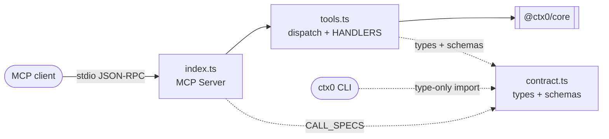
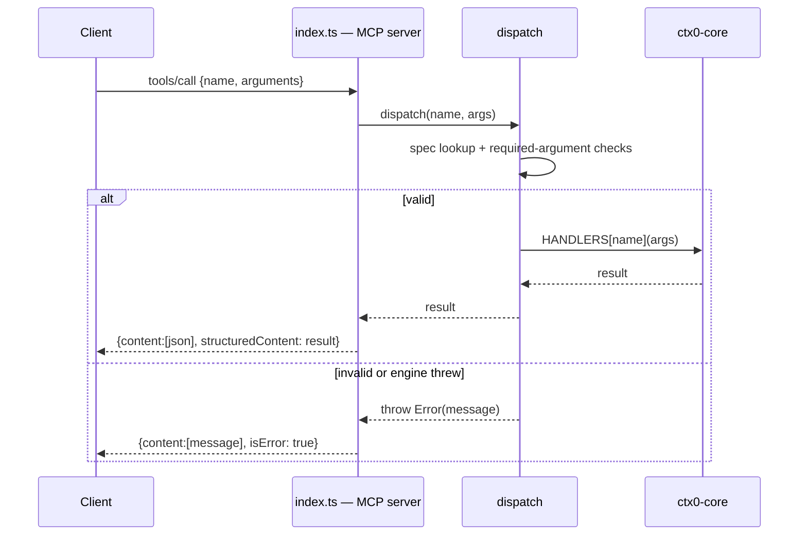

# `@ctx0/engine-server` — the contract and the engine behind it

**Package**: `packages/engine-server` · **Binary**: `ctx0-engine` →
`dist/index.js` · **Runtime dependencies**: `@ctx0/core`,
`@modelcontextprotocol/sdk`.

## Purpose

This package publishes the composition engine as a **service with a versioned contract**.
It declares the calls a frontend may make, implements each as a thin invocation of
`@ctx0/core`, and answers them over JSON-RPC 2.0 on stdio, framed as MCP. Because the
framing is MCP, any language's MCP client can drive the engine — and an agent host can too,
for free, without ctx.0 shipping a second integration
([ADR-0002](../adr/0002-engine-over-jsonrpc-mcp-stdio.md)).

## Boundaries

**May depend on**: `@ctx0/core`, the MCP SDK, `node:path`.

**Must never contain**: composition logic. `tools.ts` is arguments in, engine result out.
If a handler starts branching on template structure, that logic belongs in `@ctx0/core`.

**`contract.ts` must never import anything.** It is types and JSON Schemas only — that is
what lets the CLI depend on it without pulling in the engine
([ADR-0003](../adr/0003-versioned-contract-in-one-file.md)).

**Callers**: the `ctx0` CLI (`packages/cli/src/engine.ts`), any MCP client, the package's
own tests.

## Module map

| File | Lines | Responsibility | Key exports |
|---|--:|---|---|
| `src/contract.ts` | 288 | The contract: every call's arguments, result, and JSON Schema, plus the contract version. No logic, no imports. | `CONTRACT_VERSION`, `Calls`, `CallName`, `CallArgs`, `CallResult`, `CALL_SPECS`, `CallSpec`, `Vars`, `CatalogFeature`, `LayoutDescriptor`, `LocaleDescriptor`, `WorkspaceManifest` |
| `src/tools.ts` | 154 | The engine side: one handler per call over `@ctx0/core`, plus schema-driven argument validation. | `HANDLERS`, `dispatch` |
| `src/index.ts` | 62 | The transport: an MCP `Server` on `StdioServerTransport` exposing the calls as tools. | — (executable) |



## The contract

`CONTRACT_VERSION` is currently `'2'`. **It is bumped whenever a call's arguments or result
change shape**, and `engine.info` reports it so a mismatched CLI/engine pair can be
detected rather than failing obscurely.

Every call except `layouts.list`, `locales.list` and `secrets.generate` accepts an optional
`templatesRoot`; omitting it lets the engine use the templates it ships with.

| Call | Arguments | Result |
|---|---|---|
| `engine.info` | `templatesRoot?` | `engine`, `engineVersion`, `contractVersion`, `protocolVersion`, `templatesRoot` |
| `catalog.list` | `templatesRoot?` | `features: CatalogFeature[]` — id, summary, sides, requires, and `nav` when nav-capable |
| `catalog.resolve` | `features: string[]`, `templatesRoot?` | `order: string[]` (dependency-complete, application order), `navCapable: string[]` |
| `layouts.list` | — | `layouts: LayoutDescriptor[]` in display order |
| `locales.list` | — | `locales: LocaleDescriptor[]`, `default: string` |
| `vars.resolve` | `name`, `org?` | `vars: { appName, appSlug, org, bundleId }` |
| `workspace.create` | `targetDir`, `name`, `org?`, `features?`, `layout?`, `tabs?`, `locales?`, `scaffoldPlatforms?`, `toolVersion?`, `templatesRoot?` | `manifest`, `env: string[]`, `userSteps: string[]` |
| `workspace.status` | `dir`, `templatesRoot?` | `isWorkspace`, `manifest?`, `features: { id, summary, enabled, tab }[]` |
| `secrets.generate` | — | `secrets: Record<string, string>` |

The contract is expressed twice, deliberately:

- **`Calls`** — a TypeScript interface mapping each call name to its `args` and `result`.
  This is what makes `Engine.call('vars.resolve', {…})` typed on the CLI side, with no code
  generation step.
- **`CALL_SPECS`** — an array of `{ name, title, description, inputSchema }`. This is the
  runtime surface: `index.ts` publishes it as `tools/list`, so a client that cannot import
  the TypeScript discovers exactly the same thing at runtime.

`CatalogFeature.requires` is always an array (the engine normalises the manifest's optional
`requires` to `[]`), and `nav` is present *iff* the feature can be a tab — so a frontend
never has to reason about template structure to know what may become a navigation
destination.

`WorkspaceManifest` is redeclared here rather than imported from `@ctx0/core`, with
`schema: number` rather than the literal `3`. The contract describes what crosses the wire;
a client reading a manifest one schema version ahead should not fail to type-check.

## Handlers

`HANDLERS` in `tools.ts` maps each call name to an implementation typed against its
contract entry, so a handler whose result drifts from the declared shape fails to compile.
Each is a direct translation:

| Call | Core functions used |
|---|---|
| `engine.info` | `coreVersion`, `protocolVersion`, `templatesRoot` |
| `catalog.list` | `loadCatalog` |
| `catalog.resolve` | `loadCatalog`, `resolveFeatureOrder`, `navCapable` |
| `layouts.list` | `LAYOUTS` |
| `locales.list` | `LOCALES`, `DEFAULT_LOCALE` |
| `vars.resolve` | `resolveVars` |
| `workspace.create` | `resolveVars`, `createWorkspace` |
| `workspace.status` | `loadCatalog`, `isWorkspace`, `readManifest` |
| `secrets.generate` | `generateServerSecrets` |

Two checks live in `workspace.create` because they are boundary concerns rather than
composition logic: `targetDir` must be absolute (a relative path would resolve against the
engine's cwd, which the caller does not control), and `layout` must be a known id
(`isLayoutId`), which produces a better message than letting `composeShell` throw later.

`workspace.status` reconstructs the enabled feature set from the manifest by splitting each
layer id on `:` — layer ids are `<featureId>:<side>` for features, and the always-on layers
use reserved ids that never appear in the catalog. Outside a workspace it still returns the
full catalog with everything `enabled: false`, which is what lets the CLI's `status` render
both cases from one call.

`secrets.generate` returns a plain `Record<string, string>`: the CLI only prints the pairs,
and keeping the shape open means adding a secret does not change the contract.

## Argument validation

`dispatch(name, args)` is the single entry point, and validates before invoking:

1. Unknown call name → `Unknown call "<name>". Known: <list>.`
2. Arguments that are not a plain object (an array or a primitive) → rejected.
3. For each `required` key in the call's own `inputSchema`: a `string` must be present and
   non-empty; an `array` must be an array of strings.

The schema used is the one published in `tools/list`, so a client that speaks the contract
gets a clear message about what it got wrong, rather than whatever the engine would have
thrown three layers down.

## Transport

`index.ts` constructs an MCP `Server` named `ctx0-engine` (version = `coreVersion()`),
declares the `tools` capability, and connects a `StdioServerTransport`.

- **`tools/list`** maps `CALL_SPECS` to MCP tool descriptors.
- **`tools/call`** dispatches, and returns the result **twice**: as `structuredContent`
  (the JSON a programmatic client reads — the CLI requires it and errors if it is absent)
  and as a pretty-printed JSON text block, which is what an MCP client that only renders
  content will show.
- **Errors** are returned as `{ content: [text], isError: true }`, not as JSON-RPC
  transport errors. Failures the caller can act on — an unknown feature, a non-empty target
  directory — are *results*: this is what carries the engine's message intact to the CLI's
  top-level handler.



## Running it directly

```bash
npm run build
node packages/engine-server/dist/index.js   # speaks JSON-RPC 2.0 on stdin/stdout
```

Any MCP client can then drive it. Registered as an MCP server in an agent host, the nine
calls appear as tools with the titles and descriptions from `CALL_SPECS`.

## Adding a call

1. Add the entry to `Calls` in `contract.ts` (arguments and result).
2. Add a matching `CallSpec` to `CALL_SPECS`, with a `title`, a `description` written for
   someone who has never seen ctx.0, and an `inputSchema` that marks the genuinely required
   arguments.
3. Bump `CONTRACT_VERSION` if you changed an existing call's shape.
4. Implement it in `HANDLERS` in `tools.ts` — a thin call into `@ctx0/core`. If the logic
   does not exist there yet, add it there first.
5. Cover it in `test/tools.test.ts`.
6. Consume it from the CLI via `engine.call('<name>', {…})`.

The order matters: the contract is the design step, not the documentation step.

## Invariants

1. **`contract.ts` imports nothing and holds no logic.**
   ([ADR-0003](../adr/0003-versioned-contract-in-one-file.md))
2. **`CONTRACT_VERSION` is bumped on any shape change** to a call's arguments or result.
3. **Handlers contain no composition logic.**
4. **Actionable failures are results (`isError: true`), not transport errors.**
5. **Every call is validated in `dispatch`**, regardless of which client sent it.

## Tests

| File | Covers |
|---|---|
| `test/tools.test.ts` | Every call in the contract: that each is implemented, that required arguments are rejected, and what each returns |
| `test/stdio.test.ts` | Spawns the **built** engine and drives it with a hand-rolled JSON-RPC client — no SDK. This is what proves the contract is usable from another language. The package's `test` script runs `npm run build` first, because this test runs `dist/` |

---

**See also**: [system architecture](README.md) · [core.md](core.md) · [cli.md](cli.md) ·
[ADR-0001](../adr/0001-cli-never-imports-core.md) ·
[ADR-0002](../adr/0002-engine-over-jsonrpc-mcp-stdio.md) ·
[ADR-0003](../adr/0003-versioned-contract-in-one-file.md)
