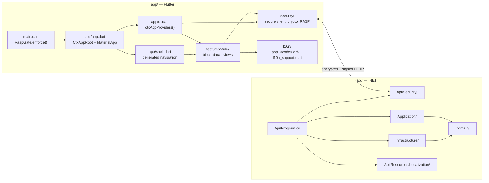

# The generated workspace

What `ctx0 create workspace` produces. This document describes the *output* architecture —
the thing the user develops in — as distinct from the scaffolder that emits it.

The generated workspace has **no runtime dependency on ctx.0**. Nothing in it links back to
the engine; `.ctx/manifest.json` is a record of how it was made, not a hook.

## Shape

```
<appSlug>/
  README.md              from templates/workspace
  AGENTS.md              static preamble + generated enabled-features block
  docker-compose.yml     PostgreSQL 16 for local development
  docs/features/<ID>.md  one generated doc per enabled feature
  .ctx/
    manifest.json        what was generated, from what, and with which hashes
    wire-protocol.md     the protocol spec, synced from protocol/
    vectors.json         the golden vectors both test suites assert against
  app/                   Flutter (Bloc)
  api/                   .NET (Clean Architecture)
```



## `app/` — the Flutter application

Architecture: **Bloc**, feature-first. The platform directories (`android/`, `ios/`,
`web/`, …) come from `flutter create` and are owned by the SDK; ctx.0 owns `lib/`, `test/`
and `pubspec.yaml`.

| Path | Role |
|---|---|
| `lib/main.dart` | Entry point. Awaits `RaspGate.enforce()` **before** `runApp` — a compromised device is refused before the app boots. |
| `lib/app/app.dart` | `CtxAppRoot`: a `MultiBlocProvider` over `ctxAppProviders()`, wrapping `_CtxMaterialApp`. The split is deliberate so the `MaterialApp`'s context sits below the providers. |
| `lib/app/di.dart` | The composition root. `ctxAppProviders()` returns the app-wide Bloc providers; the shared `ctxSecureClient` is available to all of them. |
| `lib/app/shell.dart` | **Generated.** The navigation shell for the chosen layout and tabs. |
| `lib/features/<id>/` | One directory per enabled feature: `bloc/`, `data/`, `views/`. |
| `lib/security/` | The vendored security plane: `ctx_security.dart`, `secure_http_client.dart`, `crypto/`, `rasp_gate.dart`. |
| `lib/l10n/app_<code>.arb` | **Generated.** Merged translations, one file per selected language. |
| `lib/l10n/l10n_support.dart` | **Generated.** `AppL10nSupport`: supported locales, delegates, and each language's own name. |
| `test/` | Per-feature tests plus the security suite, including the golden-vector tests. |

Three extension points in `app.dart` are worth knowing, because features attach through
them rather than by editing the file:

| Anchor | Position | Typical use |
|---|---|---|
| `app-material` | inside `MaterialApp`, below the providers | reading the locale Cubit while configuring the app |
| `app-overlay` | wraps every route, above whatever it renders | the GDPR consent banner, which must show before sign-in |
| `home-wrap` | wraps the shell itself | the auth gate |

## `api/` — the .NET API

Architecture: **Clean Architecture**, four projects under `CtxApp.sln`.

| Project | Depends on | Contents |
|---|---|---|
| `src/Domain` | — | Entities (`User`), security value types (`RefreshToken`, `EncryptedAttribute`) |
| `src/Application` | Domain | Abstractions (`ICurrentUser`, `IPersonalDataContributor`, `IPersonalDataAttachments`, `IFieldCipher`, `IBlindIndex`, `IJwtIssuer`, `IPasswordHasher`, `IRefreshTokenStore`, `ISecurityPrimitives`) and services such as `RefreshTokenService` |
| `src/Infrastructure` | Application, Domain | EF Core (`CtxAppDbContext`), and the security implementations: crypto, envelope encryption, JWT, PBKDF2, RLS |
| `src/Api` | all | `Program.cs`, endpoint modules, the security endpoint plane, localization resources |
| `tests/Ctx.Tests` | all | Security, localization and per-feature tests |

`Program.cs` composes the application in a fixed order — security plane, then EF Core with
the RLS interceptor, then features via anchors:

```csharp
builder.Services.AddCtxSecurity(builder.Configuration);
builder.Services.AddDbContext<CtxAppDbContext>(/* Npgsql + RLS interceptor */);
// ctx:anchor:services
var app = builder.Build();
app.UseCtxSecurity();
app.MapGet("/health", …);
app.MapCtxSecurityEndpoints();   // ALE key discovery + device enrollment
// ctx:anchor:endpoints
```

`public partial class Program;` at the end exposes the entry point to integration tests.

## The security plane

Always present, in both trees, regardless of which features are enabled
([ADR-0005](../adr/0005-vendored-security-overlay.md)). It is **vendored source** the user
owns and can audit — not a package dependency.

| Capability | Mobile | API |
|---|---|---|
| Application-layer encryption | `security/crypto/ale_cipher.dart` | `Infrastructure/Security/Crypto/AleCipher.cs`, `Api/Security/AleSession.cs` |
| Request signing | `security/crypto/request_signature.dart` | `Infrastructure/Security/Crypto/RequestSignature.cs`, `Api/Security/CtxSecureEndpointFilter.cs` |
| Device enrollment | `security/secure_http_client.dart` | `Infrastructure/Security/DeviceKeyRegistry.cs`, `Api/Security/CtxSecurityEndpoints.cs` |
| Identity | token storage in the `auth` feature | `Infrastructure/Security/Jwt/`, `Passwords/Pbkdf2PasswordHasher.cs`, `Application/Security/RefreshTokenService.cs` |
| Field-level encryption | — | `Infrastructure/Security/Envelope/`: envelope cipher, HMAC blind index, EF value converter |
| Tenant isolation | — | `Infrastructure/Security/Rls/`: PostgreSQL row-level security + connection interceptor |
| Device integrity | `security/rasp_gate.dart` | — |
| Rate limiting | — | `Infrastructure/Security/RateLimitOptions.cs` |

Every request between the two goes through it: encrypted with ECIES/AES-256-GCM, signed
with ECDSA P-256 over a canonical string, and stamped with the protocol version, device id
and timestamp. See [protocol.md](protocol.md).

## Localization

Present when the `l10n` feature is enabled — which every text-carrying feature requires.

| Side | Artifact | Generated? |
|---|---|---|
| Flutter | `app/lib/l10n/app_<code>.arb` | ✓ merged from every enabled layer's fragments |
| Flutter | `app/lib/l10n/l10n_support.dart` | ✓ delegates, supported locales, language names |
| Flutter | `app/lib/l10n/gen/app_l10n.dart` | by Flutter's `gen-l10n` from the ARB files |
| .NET | `api/src/Api/Resources/Localization/Messages.resx` | ✓ the culture-neutral (default) set |
| .NET | `api/src/Api/Resources/Localization/Messages.<code>.resx` | ✓ one per non-default language |
| .NET | `api/src/Api/Localization/SupportedCultures.g.cs` | ✓ the culture list as code |

The resx path is not free: `IStringLocalizer<Messages>` resolves resources as
`<root namespace>.<ResourcesPath>.<type minus root namespace>`, which is why they sit in
`Resources/Localization/` next to the `Messages` marker type's namespace, with
`Api/Localization/RootNamespace.cs` declaring the root namespace to the localizer.

Only the selected languages are emitted — a workspace created for English and Greek carries
exactly two translations, not five filtered at runtime.

## `.ctx/manifest.json`

Schema 3. The record of what was generated
([ADR-0008](../adr/0008-reversible-workspace-manifest.md)):

| Field | Meaning |
|---|---|
| `schema` | `3` — the manifest's own version |
| `ctx0Version` | The tool version that generated the workspace (the CLI passes its own) |
| `protocolVersion` | The wire-protocol version both sides implement |
| `vars` | `appName`, `appSlug`, `org`, `bundleId` — the substitution chosen at create time |
| `features` | Every applied layer, in application order: `{ id, files, hash }` |
| `navigation` | `{ layout, tabs }` |
| `localization` | `{ default, locales }` |

Layer ids are `workspace`, `app_base`, `api_base`, `security_mobile`, `security_api`, and
`<featureId>:<side>` for features. `files` is the complete list of workspace-relative paths
that layer wrote, in `sortUtf8` order; `hash` is the SHA-256 of the pre-substitution
template source, so drift in either the workspace or the template is detectable.

`ctx0 status` reads this file: its presence is what makes a directory a workspace
(`isWorkspace` checks for `.ctx/manifest.json`).

## Generated documentation

`AGENTS.md` at the workspace root is the static preamble from the workspace template
followed by a generated block, delimited by
`<!-- ctx:agents:features:start -->` / `<!-- ctx:agents:features:end -->`, holding a table
of enabled features linking to `docs/features/<ID>.md`. Each of those docs is that feature
overlay's `agents.md` fragment, token-substituted, with a do-not-hand-edit notice.

Both are derived: they are regenerated from the enabled feature set, and stale feature docs
are pruned. Edit the feature overlay, not the generated file.

## Running it

```bash
docker compose up -d                       # PostgreSQL 16 on :5432
ctx0 keygen                                # print the server secrets
# set ConnectionStrings__Default and the printed Ctx__* variables
dotnet run --project api/src/Api
flutter run --dart-define=CTX_API_BASE_URL=https://localhost:5001   # from app/
```

The environment variables and manual steps are not folklore — each enabled layer declares
them in its `feature.json`, the engine aggregates them, and `ctx0 create` prints exactly
the set that applies to the workspace it just made.

## What the user owns

Everything. There is no ctx.0 runtime, no generated-code marker outside the few files noted
as generated, and no upgrade path that rewrites the user's code. The generated files are
`app/lib/app/shell.dart`, the localization artifacts, `AGENTS.md`'s feature block, and
`docs/features/`; the rest is ordinary source to edit freely.

---

**See also**: [system architecture](README.md) · [templates.md](templates.md) ·
[protocol.md](protocol.md) · [core.md](core.md) ·
[ADR-0005](../adr/0005-vendored-security-overlay.md) ·
[ADR-0008](../adr/0008-reversible-workspace-manifest.md)
