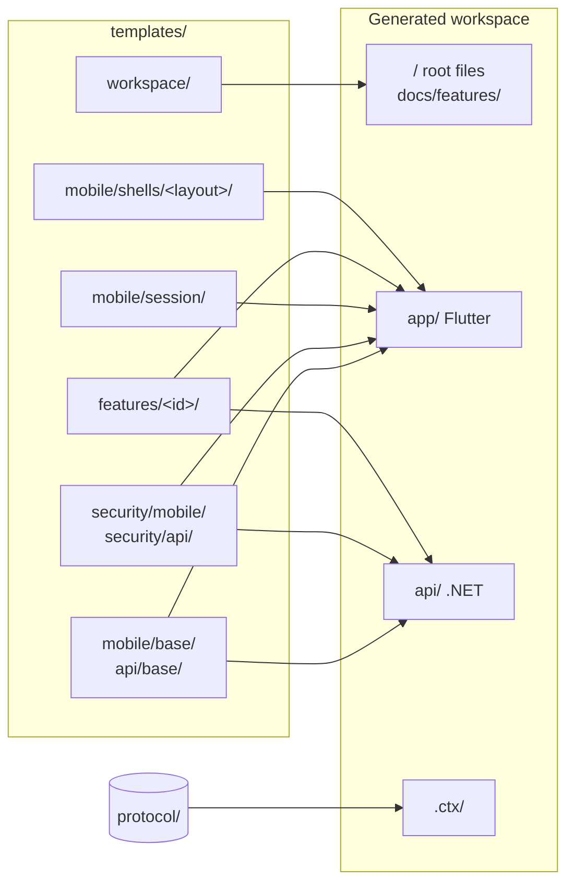
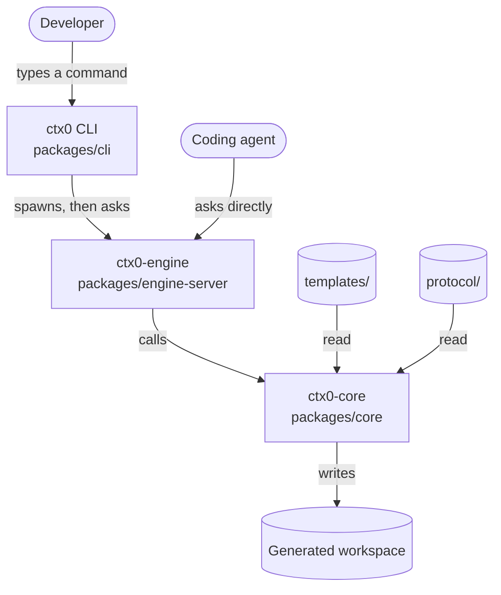

# ctx.0 system architecture

## Shape of the system

ctx.0 is a code generator. Its input is a directory of source templates plus a selection
made at invocation time; its output is a workspace holding a Flutter app and a .NET API.
Nothing it emits links back to it, so the generator is absent at the generated code's build
time and run time.

The generator is a layering engine. Templates are ordinary compilable source, and
generation is copying directories on top of each other in a fixed order, followed by line
insertions into the few files that several layers share. There is no templating language
and no expression evaluation in template contents.

That choice sets the constraints the rest of this document works within:

- Layers are unaware of each other, so composition has to be expressed as data
  (`feature.json`) that the engine reads.
- Later layers overwrite earlier ones, so order is part of the design rather than an
  implementation detail.
- Files that several layers must contribute to cannot be copied, so they are either
  anchored (insertion points) or assembled by code.
- The same inputs must produce byte-identical output, so every filesystem read is sorted.

The three sections that follow cover those in turn. The last two cover the process
boundaries and the record generation leaves behind.

## Features are folders

A feature is a directory of ordinary source files. This is all of an example `notes` feature:

```
templates/api/features/notes/
  feature.json
  agents.md
  src/Domain/Notes/Note.cs
  src/Api/Endpoints/NotesEndpoints.cs
  src/Infrastructure/Gdpr/NotesPersonalData.cs
  src/Infrastructure/Persistence/Configurations/NoteConfiguration.cs
  tests/Ctx.Tests/NotesRlsEnvelopeTests.cs
```

Those C# files sit where they belong in the generated API. ctx.0 copies a base project,
then copies each selected feature folder on top of it.

The copy rewrites one thing. Templates are written against the placeholder name `CtxApp`,
which is substituted for the requested application name in both file contents and file
paths, so a workspace named `Acme` gets `Acme.csproj`. That single substitution is what
keeps template sources compilable and testable in place.

Each folder carries a `feature.json` declaring an id, a one-line summary, and two fields the
engine composes on:

- `sides` says which projects the feature touches, the app, the API, or both.
- `requires` lists features that must be applied first, so `notes` names `auth` because it stores per-user data.

Adding a feature to ctx.0 means adding a directory and this file, leaving the generator unchanged.

## Shared files use anchors

Copying folders breaks down when two features need the same file. Both `notes` and `profile` register themselves in the API's `Program.cs`. If each shipped its own copy, the second one applied would erase the first.

Shared files therefore ship with labelled insertion points, written as comments the host
language ignores. The API's `Program.cs` carries three: one among the imports, one where
services are registered, and one where endpoints are mapped.

A feature's `wiring` array names, for each line it contributes, the file, the anchor, and
the text to insert. `notes` has four such entries, adding its import, its service
registrations and its endpoint mapping.

Many features can insert at one anchor. An insertion that is already present is skipped, so enabling a feature, disabling it and enabling it again leaves the file as it started.

## Build order

A later layer overwrites an earlier one, so the order is fixed.



1. Workspace root: README, `docker-compose.yml`, agent context files.
2. The two base projects, a runnable but empty Flutter app and .NET API.
3. The security layer on both sides, always applied and impossible to disable. It provides encryption, request signing, JWTs and per-user row isolation.
4. The session layer on the app side, always applied and impossible to disable. It provides the credentials store, the sign-in status and the locale that features plug into.
5. Selected features, each after the features it requires. Asking for `notes` also applies `auth`.
6. Wiring, once every anchored file exists.

Determinism rests on one rule applied throughout: every list read from the filesystem is
sorted into UTF-8 byte order (`packages/core/src/order.ts`) rather than used in the order
the operating system returned it.

## Files ctx.0 assembles

Four parts of a workspace depend on choices or on several features at once, so ctx.0
writes them instead of copying them.

**Translations.** Each feature ships its phrases per language in an `l10n/` folder, and so
do the always-on layers that carry their own strings, including the app's session layer.
ctx.0 merges the fragments from every enabled layer into the files Flutter and .NET expect,
covering the selected languages. (`packages/core/src/l10n.ts`)

**Navigation.** A feature that can appear as a screen declares a label, an icon and an
entry page. ctx.0 combines those with the selected layout, one of a bottom bar, rail,
drawer or plain list, and writes the app's navigation. (`packages/core/src/shell.ts`)

**Theme.** The colour scheme and font chosen at create time become `AppTheme`: one seed
colour that Material 3 expands into a light and a dark scheme, and the chosen font's text
theme merged over it. Both choices are optional, and a font is the only thing that adds the
`google_fonts` package to the app. (`packages/core/src/theme.ts`)

**Documentation.** Each feature ships an `agents.md`. The workspace `AGENTS.md` and
`docs/features/` are assembled from the enabled ones. (`packages/core/src/agents.ts`)

Disabling a feature regenerates all of them.

## Packages

`@ctx0/core` (`packages/core`) holds the generating logic. It returns results and prints
nothing.

Core has two classes of caller, a person at a terminal and a coding agent. Rather than
giving each its own entry point into core, the engine wraps core as a service answering a
fixed set of requests, and the CLI becomes one of that service's callers.



The CLI runs the engine as a separate process and talks to it over stdin and stdout using
MCP, the protocol agent tools already speak.

`packages/engine-server/src/contract.ts` lists the requests:

| Request | Answer |
|---|---|
| `engine.info` | Which engine and versions are running. |
| `catalog.list` | Every available feature and what it does. |
| `catalog.resolve` | Given a selection, the full list once dependencies are added. |
| `layouts.list` / `locales.list` | The offered navigation layouts and languages. |
| `theme.list` | The offered colour schemes and fonts, with each font's language coverage. |
| `vars.resolve` | The names derived from "Acme": slug, bundle id. |
| `workspace.create` | Generate a workspace. |
| `workspace.status` | What a given directory was generated with. |
| `secrets.generate` | Server keys for the generated API. |

The file holds descriptions and no logic, so a replacement CLI, or an engine written in
another language, only has to match it. Its version number changes when a request changes
shape.

The engine checks arguments, so every caller gets the same answer to a bad request.
Failures a user can fix, such as an unknown feature name or a target directory that
already has files in it, come back as answers carrying a message, which lets the CLI print
something useful.

## The generated workspace

```
acme/
  app/              Flutter application
  api/              .NET API
  .ctx/
    manifest.json     every layer applied, the files it wrote, a hash of its source
    vectors.json      known-good encryption test values
    wire-protocol.md  the app-to-API protocol specification
  docs/features/    one page per enabled feature
  AGENTS.md
  README.md
  docker-compose.yml
```

Each side carries its own copy of the security code, and both test against the same
`vectors.json`, which keeps them agreeing on the protocol specified in
[`protocol/wire-protocol.md`](../../protocol/wire-protocol.md).

`manifest.json` records which layer wrote each file and a hash of the source it came from,
so you can tell which feature produced a file and whether it has been edited since.
