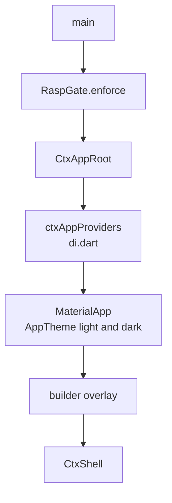
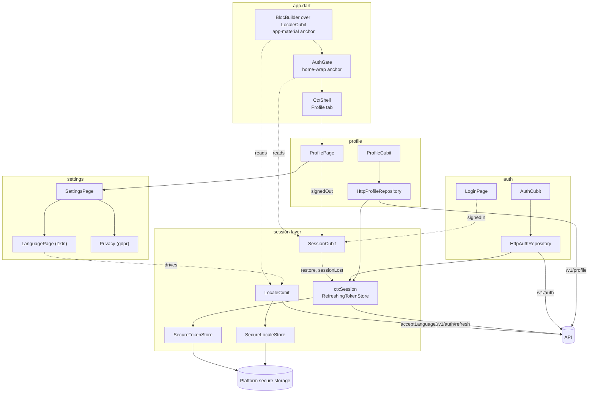
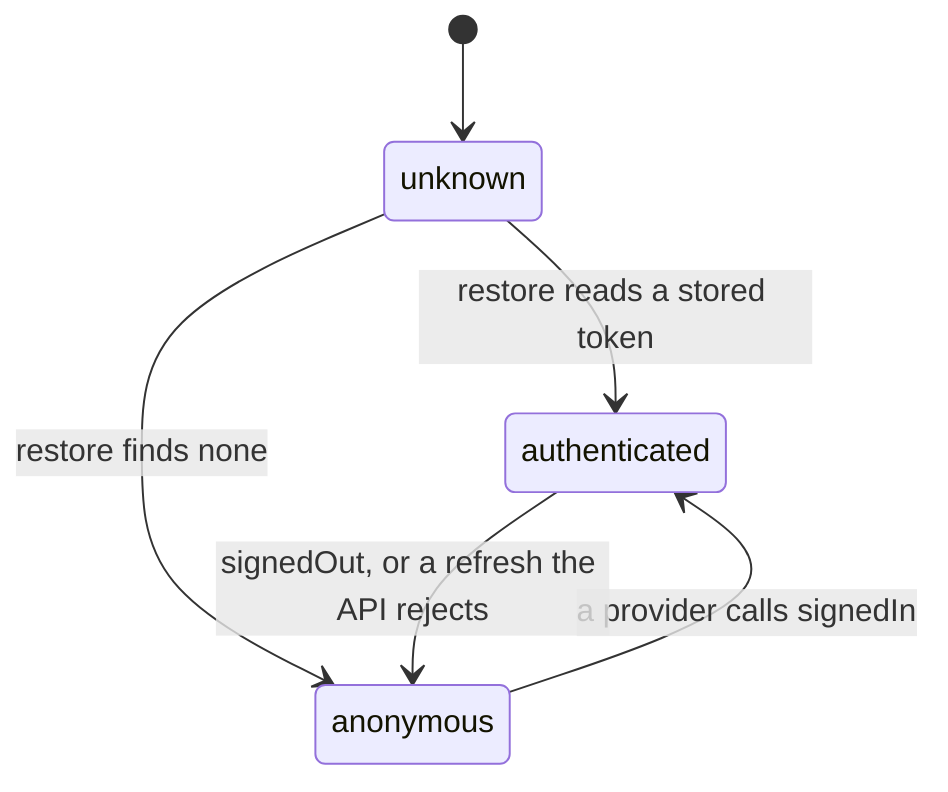
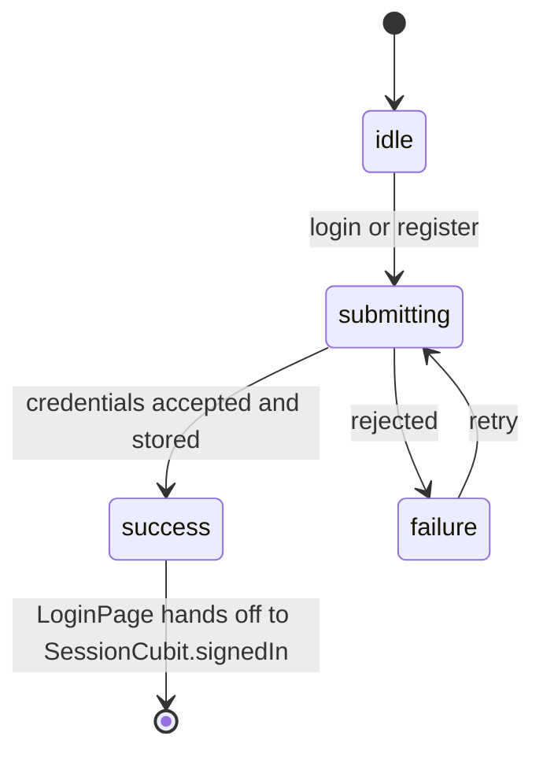
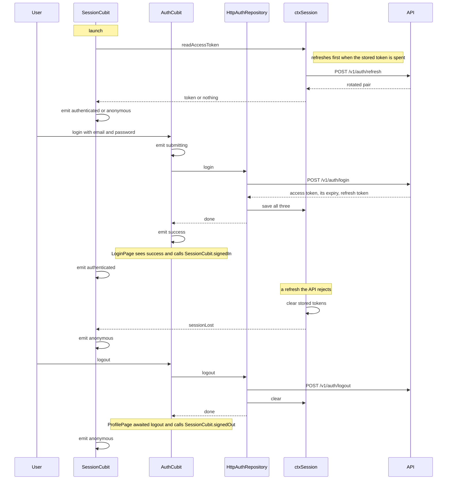

# Generated mobile app architecture

This describes the Flutter application ctx.0 writes into `app/` of a generated workspace.
It is assembled from `templates/mobile`: a base app, the vendored security layer, the
always-on session layer, one navigation shell, and one folder per enabled feature. What
follows is the shape those layers add up to. The running example is a workspace generated
with `profile`, which resolves its dependencies to `auth`, `l10n`, `settings` and `gdpr`,
so a single request produces a five-feature app on top of the session layer.

## Layout

```
app/
  pubspec.yaml
  lib/
    main.dart
    app/
      app.dart          root widget, MaterialApp
      di.dart           composition root
      shell.dart        navigation, generated
      theme.dart        AppTheme, generated
    security/           vendored, always present
      ctx_security.dart
      secure_http_client.dart
      crypto/
    session/            always present, the app-layer session
      session_cubit.dart
      token_store.dart
      locale_cubit.dart
      locale_store.dart
    l10n/gen/           AppL10n, generated from the merged .arb files
    features/
      auth/
      profile/
        data/profile_repository.dart
        bloc/profile_cubit.dart
        views/profile_page.dart
  test/
    session/              SessionCubit, the token store, LocaleCubit
    features/<id>/         one folder per feature
```

Every feature occupies `lib/features/<id>/` and splits three ways: `data` talks to the
API, `bloc` holds state, `views` renders. A feature's tests ship beside it under
`test/features/<id>/`. Nothing outside `lib/features/<id>/` belongs to a feature except
the lines it inserts at anchors, which keeps any combination of features valid. Two things
sit outside that scheme and are always present: `security/`, the vendored crypto, and
`session/`, the subject of its own section below.

## Startup



`main.dart` runs the RASP gate before anything else boots, so a rooted or jailbroken
device is refused before app state exists. `CtxAppRoot` then provides the app-wide Blocs
and builds the `MaterialApp`.

`MaterialApp` is a separate widget below the providers, which lets a widget configuring the
app read those Blocs. That is what the `app-material` anchor is for: the session layer
inserts a `BlocBuilder` over `LocaleCubit` there to drive `locale`, alongside the
localisation delegates and `supportedLocales`.

Four anchors carry the app-level extension points:

| Anchor | What attaches |
|---|---|
| `app-imports` | imports for anything the anchors below reference |
| `app-material` | `MaterialApp` configuration, such as `locale` and `localizationsDelegates` |
| `app-overlay` | widgets drawn above every route, such as a consent banner |
| `home-wrap` | wrappers around the shell, such as the auth gate |

The session layer wires the `app-material` anchor, so the app is localised whatever
features are enabled. `auth` uses `home-wrap` to put `AuthGate` in front of `CtxShell`, so
an unauthenticated launch shows the login page and never reaches navigation.

## The session layer

`session/` is a mandatory layer, not a feature. The engine applies it after the mobile
security layer and before any feature, and it cannot be disabled. It owns the three things
every app needs and no feature should have to own: the credentials, whether anyone is
signed in, and the language the app speaks. Features plug into it; they do not reimplement
it.

**Credentials: `ctxSession`.** `token_store.dart` declares the `TokenStore` interface and
two implementations. `SecureTokenStore` is a stateless facade over three platform keystore
entries, the access token, the refresh token, and the access token's expiry.
`RefreshingTokenStore` wraps it: a read returns the stored access token while it has life
left, and once the token is within thirty seconds of expiry it spends the refresh token on
`/v1/auth/refresh` and stores the rotated pair before answering. The app shares one
instance, `ctxSession = RefreshingTokenStore(SecureTokenStore())`, which is what keeps
rotation single-flight. Every repository that sends a bearer token reads through this one
object, and it exposes `sessionLost`, fired when the API rejects a refresh.

**Sign-in status: `SessionCubit`.** `SessionCubit` is the single source of truth for
`SessionStatus`, one of `unknown`, `anonymous` or `authenticated`. It holds no credentials
of its own. `restore()` runs at launch and reads `ctxSession.readAccessToken()` to decide
the initial status, and the cubit listens to `sessionLost` so a refresh the API rejects
drops it to `anonymous` without the user asking. A provider that authenticates does not
touch this state directly; it stores the tokens and then the handshake below moves the
status.

**Locale: `LocaleCubit`.** `LocaleCubit`'s state is a nullable `Locale`, which is exactly
what `MaterialApp.locale` wants: `null` means no override, follow the device language.
`load()` restores the saved choice, `select()` and `useDeviceLanguage()` change it, and
each writes through `SecureLocaleStore`. The cubit reports the language in force to a
callback the composition root hands it, which sets `ctxSecureClient.acceptLanguage`, so the
API answers in the language the UI is showing. Because the delegates, `supportedLocales`,
`l10n.yaml` and `generate: true` all ship from this layer, an app is localised whether or
not the `l10n` feature is enabled.

**The plug-in contract.** A feature that authenticates stores its tokens in `ctxSession`
and then hands the session its new status: `LoginPage`, seeing `AuthStatus.success`, calls
`context.read<SessionCubit>().signedIn()`, and `ProfilePage`, after logout completes, calls
`signedOut()`. That handshake is the whole coupling; providers keep no session state. A
feature that only reads passes `ctxSession` to its repository for the bearer token, or
watches `SessionCubit` when its UI varies by sign-in. The `l10n` feature is the language
picker and drives `LocaleCubit`. When no authenticating provider is enabled the session
simply stays `anonymous`.

## State

There is no single app state object. State is partitioned, one Cubit per feature, and the
partitions are disjoint by construction: a feature's Cubit is declared in its folder,
provided once in `di.dart`, and named in no other feature's code. Composability forces
this. Any two features can be enabled together or apart, so no feature may assume another's
state exists. The always-on session layer adds two app-wide Cubits of its own,
`SessionCubit` and `LocaleCubit`, which are not features and which every feature may read.

That leaves four distinct places a value can live, and which one it belongs in is decided
by how long it has to survive.

| Where | Lifetime | What lives there |
|---|---|---|
| Feature or session Cubit | app process | server data being shown, request status, sign-in status, locale |
| Widget `State` | the route | text controllers, scroll positions, form input before submit |
| Platform secure storage | reinstall | session tokens, locale override |
| The API | permanent | everything else |

The generated app holds no local database and no offline cache. A Cubit's data is a copy of
what the server last returned, discarded when the process dies, which is why every screen
has a `loading` status and a way to fail. Persisting anything beyond that is a decision for
whoever builds on the workspace, and it belongs behind the repository interface.

**Cubits are app-wide, not per-route.** All providers sit above `MaterialApp`, so switching
tabs does not dispose a Cubit and returning to a tab shows what was already loaded rather
than refetching. The cost is that a Cubit lives from launch to exit, so its state must stay
small: what the screen needs to draw, not an accumulating history.

**A state class is a status, the data, and an error.** Cubits emit immutable states
extending `Equatable`, so an emit that changes nothing rebuilds nothing. The status enum is
the discriminator the view switches on, and the templates keep the data alongside it rather
than replacing it: `ProfileState` holds the loaded profile through a `saving` transition,
so the screen stays populated while a save is in flight.

**Failure is state, not an exception.** Repositories throw, Cubits catch, and what reaches
the widget is a `failure` status with a message. No error crosses into the widget tree as
an exception, which is why no screen needs an error boundary and why the error can be
rendered where it belongs, next to the control that caused it.

**State flows one way.** Views call methods on a Cubit and rebuild from what it emits. A
view never writes to another view's state, and feature Cubits do not call each other. Where
two features genuinely share something, they share the store beneath it rather than the
state above it: `auth` and `profile` both read through the one shared `ctxSession` in the
session layer, beneath either Cubit's state, rather than either holding a reference to the
other.

## Composition root

`lib/app/di.dart` is the one place providers are wired in. It returns the app-wide provider
list. The session layer inserts the first entries, `SessionCubit(ctxSession)..restore()`
and `LocaleCubit` built with `SecureLocaleStore` and the `acceptLanguage` callback. Each
feature then inserts one entry: its Cubit, constructed with the HTTP implementation of its
repository and whatever that needs, such as `ctxSession` for the token.

Construction happens here rather than inside widgets, so a feature's screens hold no
knowledge of how their dependencies were built. There is no service locator and no code
generation. Repositories are declared as abstract classes with an HTTP implementation
beside them, and this is the only file that names the implementation, which is what lets a
test hand a Cubit a fake without touching the feature's code.

## Navigation

`lib/app/shell.dart` is written by the generator from the chosen layout and the `nav` block
each feature declares. That block names the tab's label, its Material icon, the page widget
to show, and the file to import it from.

The four layouts, bottom navigation bar, navigation rail, drawer and plain list, are the
same widget contract with different chrome: each shell template exposes `ctx:gen:imports`,
`ctx:gen:pages` and `ctx:gen:destinations`, which the generator fills with the enabled
features in a fixed order. Changing layout is regeneration of this one file.

A feature need not be a tab. A feature that declares a `settingsEntry` instead of a `nav`
block contributes a row to the generated `SettingsPage`, the hub opened from the profile
page's app bar: `l10n` adds the language picker there and `gdpr` its privacy controls. A
feature that declares neither, contributing only behaviour, adds no visible entry point of
its own.

## Talking to the API

Two paths out of the app, chosen by what the request needs to prove.

**The secure client.** `ctxSecureClient` is a single `SecureHttpClient` implementing the
wire protocol: a per-install ECDSA device key held in secure storage and enrolled with the
API, ECDH plus HKDF plus AES-256-GCM application-level encryption over every body, and an
ECDSA signature over each request. It proves the request came from an enrolled install.
Its base URL comes from `CTX_API_BASE_URL` at compile time.

**Authenticated JSON.** Endpoints that act on behalf of a signed-in user take the access
token minted by `auth`, read from the shared `ctxSession`, which renews it when it is spent.
`HttpProfileRepository` uses this path, since the device identity the secure client proves
carries no user identity.


The session's `LocaleCubit` sets `acceptLanguage` on the secure client when the locale
changes, so the API answers in the language the app is showing.

## Localisation

The localisation plumbing is always on and ships from the session layer: the `MaterialApp`
delegates, `supportedLocales`, `l10n.yaml` and `generate: true`. That is why an app speaks
the user's language whether or not the `l10n` feature is enabled; enabling `l10n` only adds
the in-app picker that lets the user override the device language.

Each feature ships one `.arb` file per language under its own `l10n/`, and so does the
session layer. The generator merges the fragments from enabled layers into `lib/l10n/` for
the selected languages, and Flutter's `gen-l10n` produces `AppL10n`. Views read every
user-visible string from it. Because merging is per generation, disabling a feature removes
its phrases.

## Theme

`lib/app/theme.dart` is generated from the colour scheme and font chosen at create time.
`AppTheme.light()` and `AppTheme.dark()` both derive from one seed colour through
`ColorScheme.fromSeed`, with the chosen font's text theme merged over the result. Screens
take colours and text styles from `Theme.of(context)` and define no palette of their own,
which is what lets the seed be changed once and rebrand the app. The full standard is in
[the UI/UX guidelines](../ui/README.md).

## A worked example: the profile app

Everything above meets in one workspace. Generating with `profile` resolves the dependency
chain to `auth`, `l10n`, `settings` and `gdpr`, so the shortest request that reaches a
user-data screen produces a five-feature app. All of them sit on the always-on session
layer.

### What the app is made of



The session layer holds the credentials, the sign-in status and the locale. `auth` and
`profile` both read through the one `ctxSession` and neither holds a reference to the other:
features meet at the token store, never at each other's objects, because either of them may
be absent. `AuthGate` renders from `SessionCubit`, so `auth` owns the login form while the
session owns whether anyone is signed in. The Settings hub is where `l10n` and `gdpr` hang
their rows, and the language row drives the session's `LocaleCubit`.

### Two state machines

Sign-in and the login form are separate concerns with separate state, which is the point of
the session layer. `SessionStatus` gates the app and is owned by the session:



`AuthGate` switches on exactly this: `authenticated` renders the shell, `unknown` renders a
spinner while the stored token is read and, if it has expired, renewed, and `anonymous`
renders the login page. The gate holds no state of its own, so the launch path, a sign-in,
a logout and a session that expires under the user all resolve through one switch. `unknown`
exists because reading the keystore is asynchronous; without it a returning user would see
the login screen flash before their session was found.

`AuthStatus` is the login form's own state, owned by `auth` and read by no one else:



`AuthCubit` performs the credential exchange and reports the outcome; it does not decide
whether the app is signed in. On `success` the view stores nothing new of its own, it just
tells the session, and the gate does the rest.

### The session, end to end

What the app holds is two tokens and an expiry; what they mean is decided by the API. A
short-lived JWT access token is sent as a bearer header on user-scoped requests, a
long-lived opaque refresh token is the only way to obtain a new one, and the recorded expiry
is what tells the app when to spend it. The full server-side rules, rotation and theft
detection included, are in [the API document](api.md#session-and-token-lifecycle).



Three properties of this are worth stating plainly, because they decide what a workspace
owner can rely on.

**A stored session outlives the access token.** `SessionCubit.restore` reads through
`ctxSession`, which renews a token that is spent or within thirty seconds of expiry before
answering. A user returning after the fifteen-minute access token has died lands on the
shell, not the login screen, and the renewal is the same one any feature's first request
would trigger.

**Renewal is single-flight, because rotation is destructive.** Each refresh revokes the
token it was given, and the API reads a replay as theft and revokes the entire family. The
app therefore shares one `ctxSession`, and concurrent readers wait on the one request in
flight rather than issuing their own.

**Only a 401 ends the session.** A 401 from the refresh endpoint clears storage and reports
on `sessionLost`, which `SessionCubit` turns into `anonymous`, and the gate renders the
login screen. Any other failure, an unreachable API, a timeout, or a non-401 error
response, returns no token and leaves the stored session untouched, so a transient outage
does not sign the user out and the next read tries again. Logout revokes the family
server-side first, so a refresh token captured beforehand is dead rather than good for the
rest of its fourteen days.

### A feature request end to end


The view calls one method and rebuilds from what is emitted. It holds no repository
reference and performs no I/O, which is what makes a feature's behaviour reachable from a
test through its Cubit alone, with a fake repository and no widget tree.

The chain is the same for every feature, and the token read is the only step `profile`
shares with `auth`, through `ctxSession`. A feature that needs no user identity, `ping` for
instance, drops that step and sends through the secure client instead.

## Tests

Feature tests are unit tests over Cubits and repositories using `bloc_test` and fakes. The
session layer adds `test/session/`, which covers `SessionCubit`, the refreshing token store
and `LocaleCubit` against in-memory fakes. The security layer adds `test/security/`, which
runs the shared `vectors.json` through the app's own crypto so the app and the API stay in
agreement about the protocol.
