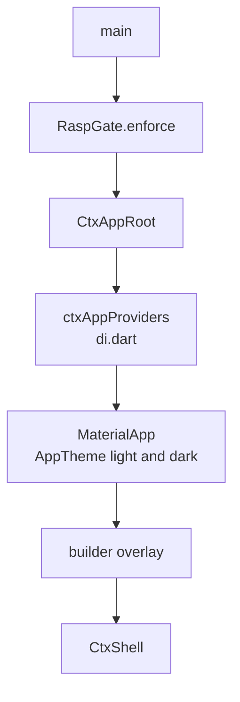
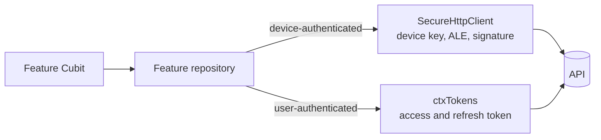
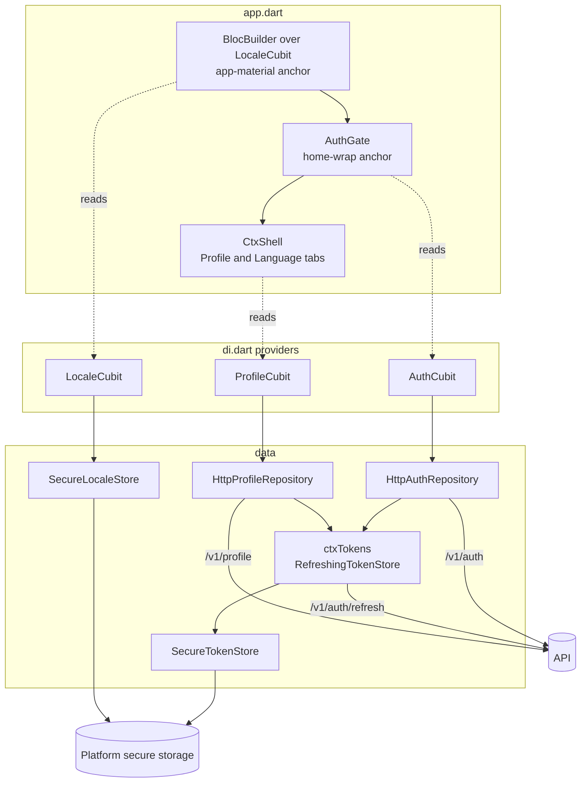
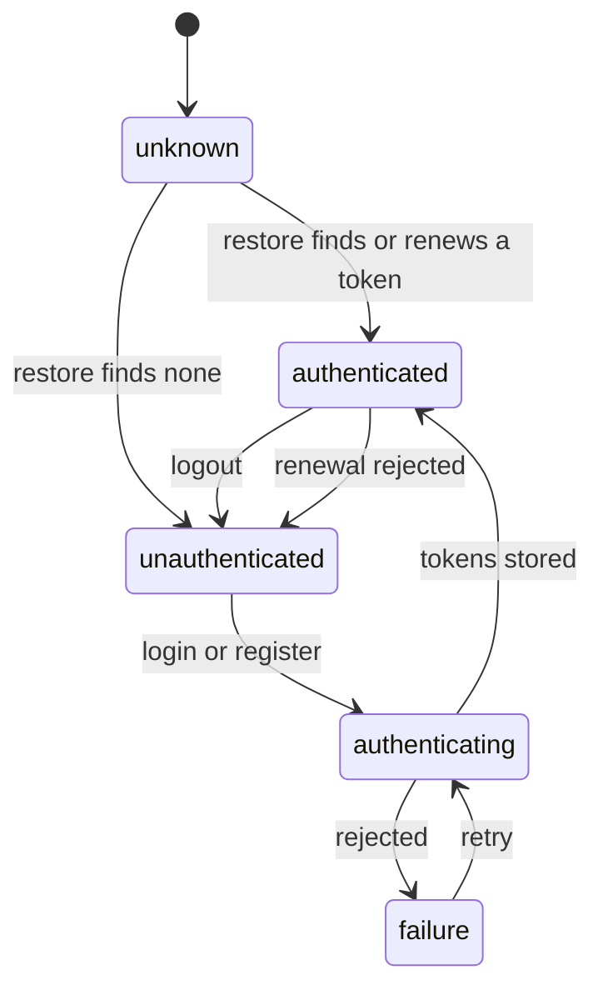
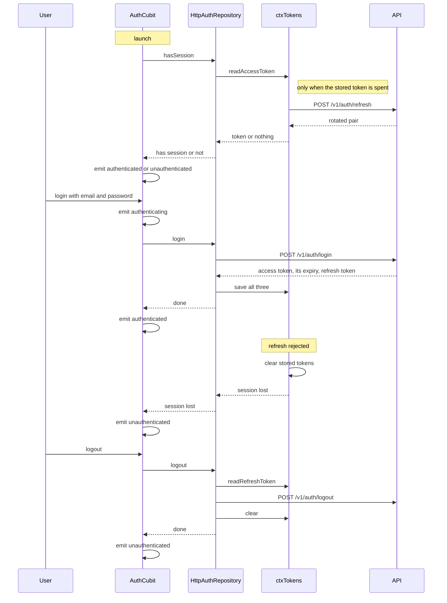
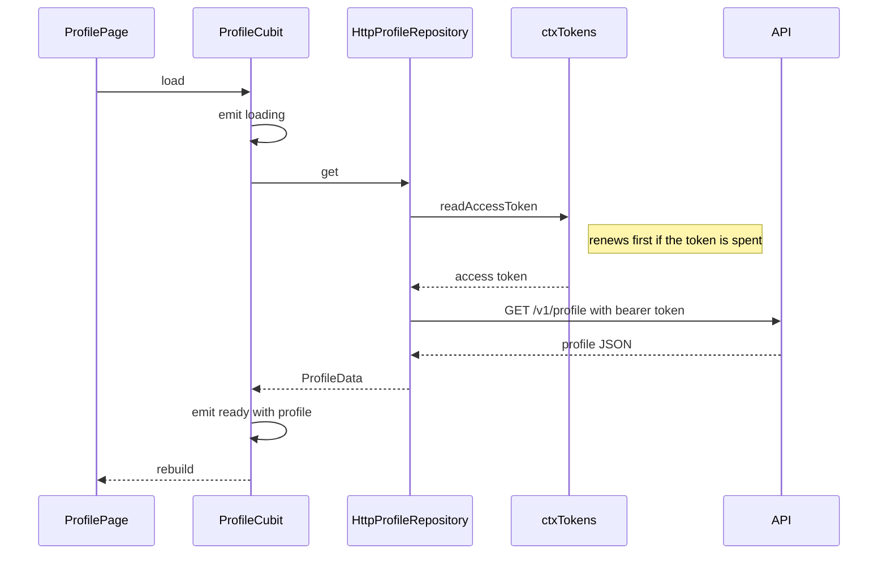

# Generated mobile app architecture

This describes the Flutter application ctx.0 writes into `app/` of a generated workspace.
It is assembled from `templates/mobile`: a base app, the vendored security layer, one
navigation shell, and one folder per enabled feature. What follows is the shape those
layers add up to, using a workspace generated with `auth`, `l10n` and `profile` as the
running example.

## Layout

```
app/
  pubspec.yaml
  lib/
    main.dart
    app/
      app.dart          root widget, MaterialApp
      di.dart           composition root
      shell.dart        navigation, generated
      theme.dart        AppTheme, generated
    security/           vendored, always present
      ctx_security.dart
      secure_http_client.dart
      crypto/
    l10n/gen/           AppL10n, generated from the merged .arb files
    features/
      auth/
      profile/
        data/profile_repository.dart
        bloc/profile_cubit.dart
        views/profile_page.dart
  test/
    features/<id>/         one folder per feature
```

Every feature occupies `lib/features/<id>/` and splits three ways: `data` talks to the
API, `bloc` holds state, `views` renders. A feature's tests ship beside it under
`test/features/<id>/`. Nothing outside `lib/features/<id>/` belongs to a feature except
the lines it inserts at anchors, which keeps any combination of features valid.

## Startup



`main.dart` runs the RASP gate before anything else boots, so a rooted or jailbroken
device is refused before app state exists. `CtxAppRoot` then provides the app-wide Blocs
and builds the `MaterialApp`.

`MaterialApp` is a separate widget below the providers, which lets a feature configuring
the app read those Blocs. That is what the `l10n` feature relies on: it inserts a
`BlocBuilder` over the locale Cubit at the `app-material` anchor to drive `locale`.

Four anchors carry the app-level extension points:

| Anchor | What attaches |
|---|---|
| `app-imports` | imports for anything the anchors below reference |
| `app-material` | `MaterialApp` configuration, such as `locale` and `localizationsDelegates` |
| `app-overlay` | widgets drawn above every route, such as a consent banner |
| `home-wrap` | wrappers around the shell, such as the auth gate |

`auth` uses `home-wrap` to put `AuthGate` in front of `CtxShell`, so an unauthenticated
launch shows the login page and never reaches navigation.

## State

There is no single app state object. State is partitioned by feature, one Cubit each, and
the partitions are disjoint by construction: a Cubit is declared in its feature's folder,
provided once in `di.dart`, and named in no other feature's code. Composability forces
this. Any two features can be enabled together or apart, so no feature may assume another's
state exists.

That leaves four distinct places a value can live, and which one it belongs in is decided
by how long it has to survive.

| Where | Lifetime | What lives there |
|---|---|---|
| Feature Cubit | app process | server data being shown, request status, error messages |
| Widget `State` | the route | text controllers, scroll positions, form input before submit |
| Platform secure storage | reinstall | session tokens, locale override |
| The API | permanent | everything else |

The generated app holds no local database and no offline cache. A Cubit's data is a copy of
what the server last returned, discarded when the process dies, which is why every screen
has a `loading` status and a way to fail. Persisting anything beyond that is a decision for
whoever builds on the workspace, and it belongs behind the repository interface.

**Cubits are app-wide, not per-route.** All providers sit above `MaterialApp`, so switching
tabs does not dispose a Cubit and returning to a tab shows what was already loaded rather
than refetching. The cost is that a Cubit lives from launch to exit, so its state must stay
small: what the screen needs to draw, not an accumulating history.

**A state class is a status, the data, and an error.** Cubits emit immutable states
extending `Equatable`, so an emit that changes nothing rebuilds nothing. The status enum is
the discriminator the view switches on, and the templates keep the data alongside it rather
than replacing it: `ProfileState` holds the loaded profile through a `saving` transition,
so the screen stays populated while a save is in flight.

**Failure is state, not an exception.** Repositories throw, Cubits catch, and what reaches
the widget is a `failure` status with a message. No error crosses into the widget tree as
an exception, which is why no screen needs an error boundary and why the error can be
rendered where it belongs, next to the control that caused it.

**State flows one way.** Views call methods on a Cubit and rebuild from what it emits. A
view never writes to another view's state, and Cubits do not call each other. Where two
features genuinely share something, they share the store beneath it rather than the state
above it: `auth` and `profile` both read through the one shared `ctxTokens`, beneath either
Cubit's state, rather than either holding a reference to the other.

## Composition root

`lib/app/di.dart` is the one place features are wired in. It returns the app-wide provider
list, and each feature inserts one entry at the providers anchor: its Cubit, constructed
with the HTTP implementation of its repository and whatever that needs, such as the token
store.

Construction happens here rather than inside widgets, so a feature's screens hold no
knowledge of how their dependencies were built. There is no service locator and no code
generation. Repositories are declared as abstract classes with an HTTP implementation
beside them, and this is the only file that names the implementation, which is what lets a
test hand a Cubit a fake without touching the feature's code.

## Navigation

`lib/app/shell.dart` is written by the generator from the chosen layout and the `nav` block
each feature declares. That block names the tab's label, its Material icon, the page widget
to show, and the file to import it from.

The four layouts, bottom navigation bar, navigation rail, drawer and plain list, are the
same widget contract with different chrome: each shell template exposes `ctx:gen:imports`,
`ctx:gen:pages` and `ctx:gen:destinations`, which the generator fills with the enabled
features in a fixed order. Changing layout is regeneration of this one file. A feature
without a `nav` block, such as `gdpr`, contributes behaviour and no tab.

## Talking to the API

Two paths out of the app, chosen by what the request needs to prove.

**The secure client.** `ctxSecureClient` is a single `SecureHttpClient` implementing the
wire protocol: a per-install ECDSA device key held in secure storage and enrolled with the
API, ECDH plus HKDF plus AES-256-GCM application-level encryption over every body, and an
ECDSA signature over each request. It proves the request came from an enrolled install.
Its base URL comes from `CTX_API_BASE_URL` at compile time.

**Authenticated JSON.** Endpoints that act on behalf of a signed-in user take the access
token minted by `auth`, read from the shared `ctxTokens`, which renews it when it is spent.
`HttpProfileRepository` uses this path, since the device identity the secure client proves
carries no user identity.



The `l10n` feature sets `acceptLanguage` on the secure client when the locale changes, so
the API answers in the language the app is showing.

## Localisation

Each feature ships one `.arb` file per language under its own `l10n/`. The generator
merges the fragments from enabled features into `lib/l10n/` for the selected languages,
and Flutter's `gen-l10n` produces `AppL10n`. Views read every user-visible string from it.
Because merging is per generation, disabling a feature removes its phrases.

## Theme

`lib/app/theme.dart` is generated from the colour scheme and font chosen at create time.
`AppTheme.light()` and `AppTheme.dark()` both derive from one seed colour through
`ColorScheme.fromSeed`, with the chosen font's text theme merged over the result. Screens
take colours and text styles from `Theme.of(context)` and define no palette of their own,
which is what lets the seed be changed once and rebrand the app. The full standard is in
[the UI/UX guidelines](../ui/README.md).

## A worked example: auth, l10n and profile

Everything above meets in one workspace. Generating with `profile` pulls in `auth`, which
pulls in `l10n`, so a three-feature app is what the shortest useful selection produces.

### What the app is made of



Three Cubits, three repositories, and one token store between them. `auth` and `profile`
both read through `ctxTokens`, and neither holds a reference to the other. That is the
shape cross-feature sharing takes here: features meet at the token store, never at each
other's objects, because either of them may be absent.

The sharing is not a convenience. `SecureTokenStore` underneath is stateless, a facade over
three keystore entries, and any number of those could coexist without disagreeing. What
cannot be duplicated is the renewal: rotating a refresh token revokes it server-side, so
two features renewing at the same moment would replay a dead token and lose the session.
`ctxTokens` is one object so that renewal is single-flight.

`AuthGate` sits between the `MaterialApp` and the shell, so nothing behind it is built
until there is a session. `profile` reaches `auth` only through the token store, and
`l10n` reaches the rest only through the generated `AppL10n` and one callback.

### What the wiring produced

Between them the three features touch three files, and no others. Each adds its provider to
`di.dart`. `auth` alone adds a line at the `home-wrap` anchor in `app.dart` to put the gate
around the shell, and `l10n` reaches `app.dart` too, at the `app-material` anchor, plus
`pubspec.yaml` for its localisation dependencies.

Two of those providers start work as they are constructed. `AuthCubit` is told to restore,
which is what begins the stored-session check at launch, and `LocaleCubit` is told to load
its saved language. `LocaleCubit` is also handed the callback that writes the language onto
the secure client's `Accept-Language`, and that callback is the only point at which `l10n`
and the security layer meet.

### Session state

`AuthState` is the one state in the app that gates the rest of it. Its status takes one of
five values, and the session moves between them like this:



`AuthGate` switches on exactly this: `authenticated` renders the shell, `unknown` renders a
spinner while the stored token is read and, if it has expired, renewed, and the remaining
three render the login page, which shows the error when there is one. The gate holds no
state of its own, so the launch path, a failed login, a logout and a session that expires
under the user all resolve through one switch.

`unknown` exists because reading the keystore is asynchronous. Without it the first frame
would have to guess, and a returning user would see the login screen flash before their
session was found.

`LocaleCubit` shows the opposite end of the range: its state is a nullable `Locale` with no
wrapper class, because that is already the whole state. `null` means no override, which is
what `MaterialApp.locale` wants in order to follow the device language.

### The session, end to end

What the app holds is two tokens and an expiry; what they mean is decided by the API. A
short-lived JWT access token is sent as a bearer header on user-scoped requests, a
long-lived opaque refresh token is the only way to obtain a new one, and the recorded expiry
is what tells the app when to spend it. The full server-side rules, rotation and theft
detection included, are in [the API document](api.md#session-and-token-lifecycle).



Three properties of this are worth stating plainly, because they decide what a workspace
owner can rely on.

**A stored session outlives the access token.** `hasSession` reads through `ctxTokens`,
which renews a token that is spent or within thirty seconds of expiry before answering. A
user returning after the fifteen-minute access token has died lands on the shell, not the
login screen, and the renewal is the same one any feature's first request would trigger.

**Renewal is single-flight, because rotation is destructive.** Each refresh revokes the
token it was given, and the API reads a replay as theft and revokes the entire family. The
app therefore shares one `ctxTokens`, and concurrent readers wait on the one request in
flight rather than issuing their own.

**Only a 401 ends the session.** A 401 from the refresh endpoint clears storage and reports
on `sessionLost`, which `AuthCubit` renders as the login screen. Any other failure, an
unreachable API, a timeout, or a non-401 error response, returns no token and leaves the
stored session untouched, so a transient outage does not sign the user out and the next read
tries again. Logout revokes the family server-side first, so a refresh token captured
beforehand is dead rather than good for the rest of its fourteen days.

### A feature request end to end



The view calls one method and rebuilds from what is emitted. It holds no repository
reference and performs no I/O, which is what makes a feature's behaviour reachable from a
test through its Cubit alone, with a fake repository and no widget tree.

The chain is the same for every feature, and the token read is the only step `profile`
shares with `auth`. A feature that needs no user identity, `ping` for instance, drops that
step and sends through the secure client instead.

## Tests

Feature tests are unit tests over Cubits and repositories using `bloc_test` and fakes. The
security layer adds `test/security/`, which runs the shared `vectors.json` through the
app's own crypto so the app and the API stay in agreement about the protocol.
