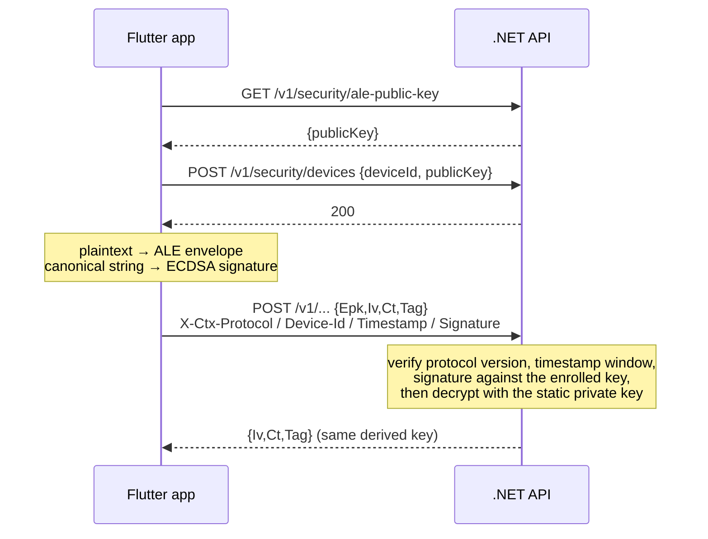

# `protocol/` — the app↔API wire protocol

**Location**: repo-root `protocol/` (resolved as `<templatesRoot>/../protocol` by
`templateLayout` in `packages/core/src/paths.ts`) · **Version**: 1.0

```
protocol/
  wire-protocol.md   the specification both sides implement
  protocol.json      the machine-readable header names and version
  vectors.json       golden test vectors
```

## Purpose

The generated Flutter app and .NET API are two independent implementations of one
cryptographic protocol. `protocol/` is that protocol's single source of truth: the prose
specification, the version and header names the engine and both runtimes read, and a set of
golden vectors both test suites reproduce. Neither security overlay is authoritative — the
document is, and the vectors are how "we both implemented it the same way" is proven rather
than assumed.

## Boundaries

`protocol/` is data. It contains no code and belongs to no package.

- **`@ctx0/core`** reads `protocol.json` for the version stamped into a workspace manifest
  (`protocolVersion` in `src/version.ts`, defaulting to `'1.0'` when the file declares
  none), and copies `vectors.json` and `wire-protocol.md` into each workspace's `.ctx/`
  (`syncProtocol` in `src/compose.ts`).
- **The security overlays** implement it. Anything that changes here changes both of them.
- **The generated workspace** carries its copy at `.ctx/wire-protocol.md` and
  `.ctx/vectors.json`, where the generated test suites read it.

The protocol directory lives *outside* the templates root because it is not a layer: it is
never copied as a tree, only synced file by file into `.ctx/`.

## The protocol

### Keys and encodings

- Curve: NIST P-256 (secp256r1).
- Private key: raw 32-byte big-endian scalar, base64.
- Public key: uncompressed point `0x04 || X[32] || Y[32]` (65 bytes), base64.
- All binary fields on the wire are standard base64.

These are exactly the encodings `generateServerSecrets` produces
([core.md](core.md#server-secrets)) — which is why secret generation lives in the engine
rather than in any frontend.

### Headers

| Header | Value |
|---|---|
| `X-Ctx-Protocol` | `1.0`. A mismatch is rejected. |
| `X-Ctx-Device-Id` | The enrolled device identifier. |
| `X-Ctx-Timestamp` | Unix time in milliseconds. Requests outside a 5-minute window are rejected. |
| `X-Ctx-Signature` | Base64 ECDSA P-256 signature over the canonical string. |

The names are duplicated in `protocol.json` under `headers` (`protocol`, `signature`,
`deviceId`, `timestamp`) so an implementation can read them rather than hard-code them.

### Enrollment

- `GET /v1/security/ale-public-key` → `{ "publicKey": <base64 uncompressed> }` — the
  server's static ALE public key.
- `POST /v1/security/devices` with `{ "deviceId", "publicKey" }` — registers the ECDSA
  public key the device will sign with.

Both are served by the always-on API security overlay
(`Api/Security/CtxSecurityEndpoints.cs`, mapped in `Program.cs` as
`app.MapCtxSecurityEndpoints()`), so they exist in every generated workspace regardless of
which features are enabled.

### ALE — application-layer encryption

ECIES over P-256 with AES-256-GCM, applied to the request body *above* TLS:

1. The sender generates an ephemeral P-256 key pair and computes the ECDH shared secret
   against the recipient's static public key. The secret is the 32-byte big-endian X
   coordinate of the shared point.
2. `key = HKDF-SHA256(ikm = sharedX, salt = 32 zero bytes, info = "ctx-ale-v1", L = 32)`.
3. `body = AES-256-GCM(key, iv = 12 random bytes, plaintext, aad = empty)` → ciphertext and
   a 16-byte tag.

Envelopes:

| Direction | JSON |
|---|---|
| Request | `{ "Epk", "Iv", "Ct", "Tag" }` — `Epk` is the sender's ephemeral public key |
| Response | `{ "Iv", "Ct", "Tag" }` — the server reuses the derived key, so `Epk` is omitted |

### Signing

The signature covers a canonical string built over the exact bytes on the wire:

```
<HTTP-METHOD uppercase>\n
<request path + query>\n
<X-Ctx-Timestamp>\n
<lowercase-hex SHA-256 of the request body bytes>
```

ECDSA P-256 with SHA-256, IEEE P1363 fixed-width encoding (`r || s`, 64 bytes), base64. The
client uses deterministic ECDSA (RFC 6979); the server accepts any valid signature. **The
body that is hashed is the ALE envelope JSON** — encryption happens first, then the
signature covers the ciphertext envelope as sent.



## Golden vectors

`vectors.json` pins one worked example of each half of the protocol, so both
implementations can be checked against fixed values rather than against each other.

| Group | Fields |
|---|---|
| `ale` | `serverPrivateB64`, `serverPublicB64`, `ephemeralPrivateB64`, `ephemeralPublicB64`, `ivB64`, `plaintextUtf8`, `derivedKeyB64`, `ciphertextB64`, `tagB64` |
| `signing` | `devicePrivateB64`, `devicePublicB64`, `method`, `path`, `timestamp`, `bodyUtf8`, `bodySha256Hex`, `canonicalString`, `signatureB64` |

The file also carries `"protocol": "1.0"`. The `signing.bodyUtf8` is an actual ALE envelope
— the vectors compose: the signing example signs the body the ALE example produces.

Both generated test suites reproduce every intermediate value (the derived key, the
ciphertext, the tag, the body hash, the canonical string) and verify the recorded
signature:

| Side | Test |
|---|---|
| Flutter | `app/test/security/crypto_vectors_test.dart`, loading `.ctx/vectors.json` via `vectors_loader.dart` |
| .NET | `api/tests/Ctx.Tests/Security/CryptoVectorsTests.cs`, via `GoldenVectors.cs` |

Their template sources are `templates/security/mobile/test/security/` and
`templates/security/api/tests/Ctx.Tests/Security/`.

## Versioning

`protocol.json`'s `version` is read by `protocolVersion()` and stamped into
`.ctx/manifest.json` as `protocolVersion`; `engine.info` also reports it, and `ctx0 status`
prints it. A workspace therefore records which protocol revision it was generated against.

At runtime the version is enforced per request through `X-Ctx-Protocol`: a client speaking a
different revision is rejected outright rather than partially understood.

Changing the protocol means, in one change: the specification in `wire-protocol.md`, the
`version` in `protocol.json`, regenerated `vectors.json`, and **both** security overlays.
A protocol change that touches only one side is a bug by construction — the vectors will
catch it.

## Invariants

1. **`wire-protocol.md` is authoritative.** Implementations follow the document; the
   document is not derived from an implementation.
2. **Both sides assert against the same vectors**, and the vectors are shipped into every
   workspace at `.ctx/vectors.json`.
3. **Encryption precedes signing**, and the signature covers the envelope bytes as sent.
4. **The version travels with the workspace** (manifest) and with every request (header).
5. **Secret encodings are protocol, not policy** — only `@ctx0/core` generates them.

---

**See also**: [system architecture](README.md) ·
[templates.md](templates.md#the-security-overlay) ·
[generated-workspace.md](generated-workspace.md) · [core.md](core.md#server-secrets) ·
[ADR-0005](../adr/0005-vendored-security-overlay.md)
