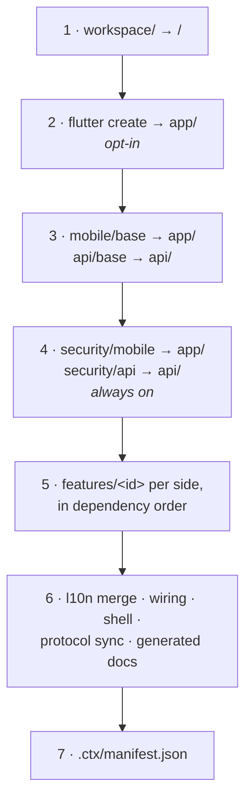

# `templates/` — the composition inputs

**Location**: repo-root `templates/` (monorepo) or `packages/core/templates` (published) ·
**Resolved by**: `packages/core/src/paths.ts`

## Purpose

`templates/` holds every tree the engine composes from. It is **data, not code**: adding a
feature is a directory plus a `feature.json`, with no engine change and no rebuild — the
engine reads the trees at runtime ([ADR-0004](../adr/0004-templates-as-data-not-code.md)).

## Layout

```
templates/
  workspace/            → workspace root
    AGENTS.md           the static preamble of the generated AGENTS.md
    README.md
    docker-compose.yml  PostgreSQL 16 for local development
  mobile/
    base/               → app/    Flutter skeleton: main.dart, app/app.dart, app/di.dart, pubspec
    shells/<layout>/    shell.dart templates: bottom_nav, drawer, home_list, nav_rail
    features/<id>/      per-feature mobile overlays
  api/
    base/               → api/    .NET solution: Api, Application, Domain, Infrastructure, tests
    features/<id>/      per-feature api overlays
  security/
    mobile/             → app/    always-on mobile security plane
    api/                → api/    always-on api security plane
```

Each of these directories (except `shells/`) is a **layer**: a self-contained tree copied
onto the workspace with token substitution applied to contents and path segments. Layers
that must touch a file another layer owns declare wiring edits instead of overwriting it.



Later layers are copied over earlier ones, so a feature can replace a base file outright by
shipping it at the same path — but anything *shared* goes through wiring instead, which is
why `Program.cs` and `di.dart` are never shipped twice.

## The substitution contract

Every template is written against three tokens, which are real, valid identifiers — so each
tree compiles and its tests run on its own, before any composition:

| Token in templates | Replaced with | Used for |
|---|---|---|
| `CtxApp` | PascalCase app name | .NET namespaces, Dart class prefixes, titles |
| `ctxapp` | lower/snake slug | the Dart package name, directory names, the Postgres db/user |
| `com.ctx.app` | bundle id | Android/iOS application ids, csproj ids |

Substitution applies to **path segments too**, so a file at `src/CtxApp.Api/…` lands at
`src/Acme.Api/…`. Files containing a NUL byte in their first 8000 bytes are copied
verbatim. See [core.md](core.md#substitution).

## Feature overlays

A feature is a directory whose name is its id, under `templates/mobile/features/<id>/`
and/or `templates/api/features/<id>/`. The two sides of a two-sided feature ship the *same*
`feature.json`. Everything inside the directory is copied into the workspace under that
side's prefix (`app/` or `api/`) — **except** the three metadata entries at the layer root:

| Entry | Role |
|---|---|
| `feature.json` | The manifest. Engine input, never copied. |
| `agents.md` | Context fragment that becomes `docs/features/<ID>.md`. Never copied. |
| `l10n/` | Per-language translation fragments, merged by the engine. Never copied. |

### The catalog today

| Feature | Sides | Requires | Nav tab | Summary |
|---|---|---|:--:|---|
| `auth` | mobile + api | `l10n` | — | Sign-up / sign-in with JWT + refresh tokens. |
| `gdpr` | mobile + api | `auth`, `l10n` | ✓ | Consent banner, asynchronous data export, hard account deletion. |
| `l10n` | mobile + api | — | ✓ | The localization plane: locale picker, delegates, `IStringLocalizer` wiring. |
| `media` | mobile + api | `auth`, `l10n` | ✓ | Media upload/serving. |
| `notes` | api only | `auth` | — | A worked CRUD example on the API side. |
| `notifications` | mobile + api | `auth`, `l10n` | ✓ | Notifications. |
| `ping` | mobile + api | `l10n` | ✓ | Secure echo endpoint — proves the signed + encrypted round trip end to end. |
| `profile` | mobile + api | `auth`, `l10n` | ✓ | User profile. |

`l10n` is the root of most dependency chains: any feature that shows text requires it,
because the generated support libraries (`AppL10nSupport`, `SupportedCultures.g.cs`) are
only emitted when the `l10n` overlays are present.

`ctx0 status` outside a workspace is the quickest way to confirm the engine discovers a new
feature and reports the right sides and summary.

## `feature.json`

The schema is `FeatureManifest` in `packages/core/src/types.ts`.

| Field | Type | Required | Meaning |
|---|---|:--:|---|
| `id` | `string` | ✓ | Stable feature id. **Must equal the directory name.** |
| `summary` | `string` | ✓ | One-line description, shown by `ctx0 status` and in the generated docs. |
| `sides` | `("mobile" \| "api")[]` | ✓ | Which trees the feature touches. Must include every side it ships an overlay for. |
| `requires` | `string[]` | | Feature ids enabled first, resolved transitively. |
| `core` | `boolean` | | True for always-on layers (the security overlays). Not toggleable. |
| `nav` | `{ label, icon, page, import }` | | Present iff the feature can be a main-navigation tab. |
| `deps` | `{ pubspec?, nuget? }` | | Dependency additions per side. |
| `wiring` | `WiringEdit[]` | | Idempotent edits to files owned by other layers. |
| `env` | `string[]` | | Environment variables the consumer must set. |
| `userSteps` | `string[]` | | Manual steps surfaced after generation. |

`nav` fields: `label` is the tab/tile text, `icon` a Material icon identifier used as
`Icons.<name>`, `page` the entry-screen widget class, and `import` the app-relative import
path for it — e.g. `../features/ping/views/ping_page.dart`. The engine turns these into the
shell's imports, pages and destinations ([core.md](core.md#the-navigation-shell)).

`env` and `userSteps` are aggregated across every enabled layer and returned by
`workspace.create`; `env` is deduplicated, `userSteps` preserves application order. They are
what the CLI prints after generating.

### Wiring

```json
{
  "file": "api/src/Api/Program.cs",
  "anchor": "endpoints",
  "insert": "app.MapPingEndpoints();"
}
```

`file` is workspace-relative (so it includes the `app/` or `api/` prefix — wiring can cross
sides). `anchor` names a marker the target file carries as `ctx:anchor:<anchor>` in its own
comment syntax; the insert goes on the line below. Substitution applies to both `file` and
`insert`, so `insert` may reference `CtxApp`. Multiple edits may target the same anchor —
each is a separate entry, applied in order.

Anchors available in the base trees:

| File | Anchors |
|---|---|
| `api/src/Api/Program.cs` | `usings`, `services`, `endpoints` |
| `api/src/Infrastructure/Persistence/CtxAppDbContext.cs` | `model-config` |
| `app/lib/app/di.dart` | `imports`, `providers` |
| `app/lib/app/app.dart` | `app-imports`, `app-material`, `app-overlay`, `home-wrap` |
| `app/pubspec.yaml` | `pubspec-deps` |

The `app.dart` anchors are positional by design: `app-material` sits inside `MaterialApp`
below the app-wide providers (so a feature can read the locale Cubit while configuring the
app), `app-overlay` wraps every route from above (the GDPR consent banner uses it, so it
shows before sign-in), and `home-wrap` wraps the shell itself (the auth gate uses it).

## Translation fragments

A feature that shows text ships one fragment per offered language at its layer root, and
declares `"requires": ["l10n"]`:

```
templates/mobile/features/auth/l10n/{en,el,de,fr,es}.arb   → merged into app/lib/l10n/app_<code>.arb
templates/api/features/auth/l10n/{en,el,de,fr,es}.json     → merged into Messages[.<code>].resx
```

Both formats are flat JSON objects. Keys must be **namespaced by feature** (`profileTitle`,
`media.tooLarge`): two layers defining the same key is a hard error, since the winner would
depend on application order. English is the template locale and must always be complete;
a missing key in another language simply falls back at runtime.
([ADR-0007](../adr/0007-translations-as-feature-fragments.md), and
[core.md](core.md#localization) for the merge rules.)

## The base trees

### `templates/mobile/base` → `app/`

The Flutter skeleton the overlays extend. `pubspec.yaml`, `pubspec.lock`, an `AGENTS.md`
for the app tree, and:

- `lib/main.dart` — `RaspGate.enforce()` before `runApp`, so a compromised device is
  refused before anything else boots.
- `lib/app/app.dart` — `CtxAppRoot` (a `MultiBlocProvider` over `ctxAppProviders()`) and
  `_CtxMaterialApp`, deliberately a separate widget so its build context sits *below* the
  providers.
- `lib/app/di.dart` — the composition root: `ctxAppProviders()` returns the app-wide Bloc
  providers, with `ctxSecureClient` from the security plane available to any of them.

The platform directories (`android/`, `ios/`, `web/`, …) are **not** templates — they come
from `flutter create` when `scaffoldPlatforms` is on. The overlay owns `lib/`, `test/` and
`pubspec.yaml`; the SDK owns everything else.

### `templates/api/base` → `api/`

A Clean Architecture .NET solution: `CtxApp.sln` plus four projects.

| Project | Contents in base |
|---|---|
| `src/Api` | `Program.cs` — security plane, EF Core + RLS interceptor, `/health`, the always-on security endpoints, and the three anchors |
| `src/Application` | `Abstractions/`: `ICurrentUser`, `IPersonalDataContributor`, `IPersonalDataAttachments` |
| `src/Domain` | `Entities/User.cs` |
| `src/Infrastructure` | `Persistence/CtxAppDbContext.cs` with the `model-config` anchor |
| `tests/Ctx.Tests` | The test project features add cases to |

`IPersonalDataContributor` is in the base rather than in `gdpr` on purpose: any feature can
implement it, and `gdpr` discovers the implementations — which is how export and erasure
cover features that did not exist when `gdpr` was written.

## The security overlay

`templates/security/{mobile,api}` are always-on layers, applied immediately after the bases
and before any feature. They are marked `"core": true` and are not in the toggleable
catalog: there is no way to generate a ctx.0 workspace without them
([ADR-0005](../adr/0005-vendored-security-overlay.md)).

The code is **vendored** — it lands in the generated workspace as ordinary source the user
owns and can read, not as a package dependency.

### `security/mobile` → `app/lib/security/`

| File | Role |
|---|---|
| `ctx_security.dart` | The entry point: the shared `ctxSecureClient` the DI root exposes |
| `secure_http_client.dart`, `secure_request.dart` | The client that encrypts, signs and sends |
| `crypto/p256.dart` | P-256 primitives |
| `crypto/ale_cipher.dart` | ECIES + AES-256-GCM application-layer encryption |
| `crypto/request_signature.dart` | The canonical string and ECDSA signature |
| `crypto/ctx_protocol.dart` | Header names and protocol constants |
| `rasp_gate.dart` | Runtime application self-protection check, enforced in `main()` |
| `test/security/` | `crypto_vectors_test.dart` and `secure_request_test.dart`, driven by `vectors_loader.dart` reading `.ctx/vectors.json` |

Declares `env: ["CTX_API_BASE_URL"]` and the `--dart-define` step to set it.

### `security/api` → `api/src/`

| Area | Files |
|---|---|
| Endpoint plane | `Api/Security/`: `SecurityBootstrap.cs` (`AddCtxSecurity`/`UseCtxSecurity`), `CtxSecurityEndpoints.cs` (ALE key discovery + device enrollment), `CtxSecureEndpointFilter.cs`, `AleSession.cs`, `AleResults.cs` |
| Abstractions | `Application/Abstractions/`: `IFieldCipher`, `IBlindIndex`, `IJwtIssuer`, `IPasswordHasher`, `IRefreshTokenStore`, `ISecurityPrimitives` |
| Crypto | `Infrastructure/Security/Crypto/`: `P256.cs`, `AleCipher.cs`, `RequestSignature.cs`, `CtxProtocol.cs` |
| Envelope encryption | `Infrastructure/Security/Envelope/`: `EnvelopeFieldCipher.cs`, `HmacBlindIndex.cs`, `EncryptedConverter.cs`, `ModelBuilderEncryptionExtensions.cs`, `EnvelopeOptions.cs`, plus `Domain/Security/EncryptedAttribute.cs` |
| Identity | `Infrastructure/Security/Jwt/`, `Passwords/Pbkdf2PasswordHasher.cs`, `Application/Security/RefreshTokenService.cs`, `Domain/Security/RefreshToken.cs` |
| Tenancy | `Infrastructure/Security/Rls/`: `CtxRls.cs`, `RlsConnectionInterceptor.cs`, `RlsInitializer.cs` — PostgreSQL row-level security |
| Tests | `tests/Ctx.Tests/Security/`: crypto vectors, envelope encryption, rate limiting, refresh tokens |

Declares the seven environment variables the API needs and the steps to produce them
(`ctx0 keygen`) and to point it at PostgreSQL.

The two overlays are two implementations of one specification — `protocol/wire-protocol.md`
— and both assert against the same golden vectors ([protocol.md](protocol.md)).

## Navigation shells

`templates/mobile/shells/<layout>/shell.dart` is not a layer: it is a single file the engine
loads, fills, and writes to `app/lib/app/shell.dart`. Each template carries single-line
generation markers the engine replaces:

| Marker | Present in | Replaced with |
|---|---|---|
| `ctx:gen:imports` | all layouts | one import per tab |
| `ctx:gen:pages` | `bottom_nav`, `nav_rail`, `drawer` | one page constructor per tab |
| `ctx:gen:destinations` | `bottom_nav`, `nav_rail`, `drawer` | the layout's destination widgets |
| `ctx:gen:tiles` | `home_list` | one `ListTile` per tab |

A missing marker is an error, so a new shell template cannot silently drop a tab.

## Adding a feature

1. `mkdir templates/mobile/features/<id>` and/or `templates/api/features/<id>`.
2. Write `feature.json`: `id` matching the directory, a `summary`, the `sides` it ships, any
   `requires`, and `nav` if it should be able to appear in the main navigation.
3. Add the overlay files under the paths they occupy in the workspace — `lib/features/<id>/…`
   for mobile, `src/<Project>/…` for api — writing against `CtxApp`/`ctxapp`/`com.ctx.app`.
4. Declare `wiring` for anything you need in a file another layer owns (`Program.cs`,
   `di.dart`, `app.dart`, `pubspec.yaml`, the `DbContext`).
5. If it shows text: add `l10n/<code>.arb` (mobile) / `l10n/<code>.json` (api) for every
   offered language, namespace the keys, and add `"l10n"` to `requires`.
6. Write `agents.md` — it becomes `docs/features/<ID>.md` in the generated workspace.
7. Add tests under the overlay's own `test/` (mobile) or `tests/Ctx.Tests/` (api).
8. Verify with `ctx0 status`, then generate a scratch workspace with `--no-platforms`.

No engine change is needed at any step.

## Invariants

1. **A `feature.json`'s `id` equals its directory name**, and `sides` lists every side it
   ships an overlay for. Both are enforced at catalog load.
2. **Each layer is independently valid.** Tokens are real identifiers, so a tree can be
   compiled and tested before composition.
3. **A layer only writes files it owns.** Anything shared goes through wiring.
4. **`feature.json`, `agents.md` and `l10n/` at a layer root are never copied.**
5. **Translation keys are namespaced by feature**, and English is always complete.
6. **The security overlays are not optional** and carry no toggle.
   ([ADR-0005](../adr/0005-vendored-security-overlay.md))

---

**See also**: [system architecture](README.md) · [core.md](core.md) ·
[generated-workspace.md](generated-workspace.md) · [protocol.md](protocol.md) ·
[ADR-0004](../adr/0004-templates-as-data-not-code.md) ·
[ADR-0005](../adr/0005-vendored-security-overlay.md) ·
[ADR-0007](../adr/0007-translations-as-feature-fragments.md)
