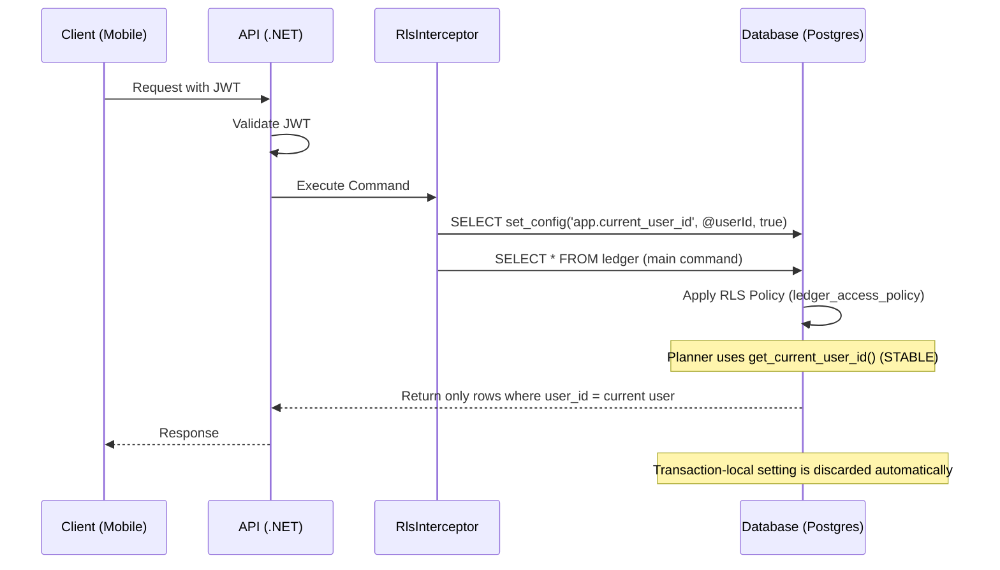

# Row-Level Security (RLS) Architecture

This document details the multi-layered enforcement of Row-Level Security in the API, spanning the .NET application layer and the PostgreSQL database layer.

---

## 1. Application Layer (The Signal)

The application layer is responsible for identifying the authenticated user and propagating that identity to the database session for the duration of a command or transaction.

### RLS Interceptor
*   **Location**: `RlsInterceptor` (`Ctx0.Security.EfCore` package)
*   **Mechanism**: A `DbCommandInterceptor` that hooks into the EF Core command execution lifecycle.
*   **Logic**:
    1.  **Extract Identity**: Retrieves the `UserId` from the `ICurrentUserProvider`.
    2.  **Context Establishment**: Before any command (`SELECT`, `INSERT`, `UPDATE`, `DELETE`) is executed, it executes a **separate, parameterized** command on the **same connection and transaction**:
        ```sql
        SELECT set_config('app.current_user_id', @userId, true);
        ```
        The user ID is always bound as a parameter — never string-interpolated (see [Security Hardening Checklist](audits/SECURITY_HARDENING_CHECKLIST.md) §7).
    3.  **Result Integrity**: By using a separate command instead of prepending to the SQL string, we avoid the "Result Set Offset Problem". This ensures that EF Core's batching and row-count verification logic (crucial for detecting concurrency issues) functions correctly without seeing extra result sets from the identity setup (see [RLS Deep Dive](RLS_DEEP_DIVE.md)).
    4.  **Scoping**: Passing `true` as the third `set_config` argument makes the setting transaction-local: it is discarded when the transaction ends, preventing identity leakage between requests in the connection pool.
    5.  **Robustness**:
        *   **Async/Sync Parity**: Fully supports both synchronous and asynchronous execution paths.
        *   **Identity Abstraction**: Supports both web and background contexts via `ICurrentUserProvider`.

### Identity Extraction & Manual Context
The API abstracts identity extraction via `ICurrentUserProvider`.
- **Automatic**: In web contexts, it extracts the user ID directly from the validated JWT claims (`uid` or `sub`).
- **Manual**: For scenarios like **User Registration** or background jobs where no JWT exists yet, the provider allows manual context setting via `IRlsContextManager`.
- **Safety**: Manual overrides use `AsyncLocal` and the `IDisposable` pattern to ensure thread-safety and scoped isolation.

> [!IMPORTANT]
> **Developer Rule:** During registration or any process that creates new rows for an anonymous user, you **must** manually set the RLS context using `IRlsContextManager.UseUserContext(newId)` within a `using` block. This ensures the database's RLS policies allow the session to "see" the newly inserted rows for row-count verification.

### System Bypass
For maintenance tasks or cross-entity business flows that require global visibility (e.g., KEK Rotation, payment processing spanning multiple owners), the system provides a bypass mechanism:
```csharp
using (rlsManager.UseSystemContext())
{
    // RLS is bypassed in this scope
    // Used in handlers that must access multiple owners' data simultaneously
    var allUsers = await db.Users.ToListAsync();
}
```
This is implemented in the `RlsInterceptor` by executing `SET LOCAL ROLE app_internal_worker;` (a fixed, non-interpolated statement — role names cannot be parameterized, so only this constant is ever used).

---

## 2. Database Layer (The Enforcement)

The database layer acts as the final gatekeeper, physically restricting row visibility and modifiability based on the `app.current_user_id` session variable.

### Optimization Functions
To prevent performance degradation (O(N*M) scans), RLS policies use `STABLE` functions. These allow the PostgreSQL query planner to execute the identity check once per query instead of once per row.
*   **Key Functions**:
    *   `get_current_user_id()`: Safely retrieves the current user ID from session state.
    *   `is_org_user(o_id)`: Optimized check for hierarchical organization access.
    *   `is_project_member(p_id)`: Optimized check for project-level access.

### Global Configuration
All sensitive tables have RLS enabled and forced to ensure that even the table owner (if not a superuser) is subject to the policies:
```sql
ALTER TABLE <table_name> ENABLE ROW LEVEL SECURITY;
ALTER TABLE <table_name> FORCE ROW LEVEL SECURITY;
```

These statements, the helper functions, and every policy are applied via **EF Core migrations** (`migrationBuilder.Sql(...)`) — see the [Database Code-First Guide](../architecture/DATABASE_CODE_FIRST.md).

### Policy Logic Patterns

For a complete list of every table and its specific RLS policy, see [Database RLS Policies](./DATABASE_RLS_POLICIES.md).

#### A. Direct Ownership (User-Centric)
Used for tables where a record belongs directly to a single user (e.g., `users`, `user_notifications`).
*   **Policy**: `USING (id = get_current_user_id())`

#### B. Hierarchical Ownership (Project/Organization)
Used for shared resources where access is determined by membership or management relationships.
*   **Project Access**: A Project record is accessible if:
    1.  The user is a `MemberUser` assigned to that project.
    2.  The user is an `OrgUser` managing the parent organization.
*   **Policy Pattern**:
    ```sql
    USING (is_project_member(id) OR is_org_user(org_id))
    ```

#### C. Public/Handshake Data
Used for initial device registration where no user context exists yet.
*   **Policy**: `USING (true)` (e.g., `app_instances`).

> [!CAUTION]
> **⚠️ Developer Rule:** Never add raw, un-cached table joins or subqueries directly into an RLS `USING` clause. PostgreSQL evaluates RLS policies as a filter on every candidate row during a scan. Raw subqueries turn cheap index lookups into $O(N \times M)$ performance bottlenecks. **Always** route relationship or permission queries through an explicit `STABLE` database function so the query planner can cache the evaluation across the scan.

---

## 3. Security Context Flow



---

## 4. Key Security Benefits

1.  **IDOR Prevention**: Even if an attacker guesses a `ProjectId` or `UserId` and attempts to pass it to an endpoint, the database will refuse to return data that doesn't belong to the JWT's identity.
2.  **Decoupled Logic**: Business logic doesn't need to be polluted with repetitive `.Where(x => x.UserId == currentUserId)` filters; the database handles this globally.
3.  **Fail-Safe**: If a developer forgets to add an authorization check in a new API endpoint, the RLS policies provide an automatic fallback that prevents data leakage.
4.  **Connection Pool Safety**: By using a transaction-local `set_config`, the connection is guaranteed to be "clean" when returned to the EF Core connection pool.
